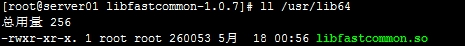

# CentOS7


## 1、命令

centOS7中service命令被systemctl替代

### 防火墙

1、查看已开放的端口(默认不开放任何端口)

` firewall-cmd --list-ports`

 2、开启80端口 

`firewall-cmd --zone=public(作用域) --add-port=80/tcp(端口和访问类型) --permanent(永久生效)`

 3、重启防火墙 

`firewall-cmd --reload`

 4、停止防火墙 

`systemctl stop firewalld.service`

 5、禁止防火墙开机启动 

`systemctl disable firewalld.service`

 6、删除 

`firewall-cmd --zone= public --remove-port=80/tcp --permanent `

### 开机自启动

**一、添加开机自启服务** 

在centos7中添加开机自启服务非常方便，只需要两条命令(以Jenkins为例)： 

```shell
systemctl enable jenkins.service #设置jenkins服务为自启动服务
sysstemctl start  jenkins.service #启动jenkins服务
```

**二、添加开机自启脚本** 

在centos7中增加脚本有两种常用的方法，以脚本autostart.sh为例：

```shell
#!/bin/bash
#description:开机自启脚本
/usr/local/tomcat/bin/startup.sh start #启动tomcat
```

**方法一** 

1、赋予脚本可执行权限（/opt/script/autostart.sh是你的脚本路径） 

```shell
chmod +x /opt/script/autostart.sh
```

2、打开/etc/rc.d/rc/local文件，在末尾增加如下内容 

```shell
chmod +x /opt/script/autostart.sh
```

3、在centos7中，/etc/rc.d/rc.local的权限被降低了，所以需要执行如下命令赋予其可执行权限 

```shell
chmod +x /opt/script/autostart.sh
```

**方法二** 

1、将脚本移动到/etc/rc.d/init.d目录下 

```shell
mv  /opt/script/autostart.sh /etc/rc.d/init.d
```

2、增加脚本的可执行权限 

```shell
chmod +x  /etc/rc.d/init.d/autostart.sh
```

3、添加脚本到开机自动启动项目中 

```shell
cd /etc/rc.d/init.d
chkconfig --add autostart.sh
chkconfig autostart.sh on
```

我的启动脚本：

```shell
[lion@localhost ~]$ cat /opt/script/autostart.sh 
#!/bin/bash
#description:autoScript
#tracker
/usr/bin/fdfs_trackerd /etc/fdfs/tracker.conf restart
#storage
/usr/bin/fdfs_storaged /etc/fdfs/storage.conf restart 
#zookeeper
/home/lion/soft/zookeeper-3.4.12/bin/zkServer.sh start
#redis
/home/lion/soft/redis-stable/bin/redis-server  /home/lion/soft/redis-stable/bin/redis.conf
#solr
/home/lion/soft/solr-7.3.1/bin/solr start
#tomcat
/home/lion/soft/apache-tomcat-8.5.31/bin/startup.sh start
```


## 2、JDK的安装

1、查看是否已经安装JDK：rpm -qa | grep  -i java 

2、若有则删除：rpm -e --nodeps java-xxx，删除所有相关的java 

3、解压

4、配置`/etc/profile`文件，需要先`su root`

```
[root@lion software]# vim /etc/profile
export JAVA_HOME=/usr/local/java/jdk1.8.0_101
export JRE_HOME=${JAVA_HOME}/jre
export CLASSPATH=.:${JAVA_HOME}/lib:${JRE_HOME}/lib
export PATH=${JAVA_HOME}/bin:$PATH
```

5、使文件生效

```
[root@lion jdk1.8.0_171]# source /etc/profile
```

6、检测是否安装成功


## 3、Tomcat的安装

1、下载

2、解压


## 4、Zookeeper的安装

1、下载安装包

2、解压

3、进入安装目录

```
[lion@localhost soft]$ cd zookeeper-3.4.12/
```

4、创建data文件夹

```
[lion@localhost zookeeper-3.4.12]$ mkdir data
```

5、进入config目录,重命名zoo_sample.cfg文件

```
[lion@localhost conf]$ mv zoo_sample.cfg zoo.cfg
```

6.编辑zoo.cfg文件，指定安装目录位置

```
dataDir=/home/lion/soft/zookeeper-3.4.12
```

7、启动zookeeper，首先要进入安装目录的bin目录下

```
[lion@localhost bin]$ ./zkServer.sh start
```

8、查看状态

```
[lion@localhost bin]$ ./zkServer.sh status
```

9、停止

```
[lion@localhost bin]$ ./zkServer.sh stop
```


## 5、Redis的安装

1、用lion账号登入虚拟机

2、wget 下载redis。发现没有wget命令，那么就 yum install wget

3、yum命令必须sudo，然后我的lion用户没有加入sudo组中

4、把lion加入sudo组里

5、安装wget，下载redis

6、解压

7、进入redis目录，make，报错，发现我机器上没有gcc

8、sudo yum install gcc

9、执行make后，Linux让我尝试执行make test

10、报错了，缺少tcl

11、sudo yum install tcl

12、make install PREFIX=指定目录


## 6、Solr的安装

### 安装

环境jdk1.8+，solr7.3

下载、解压

```shell
#运行
[lion@localhost soft]$ solr-7.3.1/bin/solr start -force
```

solr默认启动端口8983 ，配置好防火墙就可以访问了

### 配置

```shell
# 独立模式是以core来管理，云模式是以collection来管理。我搭建的只是个单机版的内容，所以独立模式足可以使用。
[lion@localhost bin]$ ./solr create -c core1
```

```shell
# 复制中文分析器到部署lib下
[lion@localhost soft]$ cp solr-7.3.1/contrib/analysis-extras/lucene-libs/lucene-analyzers-smartcn-7.3.1.jar solr-7.3.1/server/solr-webapp/webapp/WEB-INF/lib/
```

```shell
# 编辑core1的配置文件
[lion@localhost soft]$ vi solr-7.3.1/server/solr/core1/conf/managed-schema 
```

```shell
# 配置分词器，增加一下内容
<!-- ChineseAnalyzer -->
    <fieldType name="text_ik" class="solr.TextField" positionIncrementGap="100">
      <analyzer type="index">
        <tokenizer class="org.apache.lucene.analysis.cn.smart.HMMChineseTokenizerFactory"/>
      </analyzer>
      <analyzer type="query">
        <tokenizer class="org.apache.lucene.analysis.cn.smart.HMMChineseTokenizerFactory"/>
      </analyzer>
    </fieldType>
```


## 7、dubbo-admin的部署

1、You can get a release of dubbo monitor in two steps:

- Step 1:

```
git clone https://github.com/apache/incubator-dubbo-ops
```

- Step 2:

```
cd incubator-dubbo-ops && mvn package
```

2、将dubbo-admin部署到tomcat中

3、访问


## 8、Maven的安装

1、下载

 wget http://mirrors.shu.edu.cn/apache/maven/maven-3/3.5.3/binaries/apache-maven-3.5.3-bin.tar.gz

2、解压

3、在`/ect/profile`中配置

```
export MAVEN_HOME=/home/lion/soft/apache-maven-3.5.3
export PATH=$PATH:$MAVEN_HOME/bin
```

4、测试`mvn -version`

## 9、Nexus的搭建

1、下载

2、解压，解压出两个文件，一个是程序，一个是数据

`nexus-3.12.1-01  sonatype-work`

3、运行

```
[lion@localhost bin]$ ./nexus start  
```


## 10、FastDFS的安装


###简介

每个Volume之内是备份机，Volume之间是不同的数据，客户端访问Tracker获取数据是在那一个Storage Server上，然后客户端从Storage Server上获取数据。

### 安装步骤

####  **下载**

tracker和storage使用相同的安装包，下载地址：http://sourceforge.net/projects/FastDFS/ 或https://github.com/happyfish100/FastDFS（推荐）

安装FastDFS需要先将官网下载的源码进行编译，编译依赖gcc环境，如果没有gcc环境，需要安装gcc：

`yum install gcc-c++`

#### **安装libevent**

`yum -y install libevent`

#### **安装**ibfastcommon

```shell
#将libfastcommonV1.0.7.tar.gz拷贝至/usr/local/下
cd /usr/local
tar -zxvf libfastcommonV1.0.7.tar.gz
cd libfastcommon-1 .0.7
./make.sh
./make.sh install
```

**注意：**libfastcommon安装好后会自动将库文件拷贝至/usr/lib64下，由于FastDFS程序引用usr/lib目录所以需要将/usr/lib64下的库文件拷贝至/usr/lib下。

**要拷贝的文件如下：**

 

####  **tracker编译安装**

```shell
# 将FastDFS_v5.05.tar.gz拷贝至/usr/local/下
tar -zxvf FastDFS_v5.05.tar.gz

cd FastDFS

./make.sh
./make.sh install
```

#### 配置

```shell
# 安装成功后进入/etc/fdfs目录：
# 拷贝一份新的tracker配置文件：
cp tracker.conf.sample tracker.conf

#修改tracker.conf
vi tracker.conf
base_path=/home/yuqing/FastDFS   
改为：
base_path=/home/FastDFS
```

#### 启动

`/usr/bin/fdfs_trackerd /etc/fdfs/tracker.conf`

####  **FastDFS--storage安装**

#### **安装libevent**

同tracker安装

#### **安装**libfastcommon

同tracker安装。

#### **storage编译安装**

同tracker编译安装。

#### 配置

安装成功后进入/etc/fdfs目录：

拷贝一份新的storage配置文件：

`cp storage.conf.sample storage.conf`

 

修改storage.conf

`vi storage.conf`

```shell
group_name=group1

base_path=/home/yuqing/FastDFS改为：base_path=/home/FastDFS

store_path0=/home/yuqing/FastDFS改为：store_path0=/home/FastDFS/fdfs_storage

#如果有多个挂载磁盘则定义多个store_path，如下

#store_path1=.....

#store_path2=......

tracker_server=192.168.101.3:22122   #配置tracker服务器:IP

#如果有多个则配置多个tracker

tracker_server=192.168.101.4:22122
```

#### 启动

`/usr/bin/fdfs_storaged /etc/fdfs/storage.conf restart`

####  **上传图片测试**

#### **通过fdfs_test程序**

FastDFS安装成功可通过/usr/bin/fdfs_test测试上传、下载等操作。

```shell
修改/etc/fdfs/client.conf

base_path=/home/fastdfs
tracker_server=192.168.101.3:22122

使用格式：
/usr/bin/fdfs_test 客户端配置文件地址  upload  上传文件

比如将/home下的图片上传到FastDFS中：
/usr/bin/fdfs_test /etc/fdfs/client.conf upload /home/tomcat.png
```

## 11、ActiveMQ的安装

1、下载

2、解压

3、运行

```shell
[lion@localhost bin]$ ./activemq start
```

4、访问

`http://192.168.1.127:8161/`

## 12、Nginx安装

1、下载`http://nginx.org/`

2、解压`tar zxvf nginx-1.8.0.tar.gz`

3、进入nginx目录   使用 configure 命令创建一 makeFile 文件。

```shell
./configure \
--prefix=/usr/local/nginx \	#指向安装目录
--pid-path=/var/run/nginx/nginx.pid \	#指向pid
--lock-path=/var/lock/nginx.lock \	#（安装文件锁定，防止安装文件被别人利用，或自己误操作。）
--error-log-path=/var/log/nginx/error.log \	#指向log
--http-log-path=/var/log/nginx/access.log \	#指向http-log
--with-http_gzip_static_module \	#启用ngx_http_gzip_static_module支持（在线实时压缩输出数据流）
--http-client-body-temp-path=/var/temp/nginx/client \ #设定http客户端请求临时文件路径
--http-proxy-temp-path=/var/temp/nginx/proxy \	#设定http代理临时文件路径
--http-fastcgi-temp-path=/var/temp/nginx/fastcgi \	#设定http代理临时文件路径
--http-uwsgi-temp-path=/var/temp/nginx/uwsgi \	#设定http代理临时文件路径
--http-scgi-temp-path=/var/temp/nginx/scgi	#设定http scgi临时文件路径
```

4、编译`make`

5、安装`make install`

6、启动

注意：启动nginx 之前，上边将临时文件目录指定为/var/temp/nginx/client， 需要在/var下

创建此目录`mkdir /var/temp/nginx/client -p`

进入到Nginx目录下的sbin目录

`cd /usr/local/ngiux/sbins`

输入命令启动Nginx

`./nginxx`

启动后查看进程

`ps aux|grep nginxs`