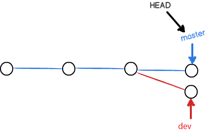

# Git

##Git和Svn的区别


Svn是集中式的，存储的是变化。中心化的。

Git是分布式的，存储的是完整的文件，去中心化，和区块链的思想相似。

Git保证完整性。

## 集中式版本控制（svn）和分布式版本控制的区别

集中式版本控制:(svn是这种形式)

有一个包含所有版本文件的单个服务器和一个数字(版本号),众多客户端从这个server上去检出文件(只是文件,本地没有仓库的概念)。

但是集中式的版本控制，有个严重的缺陷。就是中央服务器的单点故障。如果服务宕机一个小时，在这期间，没有任何人可以在正在工作的版本上很好的合作或者去保存某一个版本的改变。另外如果中央数据库的磁盘坏了，并且可能没有保存备份，那么将丢失所有的东西。你失去了绝对一切 - 除了单一的任何人的快照恰好有在本地计算机上项目的整个历史。当然本地的版本控制系统也有相同的问题。虽然，你能够把每个人的本地代码，进行合并得到一个相对完整的版本，但是当你把这个相对完整的版本重新部署到服务器的新仓库时，将会丢失所有的历史版本包括日志。

 ③分布式版本控制：（git是这种形式，GIT跟SVN一样有自己的集中式版本库或服务器）

 这是在分布式版本控制系统（DVCSs）步在DVCS（如GIT中），客户端不只是检查出文件的最新快照：他们完全镜像的存储库（本地有仓库，这就是分布式的意义）。因此，如果出现上述问题，任何客户机库的可复制备份到服务器，以恢复它。每一个克隆确实是所有数据的完整备份(除了没有push的代码，这个也是理所当然的)。

 那么针对于本地版本控制系统，和集中式版本控制系统的最严重的缺陷，就被分布式版本控制系统解决了。

1、git是分布式的scm,svn是集中式的。(最核心)

2、git是每个历史版本都存储完整的文件,便于恢复,svn是存储差异文件,历史版本不可恢复。(核心)

3、git可离线完成大部分操作,svn则不能。

4、git有着更优雅的分支和合并实现。

5、git有着更强的撤销修改和修改历史版本的能力

6、git速度更快,效率更高。

基于以上区别,git有了很明显的优势,特别在于它具有的本地仓库。

## 概念

工作区：

暂存区：通过add命令，让文件进入暂存区

本地版本库：通过commit命令，文件进入本地版本库

远程版本库：通过push命令，文件进入远程版本库

**git文件状态：已修改，已暂存，已提交。**


## 用户设置

a）git config --global user.username 'xxx'

b）git config --global user.email 'xxx'

> `git config --system`
>
> `git config --local`


对于user.name和user.email来说，有3个地方可以设置,查找顺序最近原则3，2，1.

1、`/etc/gitconfig`（几乎不会使用），针对于操作系统，`git config --system`

2、`~/.gitconfig`（很常用），针对用用户，`git config --global`

3、`.git/config`文件中，针对于特定项目的，`git config --local`


## git常用命令

```shell
# 文件进入stage
git add <file>
# 让文件从暂存区回到工作区
git rm --cached <file> 
git reset HEAD <file>` 
# 删除文件并且将其放入暂存区
git rm <file>
# 修改的文件还原到未修改状态，内容找不回了。	丢弃相对于暂存区中，文件最后一次变更
# 如果文件已经放到暂存区中，该命令是无效的
git checkout -- <file>
# 进入本地仓库，-m指定提交信息
git commit
# 修正最近一条的提交信息
git commit amend -m "修正"
# 修改提交的用户
git commit amend -reset-author
# 放到暂存区，并且提交
git commit -am [提交信息]
# 到远端仓库
git push
# 查看当前仓库状态。会提示那些文件发生修改，哪些内容需要add&commit。
git status
# 日志
git log
# 前三条
git log -3
# 日志列表
git log pretty=oneline
# 图形化显示日志
git log --graph
# 其他形式显示日志
git log --graph --abbrev-commit
git log --graph --pretty=oneline --abbrev-commit
# 帮助文档
git config --help
git help config
```


## .gitignore文件

```properties
# 忽略所有以d结尾的文件
*.d
# 忽略当前文件的mydir文件下的所有文件
mydir/
# 忽略根目录下test.txt文件
/test.txt
# 忽略所有目录下test.txt文件，**代表所有层次
/**/test.txt
```


## 分支

###常用命令

```shell
# 查看分支，-r显示所有远程分支，-a显示所有本地分支和远程分支
git branch
# 创建分支 
git brach [分支名]
# 分支重命名
git branch -m [old branch name] [new branch name]
# 当前分支最新的提交信息
git branch -v
# 删除分支
git branch -d [分支名]
# 强制删除，没合并分支的情况也会被删除分支
git branch -D [分支名]
# 切换分支 
# 如果此时有未提交的修改，是无法切换分支的，这时候就可以用`git stash`进行暂存
git checkout [分支名]
# 创建新分支，并且切换到该分支
git checkout -b [分支名]
# 在最近的两个分支上进行来回切换
git checkout -
# 合并分支，比如想要把dev分支的修改合并到master中，就要在master分支上执行 git merge dev 命令
git merge [分支名]
# 合并分支，不使用fast-forward模式，这种合并方式会产生一次新的提交
git merge --no-ff [分支名]

# 其他切换分支命令
# 切换到指定id的版本上，此时的HEAD是游离状态的，如果在此分支做了修改，需要提交才能再切换分支
git checkout [commit id]
# 如果HEAD是游离状态，切换分支后，提交也是游离状态，可以使用下面来新建分支保存那个状态,commit id 代表你上次checkout切换的分支id
git branch <new-branch-name> [commit id]

```

### 概念原理

HEAD：指向当前分支

master：指向提交

1、如下图所示，版本的每一次提交（commit），git都将它们根据提交的时间点串联成一条线。刚开始是只有一条时间线，即master分支，HEAD指向的是当前分支的当前版本。


2、当创建了新分支，比如dev分支（通过命令git branch dev完成），git新建一个指针dev，dev=master，dev指向master指向的版本，然后切换到dev分支（通过命令git checkout dev完成），把HEAD指针指向dev，如下图。


3、在dev分支上编码开发时，都是在dev上进行指针移动，比如在dev分支上commit一次，dev指针往前移动一步，但是master指针没有变，如下：


4、当我们完成了dev分支上的工作，要进行分支合并，把dev分支的内容合并到master分支上（通过首先切换到master分支，git branch master，然后合并git merge dev命令完成）。其内部的原理，其实就是先把HEAD指针指向master，再把master指针指向现在的dev指针指向的内容。如下图。


5、当合并分支的时候出现冲突（confict），比如在dev分支上commit了一个文件file1，同时在master分支上也提交了该文件file1，修改的地方不同（比如都修改了同一个语句），那么合并的时候就有可能出现冲突，如下图所示。



这时候执行git merge dev命令，git会默认执行合并，但是要手动解决下冲突，然后在master上git add并且git commit，现在git分支的结构如下图。


在master上合并成功后，切换到dev分支上，将master合并到dev上，会fast-forward，直接合并成功，因为master已经比dev快了一个版本了，上图绿色线条表示的地方。

6、合并完成后，就可以删除掉dev分支（通过git branch -d dev命令完成）。


[详细内容请看此博客](https://blog.csdn.net/zl1zl2zl3/article/details/52637737)


## 回退版本

### 常用命令

```shell
# 回退到上个版本
git reset --hard HEAD^
# 回退到上上个版本（回退两个版本）
git reset --hard HEAD^^
# 如果回退了，又想回去，commit id不需要写全
git reset --hard [commit id]
# 如果你回退之后，又想回去，但不知道commit id了，就需要查看里是的操作日志信息
git reflog
# 回退到之前的第2个提交
git reset --hard HEAD~2
# 回退到指定的提交
git reset --hard [commit id]
```

## 现场保存

​	当在一个分支做了一些修改，提交后，切换到另一个分支做了一些修改，修改未完成，没有提交，此时想切换分支就无法切换了，这就需要下面的命令了。

### 常用命令

```shell
# 将当前的工作情况保存
git stash
# 查看保存的现场列表 
git stash list
# 恢复之前的保存的状态，并把该条状态信息删除
git stash pop
# 恢复之前的保存的状态，不删除该条状态信息，你可能需要手动删除git stash drop stash@{0}
git stash apply
# 恢复指定的保存状态
git stash apply stash@{1}
# 删除某条状态信息
git stash drop stash@{0}
```


## 标签

标签有两种：轻量级标签、带有附注的标签

### 常用命令

```shell
# 创建轻量级标签
git tag [标签名]
# 创建带有附注的标签
git tag -a [标签名] -m [附注]
# 查看存在的标签
git tag
# 查找标签，支持*通配符
git tag -l [关键词]
# 删除标签
git tag -d [标签名]
```


## 文件比较

**主要是三个区域的相互比较：工作区、暂存区、版本库。**

```shell
# 比较暂存区与工作区文件之间的差别
git diff
# 工作区和最新的提交的差别
git diff HEAD
# 最新的提交和暂存区的差别
git diff --cached
# 和指定commit id的差别
git diff [commit id]
git diff --cached [commit id]
```


## 远程


### 常用命令

```shell
# 从远程仓库克隆
git clone [地址]
# 拉取，pull = fetch + merge
git pull
# 推送
git push
# 查看远程仓库的信息
git remote
# 列出所有的远程仓库的别名（有可能你本地仓库关联了Github、Gitlib多个远程仓库）
git remote show
# 显示远程仓库详情
git remote show [远程仓库别名]
# 关联远程仓库
git remote add origin https://github.com/ChinaZer01ne/utils.git
# 将本地的分支和远程分支进行关联了
git branch --set-upstream-to=origin/<branch>
# 合并两个独立的仓库
git pull origin master –allow-unrelated-histories
```


### 如何将项目分享到Github上

1、如果Github上已经新建了一个空的仓库，那么我们只需要将本地仓库和远程仓库关联起来就可以了。

```shell
# 关联远程仓库
git remote add origin [仓库地址]
# 将本地的master与远程做关联
git push -u origin master
```

如果远程和本地仓库是两个独立的项目（仓库名不一致）的话，尝试这两个命令。

```shell
# 将本地的分支和远程分支进行关联了
git branch --set-upstream-to=origin/<branch>
# 合并两个独立的仓库
git pull origin master -–allow-unrelated-histories
```


如果你想使用`SSH`的形式的仓库地址，就要`在仓库setting的Deploy keys`先配置`SSH密钥`

```shell
# 执行该命令生成公钥私钥，默认在~/.ssh文件夹下
ssh-keygen
```

将生成的公钥配置到Github上（`~/.ssh/id_rsa`）,然后执行关联仓库的操作（回到步骤1）


## 其他

1、git的提交id（commit id）是一个摘要值，是通过sha1计算出来的。

2、如果新创建一个文件夹mydir，如果mydir中没有文件，git是不识别的。

3、每个提交都有自己的parent指针，指向上一次提交的commit id。

4、`git checkout -- <file>` ：丢弃相对于暂存区中，文件最后一次变更

​      `git reset HEAD <file>` ：让文件从暂存区回到工作区。

​      如果文件已经放到暂存区中。那么`git checkout -- <file> `是无效的。

5、使用`git blame <file>`命令查看文件的修改历史。

6、 `git remote show [仓库别名]`显示仓库详情

`Fetch URL`：版本拉取的地址。

`Push URL`：版本推送的地址。