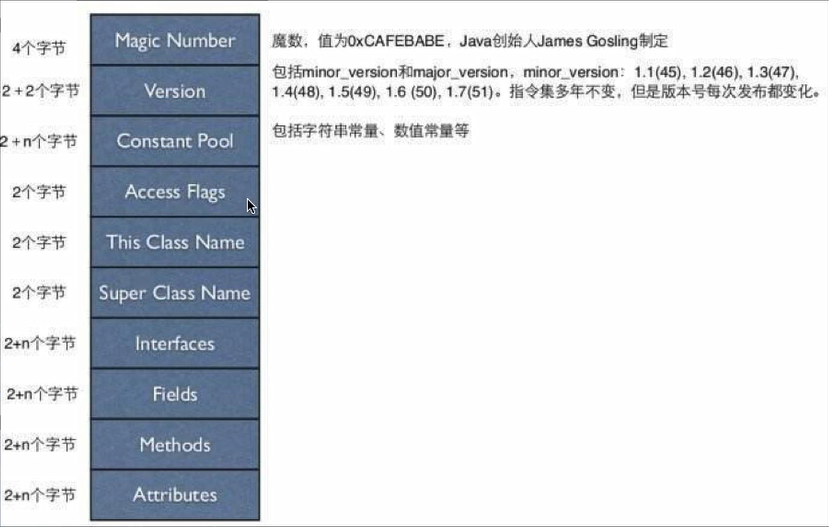
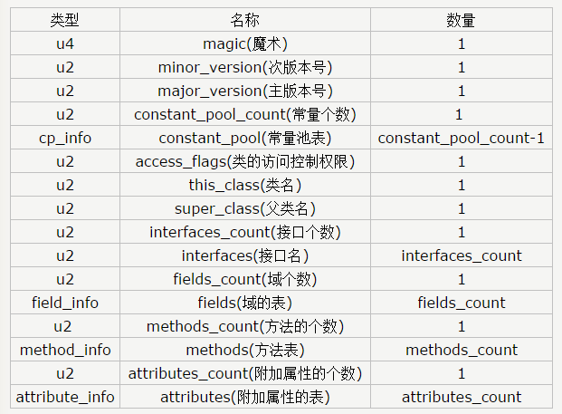
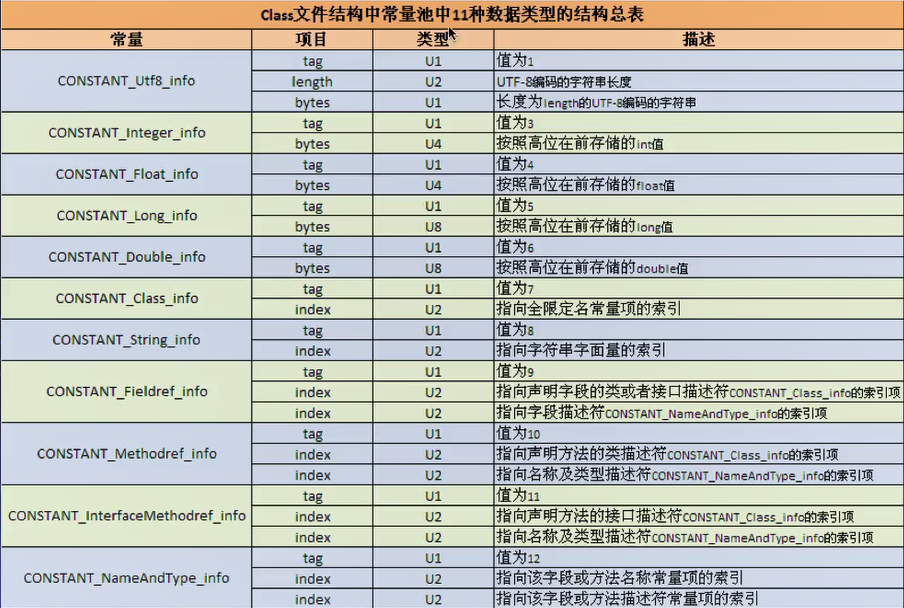
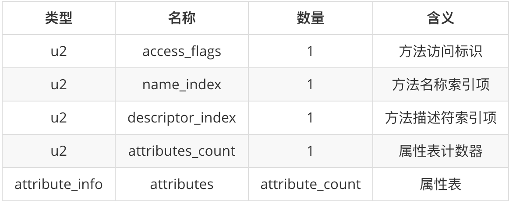
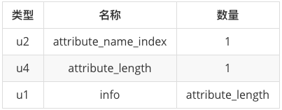
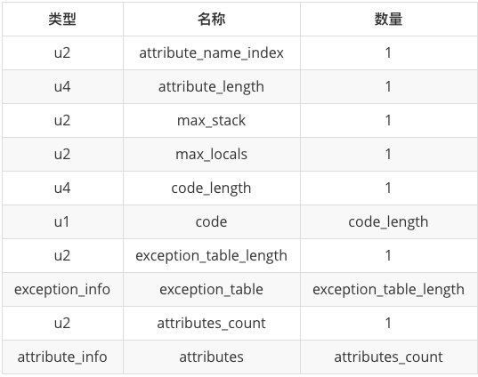
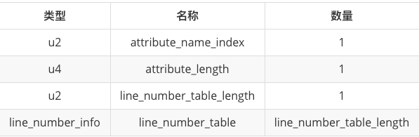
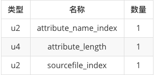

# JVM


## JVM与程序的生命周期

在如下几种情况下，Java虚拟机将结束生命周期

* 执行了System.exit()方法
* 程序正常执行结束
* 程序执行过程中遇到了异常或错误而异常终止
* 由于操作系统出现错误而导致Java虚拟机进程终止


## 字节码指令

- **ldc**：表示将int，float或是String类型的常量值从常量池中推送到栈顶。（表示接下来要使用）。相关类`com.sun.org.apache.bcel.internal.generic.LDC`
- **iconst_**：对于`-1到5之间`，java虚拟机用（`iconst_m1`，`iconst_0`，`iconst_1`，`iconst_2`，`iconst_3`，`iconst_4`，`iconst_5`）来表示。表示将（`-1到5`）的常量值推送至栈顶。相关类`com.sun.org.apache.bcel.internal.generic.ICONST`

- **bipush**：表示将单字节（`-128到127`）的常量值推送至栈顶。相关类`com.sun.org.apache.bcel.internal.generic.BIPUSH`

- **sipush**：表示将短整形（`-32768到32767`）的常量值推送至栈顶。相关类`com.sun.org.apache.bcel.internal.generic.SIPUSH`

  > 对于数字的优先级：const_、bipush、sipush

* **newarray**：表示创建一个指定的原始类型（如：int、float、char等）的数组，并将其引用值压入栈顶。相关类`com.sun.org.apache.bcel.internal.generic.NEWARRAY`
* **anewarray**：表示创建一个引用类型的（如类、接口、数组）数组，并将其压入栈顶。相关类`com.sun.org.apache.bcel.internal.generic.ANEWARRAY`
* **invokespecial**：调用父类构造方法。
* **aload_**：从局部变量表的相应位置装载一个对象引用到操作数栈的栈顶。aload_索引，表示把对应索引的引用推送到栈顶。`aload_0`是吧`this`引用推送到栈顶。
* **astroe_**：将返回值存到局部变量表中第几个局部变量中。
* ....


## 虚拟机栈

每个线程都有自己的栈。

**栈帧（Stack Frame）**：栈帧是一种用于帮助虚拟机执行方法调用与方法执行的数据结构。栈帧本身是一种数据结构，封装了方法的局部变量表、动态链接信息、方法的返回地址以及操作数栈等信息。


**slot**：slot 是局部变量表中的空间单位，虚拟机规范中有规定，对于 32 位之内的数据，用一个 slot 来存放，如 int，short，float 等；对于 64 位的数据用连续的两个 slot 来存放，如 long，double 等。引用类型的变量 JVM 并没有规定其长度，它可能是 32 位，也有可能是 64 位的，所以既有可能占一个 slot，也有可能占两个 slot。


​	

## 方法的解析与分派

​	有些符号引用是在类加载阶段或是第一次使用时就会转换为直接引用，这些符号引用是在编译期就能确定的，这种转换叫做**静态解析**；另外一些符号引用则是在每次运行期转换为直接引用，这种转换叫做**动态链接**，这体现为Java的多态性。Java中天生可以动态扩展的语言特性就是依赖动态加载和动态链接这个特点实现的。动态扩展就是在运行期可以动态修改字节码，也就是反射机制与cglib。**分派会解释多态性特征的一些最基本的体现，如“重载”、“重写”在Java虚拟机中是如何实现的**


**静态解析的4中情形**：

1、静态方法（与类型关联）

2、父类方法

3、构造方法

4、私有方法（外部不可被访问）


​	以上四类方法称作为**非虚方法（包括final方法）**，它们适合在类加载阶段进行解析，是**在类加载阶段就可以将符号引用转换为直接引用的**。

​	变量的静态类型是不会变化的，而变量的实际类型则是可以变化的（多态的一种实现），实际类型是在运行期间才可以确定。方法重载是静态的，是编译期行为；方法重写动态的，试运行期行为。


**JVM调用方法有五条指令：**

1、`invokeinterface`：**调用接口中的方法**，实际上是在运行期决定的，决定到底调用实现该接口的哪个对象的特定方法。

2、`invokestatic`：**调用静态方法**。

3、`invokespecial`：调用自己的**私有方法、构造方法（<init>）以及父类的方法**。

4、`invokedynamic`：动态调用方法。

5、`invokevirtual`：调**用虚方法，即除了以上的方法外全用invokevirtual调用**，运行期动态查找的过程。

> 假设objectref的类型为C，实际调用的方法将按照下面流程来查找：
>
> - 如果C包含了一个方法m的声明，该声明重写了解析出来的方法，则m为实际调用的方法，查找终止。
>
> - 否则：如果C有父类，则自下而上递归的在C的直接父类中执行第一步的查找。
>
> - 如果还没有查找到，则抛出AbstractMethodError错误。
>
>
>
>   关于虚方法的其他调用流程，参照[虚方法调用流程](https://blog.csdn.net/lvvista/article/details/38460135)


### 静态分派

分派的概念比较泛，分为静态分派、动态分派、单分派、多分派。

**所有依赖静态类型来定位方法执行版本的分派动作称为静态分派。静态分派的典型应用是方法重载。**

```java
Grandpa g1 = new Father();
```

如上代码，Grandpa被称为静态类型，Father被称为实际类型。

```java
public class MyTest5 {
    public void test(Grandpa grandpa){
        System.out.println("grandpa");
    }
    
    public void test(Father father){
        System.out.println("father");
    }

    public void test(Son son){
        System.out.println("son");
    }

    public static void main(String[] args) {
        Grandpa g1 = new Father();
        Grandpa g2 = new Son();
        MyTest5 myTest5 = new MyTest5();
        myTest5.test(g1);
        myTest5.test(g2);
    }
}
class Grandpa{
}
class Father extends Grandpa{
}
class Son extends Father{
}
```

运行结果：

```shell
grandpa
grandpa
```

如上代码与运行结果，在调用 sayHello()方法时，方法的调用者都为myTest5的前提下，使用哪个重载版本，完全取决于传入参数的数量和数据类型。代码中刻意定义了两个静态类型相同、实际类型不同的变量，可见**编译器**（不是虚拟机，因为**如果是根据静态类型做出的判断，那么在编译期就确定了**）在重载时是**通过参数的静态类型而不是实际类型作为判定依据的**。并且静态类型是编译期可知的，所以在编译阶段，javac 编译器就根据参数的静态类型决定使用哪个重载版本。这就是静态分派最典型的应用。


### 动态分派

​	动态分派与多态性的另一个重要体现——方法重写有着很紧密的关系。向上转型后调用子类覆写的方法便是一个很好地说明动态分派的例子。这种情况很常见，因此这里不再用示例程序进行分析。很显然，在判断执行父类中的方法还是子类中覆盖的方法时，如果用**静态类型**来判断，那么无论怎么进行向上转型，都只会调用父类中的方法，但实际情况是，根据对父类实例化的子类的不同，调用的是不同子类中覆写的方法，很明显，这里是要根据变量的实际类型来分派方法的执行版本。而实际类型的确定需要在程序运行时才能确定下来，这种在运行期根据实际类型确定方法执行版本的分派过程称为动态分派。

​	针对于方法调用动态分派的过程，虚拟机会在类的方法区建立一个虚方法表的数据结构（virtual method table，vtable）。针对于invokeinterface指令来说，虚拟机会建立一个接口方法表的数据结构（interface method table，itable）,一般是在类加载的连接阶段创建的。	

​	虚方法表的每一个方法保存了调用方法的入口。如果子类没有覆写父类方法（单单是继承过来），那么在虚方法表中会有个指针指向父类的方法；如果重写了，那么会用自己的字节码表示。


## 类加载


### 类的加载

- 类加载器并不需要等到某个类“首次主动使用”时，再加载他。

- JVM规范允许类加载器在预料某个类将要被使用时就预先加载它，如果在预先加载的过程中遇到了`.class`文件缺失或存在错误，类加载器必须在程序首次主动使用该类时才报告错误（LinkageError错误）

- 如果这个类一直没有被程序主动使用，那么类加载器就不会报告错误


### 类加载过程

在Java代码中，类型的**加载、连接与初始化**过程都是在程序运行期间完成的。


- 加载
- 连接
  - 验证
  - 准备
  - 解析
- 初始化


#### 加载

​	查找并加载类的二进制数据。

​	根据虚拟机规范，在加载阶段，虚拟机需要完成下面三件事：

​	**1）通过一个类的全限定名，来获取类的二进制流。**

​	**2）将这个字节流代表的静态存储结构转化为方法区的运行时数据结构。**

​	**3）在内存中生成代表这个类的Class对象，作为方法区这个类各种数据访问的入口。**

>因为没有规定Class类读取的来源，所以出现了从jar读取，从网络读取，有其他文件生成，数据库读取等等方式。


#### 连接

​	加载和连接阶段是交叉进行的，如一部分字节码文件格式的验证动作，加载还没完成，验证阶段或许已经开始了。

​	连接过程又分为三个阶段：**验证、准备、解析**。

##### 验证

​	确保被加载类的正确性并且不会危害虚拟机自身安全。

​	验证阶段大致会完成下面4个阶段的检验动作。**文件格式验证、元数据验证、字节码验证、符号引用验证**。


###### 文件格式验证

* 是否以魔数0xCAFEBABE开头

* 主、次版本号是否在当前虚拟机处理范围内

* Class文件中各个部分及文件本身是否有被删除的或附加的其他信息

* 等等。。。

  **第一阶段的主要目的是保证输入的字节流能正确的解析并存储于方法区之内，格式上符合描述一个Java类型信息的要求。该阶段的验证是基于二进制字节流进行的，只有通过了这个阶段验证后，字节流才会进入内存的方法区中进行存储**

  也就是说，在加载的阶段连接阶段已经开始了，说明存在交叉。

###### 元数据验证

* 这个类是否有父类（除了Object，都存在父类）

* 这个类的父类是否继承了不允许被继承的类（final修饰的类）

* 如果这个类不是抽象类，是否实现了其父类或接口之中要求实现的所有方法。

* 等等。。。

  **第二阶段的主要目的是对类的元数据信息进行语义校验，保证不存在不符合Java语言规范的元数据信息。**

###### 字节码验证

* 保证任意时刻操作数栈的数据类型于指令代码序列都能配合工作，例如不会出现类似这样的情况：在操作栈放置了一个int类型的数据，使用时却按long类型来加载入本地变量表中。

* 保证跳转指令不会跳转到方法体以外的字节码指令上。

* 保证方法体中的类型转换是有效的。

* 等等。。。

  **第三阶段验证的主要目的是通过对数据流和控制流分析，确定程序语义是合法的、符合逻辑的。**

###### 符号引用验证

​	第四阶段的校验发生在虚拟机将符号引用转化为直接引用的时候，这个转化动作将在连接的第三阶段——解析阶段中发生。符号引用验证可以看作是常量池中各种符号引用信息的匹配性校验。

* 符号引用中通过字符串描述的全限定类名是否能找到对应的类。
* 在指定类中是否存在符合方法的字段描述符以及简单名称所描述的方法和字段。
* 符号引用中的类、字段、方法的访问性（private、protected、public、default）是否可被当前类访问。

**符号引用验证的目的是确保解析动作能正常执行。对于虚拟机的类加载机制来说，验证阶段是一个非常重要的，但不是一定必要（因为对程序运行期没有影响）的简短。如果所运行的全部代码（包括自己编写的及第三方包中的代码）都已经被反复使用和验证过，那么在实施阶段就可以考虑使用`-Xverify:none`参数来关闭大部分的类验证措施，以缩短虚拟机类加载的时间。**

##### 准备

​	为类的**静态变量**分配内存，并将其初始化为**默认值**的阶段。这些变量所使用的内存都将在方法区中进行分配。

##### 解析

​	把类中的符号引用转换为直接引用。

#### 初始化

​	为类的静态变量赋予正确的初始值。

> - 加入这个类还没有被加载和连接，那么先进行加载和连接
> - 加入类存在直接父类，并且这个父类还没有被初始化，那么先初始化直接父类
> - 假如类中存在初始化语句，那就依次执行这些初始化语句


### 类加载器


#### JDK1.8

JDK1.8 默认提供了如下几种ClassLoader

**1、Bootstrp loader**
`Bootstrp loader`是用C++语言写的，它是在Java虚拟机启动后初始化的，属于JVM的一部分。它**主要负责加载%JAVA_HOME%/jre/lib**，`-Xbootclasspath`参数指定的路径以及%JAVA_HOME%/jre/classes中的类。

**2、ExtClassLoader**  

`Bootstrp loader`加载``ExtClassLoader`,并且将`ExtClassLoader`的父加载器设置为`Bootstrp loader.ExtClassLoader`是用Java写的，具体来说就是 `sun.misc.Launcher$ExtClassLoader`，`ExtClassLoader`**主要加载%JAVA_HOME%/jre/lib/ext，此路径下的所有classes目录以及java.ext.dirs系统变量指定的路径中类库**。J扩展类加载器会从文件目录的ar包中加载，而不是直接从文件目录中找class文件。

**3、AppClassLoader** 
`Bootstrp loader`加载完`ExtClassLoader`后，就会加载`AppClassLoader`,并且将AppClassLoader的父加载器指定为 ExtClassLoader。AppClassLoader也是用Java写成的，它的实现类是 `sun.misc.Launcher$AppClassLoader`，另外我们知道ClassLoader中有个getSystemClassLoader方法,此方法返回的正是AppclassLoader.`AppClassLoader`主要负责**加载classpath所指定的位置的类或者是jar文档**，它也是Java程序默认的类加载器。

**4、CustomClassLoader**

除了系统提供的类加载器以外，开发人员可以通过继承 java.lang.ClassLoader类的方式实现自己的类加载器，以满足一些特殊的需求。


##### 双亲委派机制


#### JDK1.9+

TODO 平台加载器替代了扩展加载器

```java
class Member{

}

public class JVMClassloader {
    public static void main(String[] args) {

        //String类是个系统类，系统类的类加载器是不同的
        //静态常量池定义
        String str = "Hello";
        Member member = new Member();
        System.out.println(str.getClass().getClassLoader());
        System.out.println(member.getClass().getClassLoader());
        System.out.println(member.getClass().getClassLoader().getParent());        System.out.println(member.getClass().getClassLoader().getParent().getParent());
    }
}

```

打印：

```java
null
jdk.internal.loader.ClassLoaders$AppClassLoader@14514713
jdk.internal.loader.ClassLoaders$PlatformClassLoader@4e04a765
null
```


#### 类加载器的命名空间


**问题：一个类只会被加载一次？**

​	这牵扯到一个类加载器的命名空间的问题。

 * 每个类加载器都有自己的命名空间，命名空间由该加载器及所有父加载器所加载的类组成。
 * 在同一个命名空间中，不会出现类的完整名字（包括类的包名）相同的两个类。意思就是不会出现两个相同的类。
 * 在不同的命名空间中，有可能会出现类的完整名字（包括类的包名）相同的两个类。意思是可能出现多个相同的类。
 * 如果一个class被加载了两次，加载到了不同命名空间，那么他们也不算是一个类，他们是不能进行相互赋值的。意思是不同命名空间的相同名字的类算作两个不同的类。在运行期，一个Java类是由该类的全限定类名（binary name）和用于加载该类的定义类加载器（definer loader）所共同决定的。如果同样的名字（全限定类名）的类是由两个不同的类加载器加载的，那么这些类就是不同的，即使.class文件的字节码一样，并且从相同位置加载，亦是如此。


​	当类加载器之间存在层级关系后，他们的命名空间就成了一个。（子类加载器包含父类加载器，他们是委派的关系）

​	

**命名空间产生的一些问题：**


​	**如果`A类`引用了`B`类，`A类`是由系统加载器加载的，`B类`是由自定义加载器加载的，那么在运行时就会报错，因为系统类加载器的命名空间中不自定义加载器命名空间中的类（`B类`）；或者`A类`和`B类`是由两个不同的自定义加载器分别加载的，也会产生命名空间问题。**

​	**同一个命名空间的类是相互可见的。子加载器所加载的类能够访问到父加载器加载的类，但父加载器加载的类无法访问到子加载器所加载的类。**


#### ClassLoader获取方法

```java
// 获取当前类的ClassLoader
clazz.getClassLoader();
//获取当前线程上下文的ClassLoader，一般是应用类加载器
Thread.currentThread().getContextClassLoader();
//获取系统的ClassLoader
ClassLoader.getSystemClassLoader();
//获取调用者的ClassLoader
DriverMannager.getCallerClassLoader();
```


#### 关于类加载器

​	类加载器会去定位（读取已有的）或生成（运行期生成的）一些类的数据。每个类都包含一个定义它的类加载器的引用。

​	关于数组类`getClassLoader`返回的加载器，是和它元素的类加载器相同，如果该数组是原始类型（int等），则没有类加载器。注意String和int数组的类加载器都是`null`，但含义不一样，前者代表根类加载器，后者表示没有类加载器。当然数组类不是类加载器加载的，而是虚拟机运行期动态生成的。

​	类加载器除了加载类，还可以用来定位资源。

​	关于自定义类加载器，需要重写`ClassLoader#findClass`方法，并且提供自己的`loadClassData`加载类的方法（可能从某一位置读取返回一个字节数组）。

​	**如果`A类`中引用了`B类`，`B类`一般会由加载了`A类`的类加载器（当前类加载器（Current ClassLoader））进行加载（会遵循双亲委派机制）。比如`A类`由自定义类加载器加载，`B类`的加载，会遵循双亲委派机制，自顶向下进行尝试加载，依次是根类加载器、扩展类加载器、系统加载器、自定义加载器；如果`A类`是由系统加载器加载的，那么`B类`的加载会自顶向下尝试，依次是根类加载器、扩展类加载器、系统加载器。**

​	这地单独说一下启动类加载器，启动类加载器不是java类，是C++编写的，她负责加载第一个纯java类（类加载的开始），和加载提供JRE正常运行的基本组件，包括java.util于java.lang包中的类等等。


##### 线程上下文类加载器（Context ClassLoader）

​	since 1.2；如果没有通过`Thread#setCotextClassLoader`进行设置的话，线程将继承其父线程的上下文类加载器，Java应用运行的初始线程的上下文加载器是**系统类加载器**，在线程中运行的代码可以通过该类加载器来加载类和资源。


**线程上下文类加载器的重要性：**

​	SPI（Service Provider Interface）,比如说JDBC接口是由根类加载器加载的，而厂商的实现类是有系统类加载器加载的，由于父类加载器是看不到子类加载器加载的类，就会存在一些问题。

​	父ClassLoader可以使用当前线程`Thread#currentThread#getContextClassLoader`所指定的classLoader加载类，这就改变了父ClassLoader不能使用子ClassLoader或是其他没有直接父子关系的ClassLoader加载类的情况，即改变了双亲委托模型。

​	线程上下文类加载器就是当前线程的Current ClassLoader。

​	在双亲委托模型下，类加载器是由上至下的，即下层的类加载器会委托上层进行加载。但是对于SPI来说，有些接口是Java核心类提供的，而Java核心库s是由启动类加载器来加载的，而这些接口的实现却是来自不同的jar包（厂商提供），Java的启动类加载器是不会加载来自其他来源的jar包，这样传统的双亲委托模型j就无法满足SPI的要求。而通过给当前线程设置上下文类加载器，就可由设置的上下文类加载来实现对于接口实现类的加载。

​	在SPI处理中，`ServiceClassLoader`中加载了厂商实现的类，是使用线程上下文类加载器加载的。

[SPI相关类](java.util.ServiceLoader)


**线程上下文类加载器的一般是使用模式**

获取——使用——还原

```java
ClassLoader classLoader = Thread.currentThread().getContextClassLoader();
try {
    Thread.currentThread().setContextClassLoader(targetTccl);
    //getContextClassLoader(),然后做一些自己类加载的处理
    myMethod();
}finally {
    Thread.currentThread().setContextClassLoader(classLoader);
}
```


####双亲委托机制的好处

* 可以确保Java核心类库的类型安全：所有的Java应用都至少引用java.lang.Object，也就是说在运行期，java.lang.Object这个类会被加载到Java虚拟机中；如果这个加载过程是由Java应用自己的类加载q器所完成的，那么很可能在JVM中存在多个版本的java.lang.Object类，而且这些类之间还是不兼容的，相互不可见的（命名空间的问题）。

* 可以确保Java核心类库所提供的类不会被自定义的同名类所替代（自己定义的同名类不会被加载）

* 不同的类加载器可以为相同名称（binary name）的类创建额外的命名空间。相同名称的类可以并存在Java虚拟机中，只需要用不同的类加载器来加载他们即可。不同类加载器所加载的类之间是不兼容的，这就相当于在Java虚拟机内部创建了一个有一个相互隔离的Java类空间，这些技术在很多框架中都得到了实际应用。


### 类加载过程的其他问题


#### 什么时候触发初始化过程？

首次主动使用类的时候。

主动使用：

- 创建类的实例

- 对类或接口的静态成员的使用（getstatic、putstatic）

- 对静态方法的调用（invokestatic)

- 反射（reflect）

- 初始化一个类的子类，会对父类主动使用（不适用于接口）

  > * 初始化一个类的时候，并不会先初始化它实现的接口
  > * 初始化一个接口的时候，并不会先初始化它的父接口
  >
  > 对于一个接口常量的调用，并不会要求其父接口的初始化。只有真正使用到父接口（常量或方法）时，父接口才会被初始化

- Java虚拟机启动时被标记为启动类的类（main方法）

- JDK1.7开始提供动态语言支持，java.lang.invoke.MethodHandler实例的解析结果REF_getStatic，REF_putStatic，REF_invokeStatic句柄对应的类如果没有初始化，则初始化。

  其他情况都为被动使用，被动使用**不会触发初始化过程**（有可能触发加载连接过程）。


  **注意：**

  ​	引用数组类型不会导致类的初始化，引用数组类型是运行期间jvm动态生成的。不属于主动使用。

  ​	调用`ClassLoader`类的`loadClass`方法加载一个类，并不是对类的主动使用，不会导致类的初始化。


#### 编译器常量和运行期常量的区别

​	1、当我们调用一个类的静态常量的时候，是不会触发类的的初始化的，在编译阶段，常量就已经放到调用方所在类的常量池中了。就算编译完成，把常量所在类的字节码删除也不影响运行结果。

```java
//这是一个编译期常量
public static final String str = "hello";
```

> 在字节码中，助记符是ldc之类的。

注意：如果常量是类似

```java
//这不是一个编译期常量
public static final String str = UUID.randomUUID().toString();
```

> 在字节码中，助记符是getstatic之类的。

因为随机数函数是编译期间未知的结果，所以在编译期间，这个常量是无法放入调用方所在类的常量池中的，在运行期间，会导致主动使用常量所在的类，所以会触发类的初始化。

> 我们可以通过助记符来看jvm时候对类进行了初始化。


####准备和初始化阶段的理解

1、下面程序的输出是什么？

```java
public class MyTest5 {
    public static void main(String[] args) {
        //主动使用触发类的初始化
        Singleton instance = Singleton.getInstance();
        System.out.println("counter1 : " + Singleton.counter1);
        System.out.println("counter2 : " + Singleton.counter2);
    }
}

class Singleton{
    //准备阶段赋值默认0，初始化阶段不变
    public static int counter1;
    //调用构造方法
    private static Singleton singleton = new Singleton();
    private Singleton(){
        //初始化阶段不变0，变成1
        counter1++;
        //准备阶段赋值默认0，变成1
        counter2++;
    }
    //初始化的时候又赋值成了0
    public static int counter2 = 0;

    public static Singleton getInstance(){
        return singleton;
    }
}
```

控制台打印：

```shell
counter1 : 1
counter2 : 0	
```


## 类的卸载

​	当一个类被加载、连接和初始化后，它的生命周期就开始了，当代表类的Class对象不再被引用，Class对象就会结束生命周期，类在方法区内的数据也会被卸载。从而结束类的生命周期。一个类何时结束生命周期，取决于代表它的Class对象何时结束生命周期。

​	由Java虚拟机自带的类加载器（类加载器，扩展加载器，系统加载器）所加载的类，在虚拟机的生命周期中，始终不会被卸载。因为虚拟机会一直引用这些加载器，这些加载器会一直引用他们加载的类。

​	**由用户自定义类加载器加载的类是可以被卸载的。可以通过`jvisualvm`工具来查看类的卸载情况**


## 类的实例化

* 为新的对象分配内存

* 为实例变量赋默认值

* 为实例变量赋正确的初始值

  > java编译器为它编译的每一个类都至少生成一个实例初始化方法，在java的class文件中，这个实例初始化方法被称为`<init>(表示对实例变量的初始化)`。针对源代码中每一个类的构造方法，java编译器都产生一个`<init>方法，类似对类的``<clinit>(表示对静态变量的初始化)`


## 字节码文件

​	如果想查看java文件的字节码信息，可以使用javap工具。

```shell
javap -c [文件名]
java -verbose [文件名]
java -verbose -p [文件名] # 私有的也会显示
```

​	使用`java -verbose`命令分析一个字节码文件时，将会分析该字节码文件的魔数、版本号、常量池、访问信息、类信息、类的构造方法、类中的方法信息、类变量与成员变量等信息。


###字节码数据类型

* 字节数据直接量：这是基本的数据类型。共细分为`u1、u2、u4、u8`四种，分别代表连续的1个字节，2个字节、4个字节、8个字节组成的整体数据。

* 表（数组）：表是由多个基本数据或其他表，按照既定顺序组成的大的数据集合。表是有结构的，他的结构体现在：组成表的成分所在的位置和顺序都是已经严格定义好的，比如说常量池就是一个表。


###字节码文件数据结构







####魔数（Magic Number）

​	所有的`.class`字节码文件的前四个字节都是魔数，魔数值为固定值：`0xCAFEBABE`。


####版本信息（Version）

​	魔数之后的四个字节表示版本号，前两个字节表示次版本号（minjor version），后两个字节表示主版本号（major version）。比如`0x0000 0x0034`代表次版本号为0，主版本号为52（十进制）。所以该文件的版本号为：1.8.0（52对应的是jdk8，51对应7，以此类推）。可以通过`java -version`来验证。低版本的jdk编译在高版本是无法运行的，反之是可以运行的。


####常量池（Constant Pool）

​	紧接着主版本号之后的就是常量池入口。一个Java类中定义的很多信息都是由常量池来维护和描述的，可以将常量池看作是Class文件的资源仓库，比如说Java类中定义的方法与变量信息，都是存储在常量池中。常量池中主要存储两类变量：字面量和符号引用。字面量如文本字符串，Java中声明为final的常量值等，而符号引用如类和接口的全局限定名，字段名称和描述符，方法名称和描述符等。

​	常量池的总体结构：Java类对应的常量池主要由常量池数量与常量池数组这两部分构成。常量池数量紧跟在主版本号后面，占据2个字节；常量池数组则紧跟在常量池数量之后（类似Netty的自定义协议）。常量池数组与一般的数组不同的是，常量池数字组中不同的元素的类型、结构都是不同的，长度当然也就不同；但是每一种元素的第一个数据都是一个`u1类型`，该字节是个标志位，占据一个字节。JVM在解析常量池时，会根据这个u1类型来获取元素的具体类型。值得注意的是，常量池数组中的元素个数 = 常量池数量 - 1（其中0暂时不使用），目的是满足某些常量池索引值的数据在特定情况下需要表达**不引用任何一个常量池**的含义；根本原因在于，索引为0也是一个常量（保留常量），只不过它不位于常量表中，这个常量就对应null值；所以常量池的索引从1而非0开始。



> 上面表中描述了11中数据类型的结构，其实在jdk1.7之后又增加了3种（CONSTANT_MethodHandle_info，CONSTANT_MethodType_info以及CONSTANT_InvokeDynamic_info）。这样一共是14种。

​	在JVM规范中，每个变量、字段都有描述信息，描述信息的主要作用是描述字段的数据类型、方法的参数列表（包括数量、类型与顺序）与返回值。根据描述符规则，基本数据类型和代表无返回值的void类型都用一个大写字符来表示，对象类型则使用字符L加对象的全限定类名（斜杠而不是点）来表示。为了压缩字节码文件的体积，对于基本数据类型，JVM都只使用一个大写字母来表示，如下所示：`B - byte、C - char、D - double、F - float、I - int、J - long、S - short、Z - boolean、V - void，L - 对象类型`，如`Ljava/lang/String`。

​	对于数组类型来说，每一个维度使用一个前置的`[`来表示，如`int[]`被记录为`[I`，`String[][]`被记录为`[[Ljava/lang/Stirng`。

​	用描述符来描述方法的时候，按照先参数列表，后返回值的顺序来描述。参数列表按照参数的严格顺序放在一组`()`之内，如方法：`String getRealnameByIdAndNickname(int id, String name)`的描述符为：`(I,Ljava/lang/String;)Ljava/lang/String;`。


####访问标志（Access Flags）

​	常量池信息完成接下来两个字节是访问标志。访问标志信息包括该Class文件是类还是接口，是否被定义成public，是否是abstract，如果是类，是否被声明成final。通过上面的源代码，我们知道该文件是类并且是public。对于访问修饰符的组合，会采用想加的数表示。access_flags 出现在class文件中的类的层面上， 那么它只能描述类型的修饰符， 而不能描述字段或方法的修饰符， 不要把这里的access_flags 和后面要介绍的方法表和字段表中的访问修饰符相混淆。

| 标志名         | **标志值** | **标志含义**              | **针对的对像** |
| -------------- | ---------- | ------------------------- | -------------- |
| ACC_PUBLIC     | 0x0001     | public类型                | 所有类型       |
| ACC_FINAL      | 0x0010     | final类型                 | 类             |
| ACC_SUPER      | 0x0020     | 使用新的invokespecial语义 | 类和接口       |
| ACC_INTERFACE  | 0x0200     | 接口类型                  | 接口           |
| ACC_ABSTRACT   | 0x0400     | 抽象类型                  | 类和接口       |
| ACC_SYNTHETIC  | 0x1000     | 该类不由用户代码生成      | 所有类型       |
| ACC_ANNOTATION | 0x2000     | 注解类型                  | 注解           |
| ACC_ENUM       | 0x4000     | 枚举类型                  | 枚举           |


####类名（This Class Name）

​	紧接着访问标识后面两个字节表示了类名，他指向了来自常量池中的类索引。


####父类名（Super Class Name）

​	紧接着类名后面两个字节表示了父类名，他指向了来自常量池中的父类的索引。


####接口信息（Interfaces）

​	紧接着父类名后面表示了接口信息，它包含了**接口数量和接口表**两部分，其中前两个字节表示接口的数量，该类不存在接口则这两个字节为`0x0000`；否则，接口数量后面再跟着接口名称，每个接口名占两个字节，他指向了来自常量池中的接口的索引。 


####字段信息（Fields）

​	在接口信息之后跟着字段信息，字段信息包括**字段个数和字段表（field_info）**两部分；字段数量占两个字节，字段表结构如下图所示。字段表用于描述类和接口中声明的变量。这里的字段包含了类级别变量以及实例变量，但是不包括方法内部声明的局部变量。


>  注：如果`attributes_count`值为`0x0000`则说明该字段是没有`attribute_info`信息的，整个字段信息（Fields）结束。


####方法信息（Methods）

​	在字段信息（Fields）完成之后就是方法信息。与字段信息类似，方法信息包括**方法个数和方法表（method_info）**两部分。方法数量占两个字节，方法表结构（与字段表结构类似）如下图所示。



​	方法中的属性信息都是一个`attribute_info`结构，结构如下，前两个字节是名字索引、接着 4 个字节是属性长度、接着是属性的值（info）。



​	这里前两个字节为 `0x0009`，指向了常量池第9个常量，查询可知其值为Code（撰写本文时的测试下的情况）

* `attribute_name_index`指向了`Code`的表示这是一个`Code attribute`，`Code attribute`的作用是保存该方法的结构，说明此属性是方法的字节码描述。 **Code 属性的表结构**如下：



> 注意：`max_statk`往下的所有属性对应了属性信息的`info`字段

```json
# 详细Code属性的表结构
Code_attribute {
    u2 attribute_name_index;
    u4 attribute_length;	# 表示attribute所包含的字节数，不包含attribute_name_index和attribute_length。
    u2 max_stack;	# 表示这个方法运行的任何时刻所能达到的操作数栈的最大深度。
    u2 max_locals;	# 表示方法执行期间创建的局部变量的数目，包含传入的参数的局部变量（方法参数），对于实例方法第一个入参一定是this。
    u4 code_length;	# 表示该方法所包含的字节码的字节数以及具体的指令码。
    u1 code[code_length];	# 该方法被调用时，虚拟机所执行的字节码
    u2 exception_table_length;	
    {   u2 start_pc;
        u2 end_pc;
        u2 handler_pc;
        u2 catch_type;
    } exception_table[exception_table_length];	# 这里存放的是处理异常的信息。
    u2 attributes_count;
    attribute_info attributes[attributes_count];
}
```


​	exception_table结构包含`start_pc、end_pc、handler_pc、catch_type`。`start_pc`和`end_pc`表示在code数组中的从`start_pc`到`end_pc`处（包含`start_pc`，不包含`end_pc`）的指令抛出的异常会由这个表项来处理。`handler_pc`表示处理异常的代码开始处。`catch_type`表示会被处理的异常类型，它指向常量池里的一个异常类。当`catch_type`为`any（序号为0）`时，表示处理所有的异常。


*  `attribute_name_index`如果指向了`LineNumberTable`的表示这是一个`LineNumberTable attribute`。这个属性用来表示`Code`数组中的字节码和Java代码行数之间的映射关系。这个属性可以用来在调试时候定位代码执行的行数。



​	line_number_info结构包含`start_pc、line_number`两个属性，比如：`start_pc`是`0x00`，`line_number`是`0x03`，这表示字节码的第0行对应源代码第三行。


* `attribute_name_index`如果指向了`LocalVariableTable`，表示这是一个`LocalVariableTable attribute`。用来描述栈帧中局部变量表中的变量与Java源码中定义的变量之间的关系，非运行时必须属性。

  ```json
  LocalVariableTable_attribute {
  	u2 attribute_name_index;
  	u4 attribute_length;
  	u2 local_variable_table_length;
  	{   u2 start_pc;	# 这个局部变量的生命周期开始的字节码偏移量
  		u2 length;	
  		u2 name_index;	# 局部变量的名称索引
  		u2 descriptor_index;	# 局部变量的描述符
  		u2 index;	# 这个局部变量在栈帧局部变量中slot的位置，当这个变量的数据类型是64位类型时，它占用的slot为index和index+1两个位置
  	} local_variable_table[local_variable_table_length];
  }
  ```


> JVM与定义了部分attribute，但是编译器自己也可以实现自己的attribute写入class文件，供运行时使用。不同的attribute通过`attribute_name_index`来区分。

​	

####附加属性信息（Attributes）

​	最后剩下的部分就是附加属性信息，注意，这里的附加属性信息区别于上面的类的属性表，这是属于类的内容。他由**属性数量和属性表**组成。前两个字节表示属性的数量，然后是属性表，属性表（attribute_info ）的数据结构如下：


​	前两个字节为属性名称索引，然后四个字节是属性长度，最后是属性信息，如果这个属性信息指向了`SourceFile`，那么这就是一个`SourceFile attribute`，SourceFile 属性的表结构如下图所示。





---

**注：以上出现的索引都指向了常量池中的字面量或者是符号引用。**


[字节码查看工具jclasslib](https://github.com/ingokegel/jclasslib)


##异常在Java字节码的表现

- 统一采用异常表的方式来对异常进行处理

- 在jdk1.4.2之前的版本中，并不是使用异常表的方式对异常进行处理，而是采用特定的指令方式。

- 当异常处理存在finally语句块时，现代化的JJVM采取的处理方式是将finally语句块的字节码拼接到每一个catch块后面，换句话说，程序中存在多少个catch块，就会在每一个catch块后面重复多少个finally语句块的自己吗。如下

  ```shell
      37: astore_1			# 捕捉异常1
      38: getstatic     
      41: ldc          
      43: invokevirtual 		# 执行finally
      46: goto          84	# 跳转到84行，return
      49: astore_1			# 捕捉异常2
      50: getstatic     
      53: ldc           
      55: invokevirtual 		# 执行finally
      58: goto          84	# 跳转到84行，return
      61: astore_1			# 捕捉异常3
      # 省略...
      84: return
  ```

- 在方法体中抛出的异常（throws 而不是try-catch），在字节码中会出现一个`Execeptions`（与code同级别，而不是在异常表中），他是一个异常列表。


## JVM内存模型

### synchronized在字节码级别的实现

synchronized对字节码的影响：

​	对于一个普通方法和一个synchronized方法（静态方法和实例方法），在字节码上仅仅时访问标志（access_flags）不同，synchronized方法会多一个`ACC_SYNCHRONIZED`的访问标志，不过在运行的时候会隐式的添加`monitorenter`和`monitorexit`来实现锁定操作。

​	对于一个同步代码块方法，字节码级别会显式的有`monitorenter`和`monitorexit`来实现锁定操作。

```shell
         0: aload_1
         1: dup
         2: astore_2
         3: monitorenter	# 进入同步代码块，加锁
         4: getstatic     
         7: ldc           
         9: invokevirtual 
        12: aload_2
        13: monitorexit	    # 退出同步代码块，释放锁
        14: goto          
        17: astore_3
        18: aload_2
        19: monitorexit		# 发生异常之前，释放锁，防止死锁
        20: aload_3
        21: athrow
        22: return
```


## JVM常用命令

```shell
-XX:+TraceClassLoading，用于追踪类的加载信息并打印出来
-XX:-<option> ： 关闭option选项
-XX:+<option> ： 开启option选项
-XX:<option>=<value>，表示将option赋值
```


```shell
# 用于追踪类的加载信息并打印出来
-XX:+TraceClassLoading
# 用于追踪类的卸载情况
# deprecated
-XX:+TraceClassUnloading
-Xlog:class+unload=info
```


## 注意

1、对于Java类中每一个实例方法（非static方法），其在编译后所生成的字节码中，方法参数的数量总是会比源代码种方法参数的数量多一个（this），它位于方法的第一个参数位置处；这样我们就可以在Java的实例方法中使用this来去访问当前对象的属性以及其他方法。这个操作是在编译期间完成的，即由javac编译器在编译的时候将this的访问转化为对一个普通实例方法参数访问；接下来在运行期间由JVM在调用实例方法时，自动向实例方法传入该this参数。所以，在实例方法的局部变量表中，至少会有一个指向当前对象的局部变量。

2、现代JVM在执行Java代码的时候，通常都会将解释执行和编译执行二者结合起来。所谓解释执行，就是通过解释器来读取字节码，遇到相应的指令就去执行该指令。所谓编译执行，就是通过即时编译器（Just In Time，JIT）将字节码转换为本地机器码来执行；现代JVM会根据代码热点来生成相应的本地机器码。

3、基于栈的指令集与基于寄存器的指令集之间的关系：

* JVM执行指令时所采取的方式是基于栈的指令集。
* 基于站的指令集主要操作有入栈与出栈两种。
* 基于栈的指令集的优势在于他可以在不同平台之间移植。
* 基于栈的指令集的缺点在于完成相同的操作，指令数量通常比基于寄存器的指令集多。基于栈的指令集是在内存中完成操作的，而基于寄存器的指令集是直接由CPU来执行的，他是在高速缓冲区中执行，速度要快很多。虽然虚拟机可以采用一些优化手段，但总体来说，基于栈的指令集的执行速度要慢一些的。