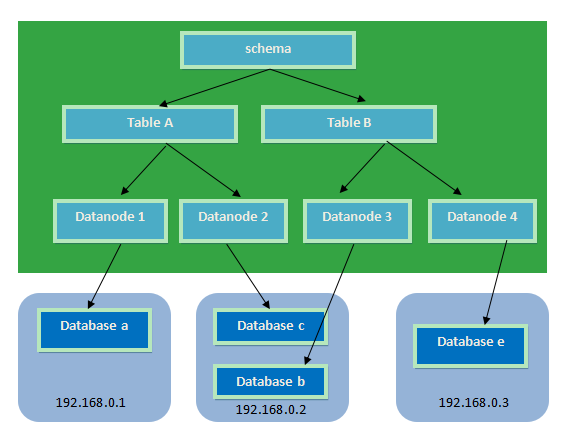

# Mysql

## 安装与配置

### 安装

```shell
# 下载mysql源安装包
wget http://dev.mysql.com/get/mysql57-community-release-el7-8.noarch.rpm
# 安装mysql源
yum localinstall mysql57-community-release-el7-8.noarch.rpm
```

检查mysql源是否安装成功

```shell
yum repolist enabled | grep "mysql.*-community.*"
```

安装Mysql

```shell
yum install mysql-community-server
```

启动Mysql服务

```shell
systemctl start mysqld
```

查看MySQL的启动状态

```shell
systemctl status mysqld
```

### 开机启动

```shell
systemctl enable mysqld
systemctl daemon-reload
```

mysql安装完成之后，在/var/log/mysqld.log文件中给root生成了一个默认密码。通过下面的方式找到root默认密码，然后登录mysql进行修改：

```shell
# 首次安装必须先启动这个文件里才有密码
grep 'temporary password' /var/log/mysqld.log
```

### 修改初始密码

```shell
mysql> ALTER USER 'root'@'localhost' IDENTIFIED BY 'MyNewPass4!'; 
# 或者
mysql> set password for 'root'@'localhost'=password('MyNewPass4!');
```


mysql5.7默认安装了密码安全检查插件（validate_password），默认密码检查策略要求密码必须包含：大小写字母、数字和特殊符号，并且长度不能少于8位。否则会提示ERROR 1819 (HY000): Your password does not satisfy the current policy requirements错误。

### 修改密码策略

在/etc/my.cnf文件添加validate_password_policy配置，指定密码策略

```shell
# 选择0（LOW），1（MEDIUM），2（STRONG）其中一种，选择2需要提供密码字典文件
validate_password_policy=0
```

如果不需要密码策略，添加my.cnf文件中添加如下配置禁用即可：

```shell
validate_password = off
```

重新启动mysql服务使配置生效：

```shell
systemctl restart mysqld
```

### 添加远程登录用户

默认只允许root帐户在本地登录，如果要在其它机器上连接mysql，必须修改root允许远程连接，或者添加一个允许远程连接的帐户，为了安全起见，我添加一个新的帐户：

```shell
mysql> GRANT ALL PRIVILEGES ON *.* TO 'yangxin'@'%' IDENTIFIED BY 'Yangxin0917!' WITH GRANT OPTION;
```

### 配置默认编码为utf8

修改/etc/my.cnf配置文件，在[mysqld]下添加编码配置，如下所示：

```shell
[mysqld]
character_set_server=utf8
init_connect='SET NAMES utf8'
```

## 索引


## 性能优化


## InnoDB的锁机制


## 集群之主从复制

### master服务器配置

#### 第一步：修改my.cnf文件：

默认安装，my.cnf在`/etc/`下

在[mysqld]段下添加：

```shell
[mysqld]
#启用二进制日志（文件名类似mysql-bin000001.log）
log-bin=mysql-bin
#服务器唯一ID，一般取IP最后一段
server-id=63
```

#### 第二步：重启mysql服务

```shell
systemctl restart mysqld.service
```

#### 第三步：在主服务器上建立帐户并授权slave

```mysql
mysql>GRANT FILE ON *.* TO 'username'@'%' IDENTIFIED BY 'user-password';
mysql>GRANT REPLICATION SLAVE, REPLICATION CLIENT ON *.* to 'username'@'%' identified by 'user-password'; 
```

一般不用root帐号，“%”表示所有客户端都可能连，只要帐号，密码正确，此处可用具体客户端IP代替，如192.168.145.226，加强安全。

刷新权限

```mysql
mysql> FLUSH PRIVILEGES;
```

查看mysql现在有哪些用户

```mysql
mysql>select user,host from mysql.user;
```

####  第四步：查询master的状态

```shell
show master status;
```

```tex
+------------------+----------+--------------+------------------+-------------------+
| File             | Position | Binlog_Do_DB | Binlog_Ignore_DB | Executed_Gtid_Set |
+------------------+----------+--------------+------------------+-------------------+
| mysql-bin.000004 |      879 |              |                  |                   |
+------------------+----------+--------------+------------------+-------------------+
```


### slave服务器配置

#### 第一步：修改my.cnf文件

在[mysqld]段下添加：

```shell
[mysqld]
#服务器唯一ID，一般取IP最后一段
server-id=64
```

####  第二步：删除UUID文件

错误处理：
如果出现此错误：

```shell
Fatal error: The slave I/O thread stops because master and slave have equal MySQL server UUIDs; these UUIDs must be different for replication to work.
```

因为是mysql是克隆的系统所以mysql的uuid是一样的，所以需要修改。

解决方法：
删除/var/lib/mysql/auto.cnf文件，重新启动服务。

#### 第三步：配置从服务器

```mysql
mysql>change master to master_host='192.168.1.63',master_port=3306,master_user='root',master_password='root',master_log_file='mysql-bin.000001',master_log_pos=120 
```

注意语句中间不要断开，master_port为mysql服务器端口号(无引号)，master_user为执行同步操作的数据库账户，“120”无单引号(此处的120就是show master status 中看到的position的值，这里的mysql-bin.000001就是file对应的值)。

> 注：
>
> **从服务器可以设置为为只读**
> 在从服务器上设置：
> read_only = ON 
>
> 或者
>
> ```mysql
> mysql> set global read_only=1; #1是只读，0是读写
> ```
>
> 注意:set global read_only=1 对拥有super权限的账号是不生效的，所以在授权账号的时候尽量避免添加super权限
>
> 然后
>
> ```mysql
> mysql>FLUSH TABLES WITH READ LOCK;
> ```


#### 第四步：启动从服务器复制功能

```mysql
mysql>start slave; 
```

####  第五步：检查从服务器复制功能状态：

```mysql
 mysql> show slave status;
```

```te
……………………(省略部分)
Slave_IO_Running: Yes //此状态必须YES
Slave_SQL_Running: Yes //此状态必须YES
……………………(省略部分)
```

注：Slave_IO及Slave_SQL进程必须正常运行，即YES状态，否则都是错误的状态(如：其中一个NO均属错误)。

#### 注意：主从之间的防火墙需要配置

## 集群之读写分离


#### MySQL-Proxy下载安装

**首先准备一台机器作为Mysql-proxy。**

https://downloads.mysql.com/archives/proxy/

```shell
wget https://downloads.mysql.com/archives/get/file/mysql-proxy-0.8.5-linux-el6-x86-64bit.tar.gz
tar zxvf mysql-proxy-0.8.5-linux-el6-x86-64bit.tar.gz
```

#### MySQL-Proxy配置

#### 创建mysql-proxy.cnf

```shell
[mysql-proxy]
user=root
admin-username=root
admin-password=root
# mysql-proxy的地址，在这里是本机地址 mysql-proxy运行ip和端口，不加端口，默认4040
proxy-address=192.168.1.65:4040
#指定后端主master写入数据 
proxy-backend-addresses=192.168.1.66:3306
#指定后端从slave读取数据
proxy-read-only-backend-addresses=192.168.1.66:3306
# rw-splitting.lua文件的位置，在mysql-proxy解压路径下的/share/doc/mysql-proxy中
proxy-lua-script=/home/soft/mysql-proxy/share/doc/mysql-proxy/rw-splitting.lua
log-file=/home/soft/mysql-proxy/mysql-proxy.log
log-level=debug
keepalive=true
daemon=true
```

#### 修改mysql-proxy.cnf权限

```shell
# 赋读写权
chmod 777 mysql-proxy.cnf
```


#### 修改rw-splitting.lua脚本

```shell
vi /home/soft/mysql-proxy/share/doc/mysql-proxy/rw-splitting.lua
```

根据需要修改设置读写分离的条件

```shell
# 大约在37-45行，设置读写分离的条件
min_idle_connections
max_idle_connections 
```

#### MySQL-Proxy启动域测试

```shell
# 启动
mysql-proxy --defaults-file=mysql-proxy.cnf # 配置文件地址
```

注意事项：如果没有配置profile文件的环境变量，则需要去拥有mysql-proxy命令的目录通过./mysql-proxy进行启动。

```shell
mysql -h192.168.1.65 -uroot -proot -P4040
```


## 分库分表之MyCat实现

官网：http://www.mycat.io/

数据的切分：

1、垂直切分：按照业务切分，不同模块的表切分到不同的数据库

2、水平切分：将数据量打的表按照一定规则，按照行数且分到不同数据库中

>单库切分：将订单表拆分为订单1表、订单2表...
>
>多库切分：将订单表拆分到不同数据库中，表名还是订单表
>
>切分规则：
>
>​	id的hash操作
>
>​	根据日期
>
>​	根据id范围
>
>​	....
>
>切分之后的查询：
>
>​	将每个表的查询结果整合到一起。

### MyCat架构图


### Mycat解决的问题

* 海量数据存储

* 查询优化


### Mycat存在的问题以一些解决方案

* 跨库join
  * 通过业务分析，将join分为多个select语句
  * 建立全局表（每个库中都有一个相同的表）
  * 冗余字段
  * E-R分片（将有关系的记录存储到一个库中）
  * Mycat最多支持跨两个库的join
* 分布式事务（Mycat只支持弱分布式事务）
  * 强一致性事务（同步）
  * 最终一致性（异步）
* 分布式主键
  * redis incr 命令
  * 数据库（生成主键）
  * UUID
  * snowflake算法（雪花算法，twitter的）

### Mycat安装配置

Mycat

#### 需求

将商品表分片存储到三个数据节点上。

#### 安装环境

**192.168.1.63：**

centos7、mysql-5.7

数据库名：db1、db2、db3

**192.168.1.64：**

centos7、mycat

#### 安装

##### 下载解压缩

```shell
wget http://dl.mycat.io/1.6.6.1/Mycat-server-1.6.6.1-release-20181031195535-linux.tar.gz

tar -zxvf Mycat-server-1.6.6.1-release-20181031195535-linux.tar.gz
```

##### 启动

```shell
# 改名
mv Mycat-server-1.6.6.1-release-20181031195535-linux.tar.gz mycat
cd mycat/bin
# 启动
./mycat start
# 停止
#./mycat stop
# 重启
#./mycat restart
```

### MyCat分片

#### MyCat分片图



1、**Schema**：逻辑库，与MySQL中的Database（数据库）对应，一个逻辑库中定义了所包括的Table。

2、**Table**：表，即物理数据库中存储的某一张表，与传统数据库不同，这里的表格需要声明其所存储的逻辑数据节点DataNode。**在此可以指定表的分片规则。**

3、**DataNode**：MyCAT的逻辑数据节点，是存放table的具体物理节点，也称之为分片节点，通过DataSource来关联到后端某个具体数据库上

4、**DataSource**：定义某个物理库的访问地址，用于捆绑到Datanode上


#### Mycat分片配置

注意：若是LINUX版本的MYSQL，则需要设置为Mysql大小写不敏感，否则可能会发生表找不到的问题。
在MySQL的配置文件中my.ini [mysqld] 中增加一行

```shell
lower_case_table_names= 1
```

#####配置 schema.xml

```xml
<?xml version="1.0"?>
<!DOCTYPE mycat:schema SYSTEM "schema.dtd">
<mycat:schema xmlns:mycat="http://org.opencloudb/">
	<!-- 
		name属性:
		server.xml中配置的用户的schema属性就是此处指定的。
		这个名称需要与java代码中的数据库名一致。
		spring.datasource.url=jdbc:mysql://localhost:3306/TESTDB?useUnicode=true&characterEncoding=utf-8
		sqlMaxLimit属性：此处指定是sql语句默认查100条记录，相当于给sql加了limit属性
	-->
	<schema name="TESTDB" checkSQLschema="false" sqlMaxLimit="100">
		<!-- auto sharding by id (long) -->
        <!-- name属性是数据库的表名-->
        <!-- rule属性是分片的规则，在rule.xml中指定,每一个配置规则在mycat/conf目录下都有对应的文件-->
        <!--分库分表-->
        <!--
			一个dataNode属性配置了多个dataNode表示分表到多个dataNode上。
			不同的表配置到不同的dataNode上表示不同表的分库处理
		-->
		<table name="item" dataNode="dn1,dn2,dn3" rule="mod-long" />
		<table name="user" dataNode="dn4" rule="auto-sharding-long" />
       		
		<table name="TB_USER" primaryKey="ID" type="global" dataNode="dn1,dn2" />
	</schema>
    <!-- 分片配置 -->
    <!--dataHost属性中的值类似别名的概念-->
	<dataNode name="dn1" dataHost="localhost1" database="db1" />
	<dataNode name="dn2" dataHost="localhost1" database="db2" />
	<dataNode name="dn3" dataHost="localhost1" database="db3" />
    <!--<dataNode name="dn4" dataHost="localhost2" database="db4" />-->
     <!-- 物理数据库配置 -->
    <!--可以配置多个dataHost-->
	<dataHost name="localhost1" maxCon="1000" minCon="10" balance="0"
		writeType="0" dbType="mysql" dbDriver="native" switchType="1"  slaveThreshold="100">
		<heartbeat>select user()</heartbeat>
		<!-- can have multi write hosts -->
		<writeHost host="hostM1" url="192.168.1.63:3306" user="root"
			password="root">
			<!-- can have multi read hosts -->
		</writeHost>
	</dataHost>
    <!--
    <dataHost name="localhost2" maxCon="1000" minCon="10" balance="0"
		writeType="0" dbType="mysql" dbDriver="native" switchType="1"  slaveThreshold="100">
		<heartbeat>select user()</heartbeat>
		<writeHost host="hostM1" url="192.168.1.64:3306" user="root"
			password="root">
		</writeHost>
	</dataHost>
	-->
</mycat:schema>
```


##### 配置server.xml

配置一个`<user>`标签

```xml
<user name="test">
    <!-- 连接mycat的密码 -->
    <property name="password">test</property>
    <!-- 与schema.xml中配置的<schemas>标签名相关-->
    <property name="schemas">TESTDB</property>
    <!--是否是只读用户-->
    <property name="readOnly">true</property>
    <!-- 表级 DML 权限设置 -->
        <!--        
        <privileges check="false">
            <schema name="TESTDB" dml="0110" >
                <table name="tb01" dml="0000"></table>
                <table name="tb02" dml="1111"></table>
            </schema>
        </privileges>       
         -->
</user>
```


##### 配置rule.xml

rule.xml里面就定义了我们对表进行拆分所涉及到的规则定义。我们可以灵活的对表使用不同的分片算法，或者对表使用相同的算法但具体的参数不同。这个文件里面主要有tableRule和function这两个标签。在具体使用过程中可以按照需求添加tableRule和function。

此配置文件可以不用修改，使用默认即可。

#### Mycat读写分离

##### 配置

Mycat的读写分离是基于mysql的主从复制来完成的。

只需要在搭建了主从复制的节点的`<writeHost>`标签中配置子标签`<readHost>`，两个节点必须配置了主从复制

```xml
<dataHost name="localhost2" maxCon="1000" minCon="10" balance="0"
	writeType="0" dbType="mysql" dbDriver="native" switchType="1"  slaveThreshold="100">
	<heartbeat>show slave status</heartbeat>
	<writeHost host="hostM" url="192.168.1.64:3306" user="root"
		password="root">
        <!-- 192.168.1.65 和 192.168.1.64 必须配置了mysql的主从复制-->
		<readHost host="hostS" url="192.168.1.65:3306" user="root" password="root" />
	</writeHost>
</dataHost>
```
#####标签属性解释

**(1)**  **设置 balance="1"与writeType="0"**

Balance参数设置：

* balance=“0”, 所有读操作都发送到当前可用的writeHost上。

* balance=“1”，所有读操作都随机的发送到readHost。

* balance=“2”，所有读操作都随机的在writeHost、readhost上分发

WriteType参数设置：

* writeType=“0”, 所有写操作都发送到可用的writeHost上。

*  writeType=“1”，所有写操作都随机的发送到readHost。

* writeType=“2”，所有写操作都随机的在writeHost、readhost分上发。

 “readHost是从属于writeHost的，即意味着它从那个writeHost获取同步数据，因此，当它所属的writeHost宕机了，则它也不会再参与到读写分离中来，即“不工作了”，这是因为此时，它的数据已经“不可靠”了。基于这个考虑，目前mycat 1.3和1.4版本中，若想支持MySQL一主一从的标准配置，并且在主节点宕机的情况下，从节点还能读取数据，则需要在Mycat里配置为两个writeHost并设置banlance=1。”

**(2)**  **设置 switchType="2" 与slaveThreshold="100"**

**switchType** **目前有三种选择：**

* switchType="-1"：表示不自动切换

* switchType="1" ：默认值，自动切换

* switchType="2" ：基于MySQL主从同步的状态决定是否切换

“Mycat心跳检查语句配置为 show slave status ，dataHost 上定义两个新属性： switchType="2" 与slaveThreshold="100"，此时意味着开启MySQL主从复制状态绑定的读写分离与切换机制。Mycat心跳机制通过检测 show slave status 中的 "Seconds_Behind_Master", "Slave_IO_Running", "Slave_SQL_Running" 三个字段来确定当前主从同步的状态以及Seconds_Behind_Master主从复制时延。“

## Mysql中遇到的坑

### order by， limit 排序分页数据重复问题

在`Mysql5.6以及5.7`版本（再往上的版本未测试）中，当我们进行排序并且分页的时候，或出现数据重复或丢失的问题。

原因：

> 在MySQL 5.6的以上的版本中，优化器在遇到order by limit语句的时候，做了一个优化，即使用了priority queue。使用 priority queue 的目的，就是在不能使用索引有序性的时候，如果要排序，并且使用了limit n，那么只需要在排序的过程中，保留n条记录即可，这样虽然不能解决所有记录都需要排序的开销，但是只需要 sort buffer 少量的内存就可以完成排序。之所以这些版本出现了第二页数据重复的问题，是因为 priority queue 使用了堆排序的排序方法，而堆排序是一个不稳定的排序方法，也就是相同的值可能排序出来的结果和读出来的数据顺序不一致。5.5 没有这个优化，所以也就不会出现这个问题。


---


解决办法：

>1、 加上索引排序
>​         `select * from table order by xx,id（任意有索引的字段） limit 0,10`
>
>2、给xx字段加上索引
>​         作为验证，您可以在这个字段上加索引 
>
>​	 `alter table tea_course_sort add index(course_sort_order)`
>
>​	然后由于这个表数目太小，以防加索引都未必能用得上，语句修改为
>​       `select * from tea_course_sort  force index(course_sort_order) order by tea_course_sort.course_sort_order desc  limit 0,10;`


​         