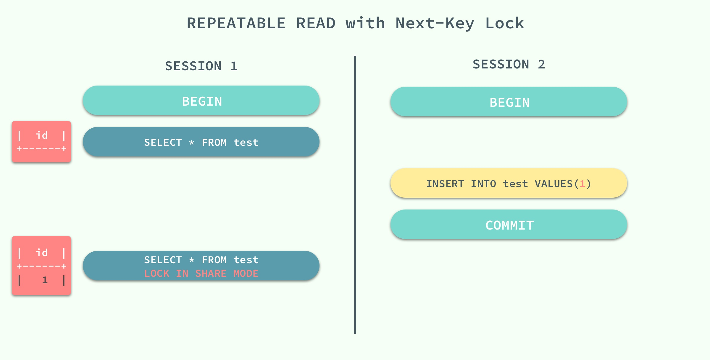

# Mysql

## 数据库三大范式


**第一范式（1NF）**：数据表中的每一列（每个字段）必须是不可拆分的最小单元，也就是确保每一列的原子性；


**第二范式（2NF）**：满足1NF后，要求表中的所有列，都必须依赖于主键，而不能有任何一列与主键没有关系，也就是说一个表只描述一件事情；

​	例如：订单表只描述订单相关的信息，所以所有字段都必须与订单id相关       产品表只描述产品相关的信息，所以所有字段都必须与产品id相 关；因此不能在一张表中同时出现订单信息与产品信息；如下图所示：


**第三范式（3NF）**：必须先满足第二范式（2NF），要求：表中的每一列只与主键直接相关而不是间接相关，（表中的每一列只能依赖于主键）；

​	 例如：订单表中需要有客户相关信息，在分离出客户表之后，订单表中只需要有一个用户id即可，而不能有其他的客户信息。因为其他的客户信息直接关联于用户id，而不是直接与订单id直接相关。


## 安装与配置

### 安装

```shell
# 下载mysql源安装包
wget http://dev.mysql.com/get/mysql57-community-release-el7-8.noarch.rpm
# 安装mysql源
yum localinstall mysql57-community-release-el7-8.noarch.rpm
```

检查mysql源是否安装成功

```shell
yum repolist enabled | grep "mysql.*-community.*"
```

安装Mysql

```shell
yum install mysql-community-server
```

启动Mysql服务

```shell
systemctl start mysqld
```

查看MySQL的启动状态

```shell
systemctl status mysqld
```

### 开机启动

```shell
systemctl enable mysqld
systemctl daemon-reload
```

mysql安装完成之后，在/var/log/mysqld.log文件中给root生成了一个默认密码。通过下面的方式找到root默认密码，然后登录mysql进行修改：

```shell
# 首次安装必须先启动这个文件里才有密码
grep 'temporary password' /var/log/mysqld.log
```

### 修改初始密码

```shell
mysql> ALTER USER 'root'@'localhost' IDENTIFIED BY 'MyNewPass4!'; 
# 或者
mysql> set password for 'root'@'localhost'=password('MyNewPass4!');
```


mysql5.7默认安装了密码安全检查插件（validate_password），默认密码检查策略要求密码必须包含：大小写字母、数字和特殊符号，并且长度不能少于8位。否则会提示ERROR 1819 (HY000): Your password does not satisfy the current policy requirements错误。

### 修改密码策略

在/etc/my.cnf文件添加validate_password_policy配置，指定密码策略

```shell
# 选择0（LOW），1（MEDIUM），2（STRONG）其中一种，选择2需要提供密码字典文件
validate_password_policy=0
```

如果不需要密码策略，添加my.cnf文件中添加如下配置禁用即可：

```shell
validate_password = off
```

重新启动mysql服务使配置生效：

```shell
systemctl restart mysqld
```

### 添加远程登录用户

默认只允许root帐户在本地登录，如果要在其它机器上连接mysql，必须修改root允许远程连接，或者添加一个允许远程连接的帐户，为了安全起见，我添加一个新的帐户：

```shell
mysql> GRANT ALL PRIVILEGES ON *.* TO 'yangxin'@'%' IDENTIFIED BY 'Yangxin0917!' WITH GRANT OPTION;
```

### 配置默认编码为utf8

修改/etc/my.cnf配置文件，在[mysqld]下添加编码配置，如下所示：

```shell
[mysqld]
character_set_server=utf8
init_connect='SET NAMES utf8'
```


## 索引


### 先看看几种树形结构

​	**二叉查找树（Binary Search Tree）**，（又：[二叉搜索树](https://baike.baidu.com/item/%E4%BA%8C%E5%8F%89%E6%90%9C%E7%B4%A2%E6%A0%91/7077855)，二叉排序树）它或者是一棵空树，或者是具有下列性质的[二叉树](https://baike.baidu.com/item/%E4%BA%8C%E5%8F%89%E6%A0%91/1602879)： 若它的左子树不空，则左子树上所有结点的值均小于它的根结点的值； 若它的右子树不空，则右子树上所有结点的值均大于它的根结点的值； 它的左、右子树也分别为[二叉排序树](https://baike.baidu.com/item/%E4%BA%8C%E5%8F%89%E6%8E%92%E5%BA%8F%E6%A0%91/10905079)。**每个节点有两个子节点，数据量的增大必然导致高度的快速增加，显然这个不适合作为大量数据存储的基础结构。**

​	**B树**：一棵m阶B树是一棵平衡的m路搜索树。最重要的性质是每个非根节点所包含的关键字个数 j 满足：┌m/2┐ - 1 <= j <= m - 1；一个节点的子节点数量会比关键字个数多1，这样关键字就变成了子节点的分割标志。一般会在图示中把关键字画到子节点中间，非常形象，也容易和后面的B+树区分。由于数据同时存在于叶子节点和非叶子结点中，无法简单完成按顺序遍历B树中的关键字，必须用中序遍历的方法。

​	**B+树**：一棵m阶B树是一棵平衡的m路搜索树。最重要的性质是每个非根节点所包含的关键字个数 j 满足：┌m/2┐ - 1 <= j <= m；子树的个数最多可以与关键字一样多。非叶节点存储的是子树里最小的关键字。同时数据节点只存在于叶子节点中，且叶子节点间增加了横向的指针，这样顺序遍历所有数据将变得非常容易。

​	 **B*树**：一棵m阶B树是一棵平衡的m路搜索树。最重要的两个性质是1每个非根节点所包含的关键字个数 j 满足：┌m2/3┐ - 1 <= j <= m；2非叶节点间添加了横向指针。


[具体树的性质及其他详情请参照数据结构与算法](数据结构与算法.md)


### 索引原理


​	**InnoDB使用的是聚簇索引**，将主键组织到一棵B+树中，而行数据就储存在叶子节点上，如果根据主键查询，则按照B+树的检索算法即可查找到对应的叶节点，获得行数据。若对其他列（建立索引）进行搜索，则需要两个步骤：第一步在辅助索引B+树中检索Name，到达其叶子节点获取对应的主键。第二步使用主键在主索引B+树中再执行一次主B+树检索操作，最终到达叶子节点即可获取整行数据。

​	**MyISM使用的是非聚簇索引**，非聚簇索引的两棵B+树看上去没什么不同，节点的结构完全一致只是存储的内容不同而已，主键索引B+树的节点存储了主键，辅助键索引B+树存储了辅助键。表数据存储在独立的地方，这两颗B+树的叶子节点都使用一个地址指向真正的表数据，对于表数据来说，这两个键没有任何差别。由于索引树是独立的，通过辅助键检索无需访问主键的索引树。


​	我们重点关注聚簇索引，看上去聚簇索引的效率明显要低于非聚簇索引，因为每次使用辅助索引检索都要经过两次B+树查找，这不是多此一举吗？聚簇索引的优势在哪？

　　1. 由于行数据和叶子节点存储在一起，这样主键和行数据是一起被载入内存的，找到叶子节点就可以立刻将行数据返回了，如果按照主键Id来组织数据，获得数据更快。

　　2. 辅助索引使用主键作为"指针" 而不是使用地址值作为指针的好处是，减少了当出现行移动或者数据页分裂时辅助索引的维护工作，使用主键值当作指针会让辅助索引占用更多的空间，换来的好处是InnoDB在移动行时无须更新辅助索引中的这个"指针"。也就是说行的位置（实现中通过16K的Page来定位，后面会涉及）会随着数据库里数据的修改而发生变化（前面的B+树节点分裂以及Page的分裂），使用聚簇索引就可以保证不管这个主键B+树的节点如何变化，辅助索引树都不受影响。


#### Page结构

​	Page是整个InnoDB存储的最基本构件，也是InnoDB磁盘管理的最小单位，与数据库相关的所有内容都存储在这种Page结构里。Page分为几种类型，常见的页类型有**数据页（B-tree Node）**，**Undo页（Undo Log Page）**，**系统页（System Page）** ，**事务数据页（Transaction System Page）**等。单个Page的大小是16K（编译宏UNIV_PAGE_SIZE控制）。每个Page使用一个32位的int值来唯一标识，这也正好对应InnoDB最大64TB的存储容量（16Kib * 2^32 = 64Tib）。一个Page的基本结构如下图所示：


​	每个Page都有通用的头和尾，但是中部的内容根据Page的类型不同而发生变化。Page的头部里有我们关心的一些数据，下图把Page的头部详细信息显示出来：


​	Page的头部保存了两个指针，分别指向Previous Page和Next Page，头部还有Page的类型信息和用来唯一标识Page的编号。根据这两个指针我们很容易想象出Page链接起来就是一个双向链表的结构。

​	


​	再看看Page的主体内容，我们主要关注**行数据和索引的存储**，他们都位于Page的User Records部分，User Records占据Page的大部分空间，User Records由一条一条的Record组成，每条记录代表索引树上的一个节点（非叶子节点和叶子节点）。在一个Page内部，单链表的头尾由固定内容的两条记录来表示，字符串形式的"Infimum"代表开头，"Supremum"代表结尾。这两个用来代表开头结尾的Record存储在System Records的段里，这个System Records和User Records是两个平行的段。InnoDB存在4种不同的Record，它们分别是**1. 主键索引树非叶节点**，**2. 主键索引树叶子节点**， **3. 辅助键索引树非叶节点** ，**4. 辅助键索引树叶子节点**。这4种节点的Record格式有一些差异，但是它们都存储着Next指针指向下一个Record。后续我们会详细介绍这4种节点，现在只需要把Record当成一个**存储了数据同时含有Next指针的单链表节点**即可。


​	User Record在Page内以单链表的形式存在，最初数据是按照插入的先后顺序排列的，但是随着新数据的插入和旧数据的删除，数据物理顺序会变得混乱，但他们依然**保持着逻辑上的先后顺序**。


​	把User Record的组织形式和若干Page组合起来，就看到了稍微完整的形式。

​	

现在看下如何定位一个Record：

1. 通过根节点开始遍历一个索引的B+树，通过各层非叶子节点最终到达一个Page，这个Page里存放的都是叶子节点。
2. 在Page内从"Infimum"节点开始遍历单链表（这种遍历往往会被优化），如果找到该键则成功返回。如果记录到达了"supremum"，说明当前Page里没有合适的键，这时要借助Page的Next Page指针，跳转到下一个Page继续从"Infimum"开始逐个查找。


​	详细看下不同类型的Record里到底存储了什么数据，根据B+树节点的不同，User Record可以被分成四种格式，下图种按照颜色予以区分。

1. **主索引树非叶节点（绿色）**
   1. 子节点存储的主键里最小的值（Min Cluster Key on Child），这是B+树必须的，作用是在一个Page里定位到具体的记录的位置。
   2. 最小的值所在的Page的编号（Child Page Number），作用是定位Record。

2. **主索引树叶子节点（黄色）**

   1. 主键（Cluster Key Fields），B+树必须的，也是数据行的一部分

   2. 除去主键以外的所有列（Non-Key Fields），这是数据行的除去主键的其他所有列的集合。

      这里的1和2两部分加起来就是一个完整的数据行。

3. **辅助索引树非叶节点非（蓝色）**
   1. 子节点里存储的辅助键值里的最小的值（Min Secondary-Key on Child），这是B+树必须的，作用是在一个Page里定位到具体的记录的位置。
   2. 主键值（Cluster Key Fields），非叶子节点为什么要存储主键呢？因为辅助索引是可以不唯一的，但是B+树要求键的值必须唯一，所以这里把辅助键的值和主键的值合并起来作为在B+树中的真正键值，保证了唯一性。但是这也导致在辅助索引B+树中非叶节点反而比叶子节点多了4个字节。（即下图中蓝色节点反而比红色多了4字节）
   3. 最小的值所在的Page的编号（Child Page Number），作用是定位Record。

4. **辅助索引树叶子节点（红色）**
   1. 辅助索引键值（Secondary Key Fields），这是B+树必须的。
   2. 主键值（Cluster Key Fields），用来在主索引树里再做一次B+树检索来找到整条记录。


​	


下面是本篇最重要的部分了，结合B+树的结构和前面介绍的4种Record的内容，我们终于可以画出一幅全景图。


​	把上图还原成下面这个更简洁的树形示意图，这就是B+树的一部分。注意**Page和B+树节点之间并没有一一对应的关系**，Page只是作为一个Record的保存容器，它存在的目的是便于对磁盘空间进行批量管理，上图中的编号为47的Page在树形结构上就被拆分成了两个独立节点。


### 索引失效的可能情况

1. **隐式转换导致索引失效.这一点应当引起重视.也是开发中经常会犯的错误。**

   由于表的字段tu_mdn定义为varchar2(20),但在查询时把该字段作为number类型以where条件传给MySQL，,这样会导致索引失效。

    错误的例子：select * fromtest where tu_mdn=13333333333;

    正确的例子：select * fromtest where tu_mdn='13333333333';

2. **对索引列进行运算导致索引失效,我所指的对索引列进行运算包括(+，-，\*，/，! 等)**

   错误的例子：select* from test where id-1=9;

   正确的例子：select * fromtest where id=10;

3. **使用MySQL致索引失效.对于这样情况应当创建基于函数的索引**。

4. **以下使用会使索引失效，应避免使用；**

    a. 使用 <> 、not in、not exist、!=

    b. like "%_"百分号在前（可采用在建立索引时用reverse(columnName)这种方法处理）

    c. 单独引用复合索引里非第一位置的索引列.应总是使用索引的第一个列，如果索引是建立在多个列上,只有在它的第一个列被 where子句引用时，优化器才会选择使用该索引。

    d.字符型字段为数字时在where条件里不添加引号.

     e.当变量采用的是times变量，而表的字段采用的是date变量时.或相反情况。

5. **不要将空的变量值直接与比较运算符（符号）比较。**

   如果变量可能为空，应使用 IS NULL 或 IS NOT NULL 进行比较，或者使用 ISNULL函数。

6. **不要在 SQL 代码中使用双引号。**

7. **将索引所在表空间和数据所在表空间分别设于不同的磁盘chunk上，有助于提高索引查询的效率。**

8. **Oracle默认使用的基于代价的SQL优化器（CBO）非常依赖于统计信息，一旦统计信息不正常，会导致数据库查询时不使用索引或使用错误的索引。**

9. **Oracle在进行一次查询时，一般对一个表只会使用一个索引。**

10. **优先且尽可能使用分区索引。**


## MyISAM与InnoDB区别

1. **InnoDB支持事务，MyISAM不支持事务。**对于InnoDB每一条SQL语句都默认封装成事务，自动提交，这样会影响速度，所以最好把多条SQL语句放在begin和commit之间，组成一个事务。

2. **InnoDB支持外键，而MyISAM不支持。**对于一个包含外键的InnoDB表转为MyISAM会失败。

3. **InnoDB是聚簇索引**，使用B+Tree作为索引结构，**数据文件是和主键索引绑在一起**表数据文件本身就是按B+Tree组织的一个索引结构），必须要有主键，通过主键索引效率很高。但是辅助索引需要两次查询，先查询到主键，然后再通过主键查询到数据。因此，主键不应该过大，因为主键太大，其他索引也都会很大。

    **MyISAM是非聚簇索引**，也是使用B+Tree作为索引结构，**索引和数据文件是分离的**，索引保存的是数据文件的指针。主键索引和辅助索引是独立的。

   也就是说：**InnoDB的B+树主键索引的叶子节点就是数据文件，辅助索引的叶子节点是主键的值；而MyISAM的B+树主键索引和辅助索引的叶子节点都是数据文件的地址指针。**

4. **InnoDB不保存表的具体行数**，执行select count(\*) from table时需要全表扫描。**而MyISAM用一个变量保存了整个表的行数**，执行上述语句时只需要读出该变量即可，速度很快；

5. Innodb不支持全文索引，而MyISAM支持全文索引，查询效率上MyISAM要高；**5.7以后的InnoDB支持全文索引了**

6. **MyISAM表格可以被压缩后进行查询操作**

7.  **InnoDB支持表、行(默认)级锁，而MyISAM支持表级锁**

   **InnoDB的行锁是实现在索引上的，而不是锁在物理行记录上。潜台词是，如果访问没有命中索引，也无法使用行锁，将要退化为表锁。**

   例如：

   > t_user(uid, uname, age, sex) innodb;
   >
   > * uid PK
   > * 无其他索引

   ```sql
   
   -- 命中索引，行锁。
   update t_user set age=10 where uid=1;             
   -- 未命中索引，表锁。
   update t_user set age=10 where uid != 1;          
   -- 无索引，表锁。
   update t_user set age=10 where name='shenjian';   
   ```

8. **InnoDB表必须有主键（用户没有指定的话会自己找或生成一个长度为6个字节，类型为长整形的主键），而Myisam可以没有**

9. **Innodb存储文件有frm、ibd，而Myisam是frm、MYD、MYI**

   ​        Innodb：frm是表定义文件，ibd是数据文件，InnoDB的数据文件本身就是索引文件。

   ​        Myisam：frm是表定义文件，myd是数据文件，myi是索引文件


## 数据库引擎的选择


1. 是否要支持事务，如果要请选择innodb，如果不需要可以考虑MyISAM；
2. 如果表中绝大多数都只是读查询，可以考虑MyISAM，如果既有读也有写，请使用InnoDB。
3. 系统奔溃后，MyISAM恢复起来更困难，能否接受；
4. MySQL5.5版本开始Innodb已经成为Mysql的默认引擎(之前是MyISAM)，说明其优势是有目共睹的，如果你不知道用什么，那就用InnoDB，至少不会差。


**innodb引擎的4大特性**

*  插入缓冲（insert buffer)
* 二次写(double write)
* 自适应哈希索引(ahi)
* 预读(read ahead)


## 锁机制

​	我们都知道锁的种类一般分为乐观锁和悲观锁两种，I**nnoDB 存储引擎中使用的就是悲观锁**，而按照锁的粒度划分，也可以分成行锁和表锁。


###并发控制机制

​	乐观锁和悲观锁其实都是并发控制的机制，同时它们在原理上就有着本质的差别；

 * 乐观锁是一种思想，它其实并不是一种真正的『锁』。**他会先尝试对资源进行修改，在写回时判断资源是否进行了改变，如果没有发生改变就写回，否则就会进行重试，在整个的执行过程中其实都没有对数据库进行加锁；**（CAS也是用了这种思想）
 * 悲观锁就是一种真正的锁了，它会在获取资源前对资源进行加锁，确保同一时刻只有有限的线程能够访问该资源，其他想要尝试获取资源的操作都会进入等待状态，直到该线程完成了对资源的操作并且释放了锁后，其他线程才能重新操作资源；

虽然乐观锁和悲观锁在本质上并不是同一种东西，一个是一种思想，另一个是一种真正的锁，但是它们都是一种并发控制机制。

​	乐观锁不会存在死锁的问题，但是由于更新后验证，所以当**冲突频率**和**重试成本**较高时更推荐使用悲观锁，而需要非常高的**响应速度**并且**并发量**非常大的时候使用乐观锁就能较好的解决问题（比较CAS来学习），在这时使用悲观锁就可能出现严重的性能问题；在选择并发控制机制时，需要综合考虑上面的四个方面（冲突频率、重试成本、响应速度和并发量）进行选择。


### 读锁与写锁（共享锁与互斥锁）

​	对数据的操作其实只有两种，也就是读和写，而数据库在实现锁时，也会对这两种操作使用不同的锁；InnoDB 实现了标准的行级锁，也就是共享锁（Shared Lock）和互斥锁（Exclusive Lock）；共享锁和互斥锁的作用其实非常好理解：

- **共享锁（读锁）**：允许事务对一条行数据进行读取；
- **互斥锁（写锁）**：允许事务对一条行数据进行删除或更新；


​	而它们的名字也暗示着各自的另外一个特性，共享锁之间是兼容的，而互斥锁与其他任意锁都不兼容：


​	稍微对它们的使用进行思考就能想明白它们为什么要这么设计，因为共享锁代表了读操作、互斥锁代表了写操作，所以我们可以在数据库中**并行读**，但是只能**串行写**，只有这样才能保证不会发生线程竞争，实现线程安全。


### 锁的粒度

​	无论是共享锁还是互斥锁其实都只是对某一个数据行进行加锁，InnoDB 支持多种粒度的锁，也就是行锁和表锁；为了支持多粒度锁定，InnoDB 存储引擎引入了意向锁（Intention Lock），意向锁就是一种表级锁。

与上一节中提到的两种锁的种类相似的是，意向锁也分为两种：

- **意向共享锁**：事务想要在获得表中某些记录的共享锁，需要在表上先加意向共享锁；
- **意向互斥锁**：事务想要在获得表中某些记录的互斥锁，需要在表上先加意向互斥锁；

随着意向锁的加入，锁类型之间的兼容矩阵也变得愈加复杂：


​	意向锁其实不会阻塞全表扫描之外的任何请求，它们的主要目的是为了表示**是否有人请求锁定表中的某一行数据**。

> 有的人可能会对意向锁的目的并不是完全的理解，我们在这里可以举一个例子：如果没有意向锁，当已经有人使用行锁对表中的某一行进行修改时，如果另外一个请求要对全表进行修改，那么就需要对所有的行是否被锁定进行扫描，在这种情况下，效率是非常低的；不过，在引入意向锁之后，当有人使用行锁对表中的某一行进行修改之前，会先为表添加意向互斥锁（IX），再为行记录添加互斥锁（X），在这时如果有人尝试对全表进行修改就不需要判断表中的每一行数据是否被加锁了，只需要通过等待意向互斥锁被释放就可以了。


### 锁的算法

​	到目前为止已经对 InnoDB 中锁的粒度有一定的了解，也清楚了在对数据库进行读写时会获取不同的锁，在这一小节将介绍锁是如何添加到对应的数据行上的，我们会分别介绍三种锁的算法：Record Lock、Gap Lock 和 Next-Key Lock。


#### Record Lock

记录锁（Record Lock）是加到**索引记录**上的锁，假设我们存在下面的一张表 `users`：

```sql
CREATE TABLE users(
    id INT NOT NULL AUTO_INCREMENT,
    last_name VARCHAR(255) NOT NULL,
    first_name VARCHAR(255),
    age INT,
    PRIMARY KEY(id),
    KEY(last_name),
    KEY(age)
);
```

​	如果我们使用 `id` 或者 `last_name` 作为 SQL 中 `WHERE` 语句的过滤条件，那么 InnoDB 就可以通过索引建立的 B+ 树找到行记录并添加索引，但是如果使用 `first_name` 作为过滤条件时，由于 InnoDB 不知道待修改的记录具体存放的位置，也无法对将要修改哪条记录提前做出判断就会锁定整个表。


#### Gap Lock

​	记录锁是在存储引擎中最为常见的锁，除了记录锁之外，InnoDB 中还存在间隙锁（Gap Lock），间隙锁是对索引记录中的一段连续区域的锁；当使用类似 `SELECT * FROM users WHERE id BETWEEN 10 AND 20 FOR UPDATE;` 的 SQL 语句时，就会阻止其他事务向表中插入 `id = 15` 的记录，因为整个范围都被间隙锁锁定了。

> 间隙锁是存储引擎对于性能和并发做出的权衡，并且只用于某些事务隔离级别。

​	虽然间隙锁中也分为共享锁和互斥锁，不过它们之间并不是互斥的，也就是不同的事务可以同时持有一段相同范围的共享锁和互斥锁，它唯一阻止的就是**其他事务向这个范围中添加新的记录**。


#### Next-Key Lock

​	Next-Key 锁相比前两者就稍微有一些复杂，它是记录锁和记录前的间隙锁的结合，在 `users` 表中有以下记录：

```shell
+------|-------------|--------------|-------+
|   id | last_name   | first_name   |   age |
|------|-------------|--------------|-------|
|    4 | stark       | tony         |    21 |
|    1 | tom         | hiddleston   |    30 |
|    3 | morgan      | freeman      |    40 |
|    5 | jeff        | dean         |    50 |
|    2 | donald      | trump        |    80 |
+------|-------------|--------------|-------+
```

如果使用 Next-Key 锁，那么 Next-Key 锁就可以在需要的时候锁定以下的范围：

```shell
(-∞, 21]
(21, 30]
(30, 40]
(40, 50]
(50, 80]
(80, ∞)
```

> 既然叫 Next-Key 锁，锁定的应该是当前值和后面的范围，但是实际上却不是，Next-Key 锁锁定的是当前值和前面的范围。

当我们更新一条记录，比如 `SELECT * FROM users WHERE age = 30 FOR UPDATE;`，InnoDB 不仅会在范围 `(21, 30]` 上加 Next-Key 锁，还会在这条记录后面的范围 `(30, 40]` 加间隙锁，所以插入 `(21, 40]` 范围内的记录都会被锁定。

Next-Key 锁的作用其实是为了解决幻读的问题，我们会在下一节谈事务的时候具体介绍。


### 死锁


​	既然 InnoDB 中实现的锁是悲观的，那么不同事务之间就可能会互相等待对方释放锁造成死锁，最终导致事务发生错误；想要在 MySQL 中制造死锁的问题其实非常容易：

​	

​	两个会话都持有一个锁，并且尝试获取对方的锁时就会发生死锁，不过 MySQL 也能在发生死锁时及时发现问题，并保证其中的一个事务能够正常工作，这对我们来说也是一个好消息。


#### mysql数据库死锁的产生原因及解决办法

在数据库中有两种基本的锁类型：排它锁（Exclusive Locks，即X锁）和共享锁（Share Locks，即S锁）。当数据对象被加上排它锁时，其他的事务不能对它读取和修改。加了共享锁的数据对象可以被其他事务读取，但不能修改。数据库利用这两 种基本的锁类型来对数据库的事务进行并发控制。之前已经讲过了。

##### 死锁的第一种情况

一个用户A 访问表A(锁住了表A),然后又访问表B；另一个用户B 访问表B(锁住了表B)，然后企图访问表A；这时用户A由于用户B已经锁住表B，它必须等待用户B释放表B才能继续，同样用户B要等用户A释放表A才能继续，这就死锁就产生了。

解决方法：

这种死锁比较常见，是由于程序的BUG产生的，除了调整的程序的逻辑没有其它的办法。仔细分析程序的逻辑，对于数据库的多表操作时，尽量按照相同的顺序进 行处理，尽量避免同时锁定两个资源，如操作A和B两张表时，总是按先A后B的顺序处理， 必须同时锁定两个资源时，要保证在任何时刻都应该按照相同的顺序来锁定资源。

##### 死锁的第二种情况

用户A查询一条纪录，然后修改该条纪录；这时用户B修改该条纪录，这时用户A的事务里锁的性质由查询的共享锁企图上升到独占锁，而用户B里的独占锁由于A 有共享锁存在所以必须等A释放掉共享锁，而A由于B的独占锁而无法上升的独占锁也就不可能释放共享锁，于是出现了死锁。这种死锁比较隐蔽，但在稍大点的项 目中经常发生。如在某项目中，页面上的按钮点击后，没有使按钮立刻失效，使得用户会多次快速点击同一按钮，这样同一段代码对数据库同一条记录进行多次操 作，很容易就出现这种死锁的情况。

解决方法：

1、对于按钮等控件，点击后使其立刻失效，不让用户重复点击，避免对同时对同一条记录操作。
2、使用乐观锁进行控制。乐观锁大多是基于数据版本（Version）记录机制实现。即为数据增加一个版本标识，在基于数据库表的版本解决方案中，一般是 通过为数据库表增加一个“version”字段来实现。读取出数据时，将此版本号一同读出，之后更新时，对此版本号加一。此时，将提交数据的版本数据与数 据库表对应记录的当前版本信息进行比对，如果提交的数据版本号大于数据库表当前版本号，则予以更新，否则认为是过期数据。乐观锁机制避免了长事务中的数据 库加锁开销（用户A和用户B操作过程中，都没有对数据库数据加锁），大大提升了大并发量下的系统整体性能表现。Hibernate 在其数据访问引擎中内置了乐观锁实现。需要注意的是，由于乐观锁机制是在我们的系统中实现，来自外部系统的用户更新操作不受我们系统的控制，因此可能会造 成脏数据被更新到数据库中。
3、使用悲观锁进行控制。悲观锁大多数情况下依靠数据库的锁机制实现，如Oracle的Select … for update语句，以保证操作最大程度的独占性。但随之而来的就是数据库性能的大量开销，特别是对长事务而言，这样的开销往往无法承受。如一个金融系统， 当某个操作员读取用户的数据，并在读出的用户数据的基础上进行修改时（如更改用户账户余额），如果采用悲观锁机制，也就意味着整个操作过程中（从操作员读 出数据、开始修改直至提交修改结果的全过程，甚至还包括操作员中途去煮咖啡的时间），数据库记录始终处于加锁状态，可以想见，如果面对成百上千个并发，这 样的情况将导致灾难性的后果。所以，采用悲观锁进行控制时一定要考虑清楚。

#####死锁的第三种情况

如果在事务中执行了一条不满足条件的update语句，则执行全表扫描，把行级锁上升为表级锁，多个这样的事务执行后，就很容易产生死锁和阻塞。类似的情 况还有当表中的数据量非常庞大而索引建的过少或不合适的时候，使得经常发生全表扫描，最终应用系统会越来越慢，最终发生阻塞或死锁。

解决方法：

SQL语句中不要使用太复杂的关联多表的查询；使用“执行计划”对SQL语句进行分析，对于有全表扫描的SQL语句，建立相应的索引进行优化。


[mysql数据库死锁的产生原因及解决办法](https://www.cnblogs.com/sivkun/p/7518540.html)


## 事务隔离级别


事务遵循ACID 四大特性：原子性（Atomicity）、一致性（Consistency）、隔离性（Isolation）和持久性（Durability）


### 几种隔离级别

事务的隔离性是数据库处理数据的几大基础之一，而隔离级别其实就是提供给用户用于在性能和可靠性做出选择和权衡的配置项。

ISO 和 ANIS SQL 标准制定了四种事务隔离级别，而 InnoDB 遵循了 SQL:1992 标准中的四种隔离级别：`READ UNCOMMITED`、`READ COMMITED`、`REPEATABLE READ` 和 `SERIALIZABLE`；每个事务的隔离级别其实都比上一级多解决了一个问题：

- `RAED UNCOMMITED`：使用查询语句不会加锁，可能会读到未提交的行（Dirty Read）；
- `READ COMMITED`：只对记录加记录锁，而不会在记录之间加间隙锁，所以允许新的记录插入到被锁定记录的附近，所以再多次使用查询语句时，可能得到不同的结果（Non-Repeatable Read）；
- `REPEATABLE READ`：多次读取同一范围的数据会返回第一次查询的快照，不会返回不同的数据行，但是可能发生幻读（Phantom Read）；
- `SERIALIZABLE`：InnoDB 隐式地将全部的查询语句加上共享锁，解决了幻读的问题；


​	MySQL 中默认的事务隔离级别就是 `REPEATABLE READ`，但是它通过 Next-Key 锁也能够在某种程度上解决幻读的问题。

​	


接下来，我们将数据库中创建如下的表并通过个例子来展示在不同的事务隔离级别之下，会发生什么样的问题：


### 脏读

> 在一个事务中，读取了其他事务未提交的数据。

当事务的隔离级别为 `READ UNCOMMITED` 时，我们在 `SESSION 2` 中插入的**未提交**数据在 `SESSION 1` 中是可以访问的。


### 不可重复读

> 在一个事务中，同一行记录被访问了两次却得到了不同的结果。

当事务的隔离级别为 `READ COMMITED` 时，虽然解决了脏读的问题，但是如果在 `SESSION 1` 先查询了**一行**数据，在这之后 `SESSION 2` 中修改了同一行数据并且提交了修改，在这时，如果 `SESSION 1` 中再次使用相同的查询语句，就会发现两次查询的结果不一样。


不可重复读的原因就是，在 `READ COMMITED` 的隔离级别下，存储引擎不会在查询记录时添加行锁，锁定 `id = 3` 这条记录。

### 幻读

> 在一个事务中，同一个范围内的记录被读取时，其他事务向这个范围添加了新的记录。

重新开启了两个会话 `SESSION 1` 和 `SESSION 2`，在 `SESSION 1` 中我们查询全表的信息，没有得到任何记录；在 `SESSION 2` 中向表中插入一条数据并提交；由于 `REPEATABLE READ` 的原因，再次查询全表的数据时，我们获得到的仍然是空集，但是在向表中插入同样的数据却出现了错误。


这种现象在数据库中就被称作幻读，虽然我们使用查询语句得到了一个空的集合，但是插入数据时却得到了错误，好像之前的查询是幻觉一样。

在标准的事务隔离级别中，**幻读是由更高的隔离级别 `SERIALIZABLE` 解决的，但是它也可以通过 MySQL 提供的 Next-Key 锁解决**：



`REPEATABLE READ` 和 `READ UNCOMMITED` 其实是矛盾的，如果保证了前者就看不到已经提交的事务，如果保证了后者，就会导致两次查询的结果不同，MySQL 为我们提供了一种折中的方式，能够在 `REPEATABLE READ` 模式下加锁访问已经提交的数据，其本身并不能解决幻读的问题，而是通过文章前面提到的 Next-Key 锁来解决。


[更加详细介绍查看](https://draveness.me/mysql-innodb)


## MySQL优化


### 规范


#### 一、基础规范


1. **必须使用InnoDB存储引擎**

   解读：支持事务、行级锁、并发性能更好、CPU及内存缓存页优化使得资源利用率更高

2. **必须使用UTF8字符集**

   解读：万国码，无需转码，无乱码风险，节省空间

3. **数据表、数据字段必须加入中文注释**

   解读：N年后谁tm知道这个r1,r2,r3字段是干嘛的

4. **禁止使用存储过程、视图、触发器、Event**

   解读：高并发大数据的互联网业务，架构设计思路是“解放数据库CPU，将计算转移到服务层”，并发量大的情况下，这些功能很可能将数据库拖死，业务逻辑放到服务层具备更好的扩展性，能够轻易实现“增机器就加性能”。数据库擅长存储与索引，CPU计算还是上移吧

5. **禁止存储大文件或者大照片**

   解读：为何要让数据库做它不擅长的事情？大文件和照片存储在文件系统，数据库里存URI多好


#### 二、命名规范

6. **只允许使用内网域名，而不是ip连接数据库**

7. **线上环境、开发环境、测试环境数据库内网域名遵循命名规范**

   业务名称：xxx

   线上环境：dj.xxx.db

   开发环境：dj.xxx.rdb

   测试环境：dj.xxx.tdb

   **从库**在名称后加-s标识，**备库**在名称后加-ss标识

   线上从库：dj.xxx-s.db

   线上备库：dj.xxx-sss.db

8. **库名、表名、字段名：小写，下划线风格，不超过32个字符，必须见名知意，禁止拼音英文混用**

9. **表名t_xxx，非唯一索引名idx_xxx，唯一索引名uniq_xxx**


#### 三、表设计规范

10. **单实例表数目必须小于500**

11. **单表列数目必须小于30**

12. **表必须有主键，例如自增主键**

    解读：

    a）主键递增，数据行写入可以提高插入性能，可以避免page分裂，减少表碎片提升空间和内存的使用

    b）主键要选择较短的数据类型， Innodb引擎普通索引都会保存主键的值，较短的数据类型可以有效的减少索引的磁盘空间，提高索引的缓存效率

    c） 无主键的表删除，在row模式的主从架构，会导致备库夯住

13. **禁止使用外键，如果有外键完整性约束，需要应用程序控制**

    解读：外键会导致表与表之间耦合，update与delete操作都会涉及相关联的表，十分影响sql 的性能，甚至会造成死锁。高并发情况下容易造成数据库性能，大数据高并发业务场景数据库使用以性能优先


#### 四、字段设计规范

14. **必须把字段定义为NOT NULL并且提供默认值**

    解读：

    a）null的列使索引/索引统计/值比较都更加复杂，对MySQL来说更难优化

    b）null 这种类型MySQL内部需要进行特殊处理，增加数据库处理记录的复杂性；同等条件下，表中有较多空字段的时候，数据库的处理性能会降低很多

    c）null值需要更多的存储空，无论是表还是索引中每行中的null的列都需要额外的空间来标识

    d）对null 的处理时候，只能采用is null或is not null，而不能采用=、in、<、<>、!=、not in这些操作符号。如：where name!=’shenjian’，如果存在name为null值的记录，查询结果就不会包含name为null值的记录

15. **禁止使用TEXT、BLOB类型**

    解读：会浪费更多的磁盘和内存空间，非必要的大量的大字段查询会淘汰掉热数据，导致内存命中率急剧降低，影响数据库性能。实在避免不了blob，请拆表；

16. **禁止使用小数存储货币**

    解读：使用整数吧，小数容易导致钱对不上

17. **必须使用varchar(20)存储手机号**

    解读：

    a）涉及到区号或者国家代号，可能出现+-()

    b）手机号会去做数学运算么？

    c）varchar可以支持模糊查询，例如：like“138%”

18. **禁止使用ENUM，可使用TINYINT代替**

    解读：

    a）增加新的ENUM值要做DDL操作

    b）ENUM的内部实际存储就是整数，你以为自己定义的是字符串？


#### 五、索引设计规范

19. **单表索引建议控制在5个以内**

20. **单索引字段数不允许超过5个**

    解读：字段超过5个时，实际已经起不到有效过滤数据的作用了

21. **禁止在更新十分频繁、区分度不高的属性上建立索引**

    解读：

    a）更新会变更B+树，更新频繁的字段建立索引会大大降低数据库性能

    b）“性别”这种区分度不大的属性，覆盖记录条数过多，建立索引是没有什么意义的，不能有效过滤数据，性能与全表扫描类似

22. **建立组合索引，必须把区分度高的字段放在前面**

    解读：能够更加有效的过滤数据


#### 六、SQL使用规范

23. **禁止使用SELECT \*，只获取必要的字段，需要显示说明列属性**

    解读：

    a）读取不需要的列会增加CPU、IO、NET消耗

    b）不能有效的利用覆盖索引

    c）使用SELECT *容易在增加或者删除字段后出现程序BUG

24. **禁止使用INSERT INTO t_xxx VALUES(xxx)，必须显示指定插入的列属性**

    解读：容易在增加或者删除字段后出现程序BUG

25. **禁止使用属性隐式转换**

    解读：SELECT uid FROM t_user WHERE phone=13812345678 会导致全表扫描，而不能命中phone索引，猜猜为什么？（这个线上问题不止出现过一次）

26. **禁止在WHERE条件的属性上使用函数或者表达式**

    解读：SELECT uid FROM t_user WHERE from_unixtime(day)>='2017-02-15' 会导致全表扫描

    正确的写法是：SELECT uid FROM t_user WHERE day>= unix_timestamp('2017-02-15 00:00:00')

27. **禁止负向查询，以及%开头的模糊查询**

    解读：

    a）负向查询条件：NOT、!=、<>、!<、!>、NOT IN、NOT LIKE等，会导致全表扫描

    b）%开头的模糊查询，会导致全表扫描

28. **禁止大表使用JOIN查询，禁止大表使用子查询**

    解读：会产生临时表，消耗较多内存与CPU，极大影响数据库性能

29. **禁止使用OR条件，必须改为IN查询**

    解读：旧版本Mysql的OR查询是不能命中索引的，即使能命中索引，为何要让数据库耗费更多的CPU帮助实施查询优化呢？

30. **应用程序必须捕获SQL异常，并有相应处理**


总结：大数据量高并发的互联网业务，极大影响数据库性能的都不让用，不让用哟。


### 性能优化经验

1. **为查询缓存优化你的查询**

   ```mysql
   // 查询缓存不开启
   $r = mysql_query("SELECT username FROM user WHERE signup_date >= CURDATE()");
   // 开启查询缓存
   $today = date("Y-m-d");
   $r = mysql_query("SELECT username FROM user WHERE signup_date >= '$today'");
   ```

    上面两条SQL语句的差别就是 CURDATE() ，MySQL的查询缓存对这个函数不起作用。所以，像 NOW() 和 RAND() 或是其它的诸如此类的SQL函数都不会开启查询缓存，因为这些函数的返回是会不定的易变的。所以，你所需要的就是用一个变量来代替MySQL的函数，从而开启缓存。

2. **EXPLAIN 你的 SELECT 查询**

3. **当只要一行数据时使用 LIMIT 1**

   当你查询表的有些时候，你已经知道结果只会有一条结果，但因为你可能需要去fetch游标，或是你也许会去检查返回的记录数。

   在这种情况下，加上 LIMIT 1 可以增加性能。这样一样，MySQL数据库引擎会在找到一条数据后停止搜索，而不是继续往后查少下一条符合记录的数据。

4. **为搜索字段建索引**

   但是以“%”开头的模糊查询是无法触发索引的。

5. **在Join表的时候使用相当类型的例，并将其索引**

6. **千万不要 ORDER BY RAND()**

7. **避免 SELECT ***

8. **永远为每张表设置一个ID**

9. **使用 ENUM 而不是 VARCHAR**

10. **从 PROCEDURE ANALYSE() 取得建议**

11. **尽可能的使用 NOT NULL**

12. **Prepared Statements**

13. **无缓冲的查询**

14. **把IP地址存成 UNSIGNED INT**

15. **固定长度的表会更快**

16. **垂直分割**

17. **拆分大的 DELETE 或 INSERT 语句**

    因为这两个操作是会锁表的，表一锁住了，别的操作都进不来了。

18. **越小的列会越快**

19. **选择正确的存储引擎**

20. **使用一个对象关系映射器（Object Relational Mapper）**

21. **小心“永久链接”**


 [MYSQL性能优化的最佳20+条经验](https://www.cnblogs.com/zhouyusheng/p/8038224.html)


## 集群之主从复制

### master服务器配置

#### 第一步：修改my.cnf文件：

默认安装，my.cnf在`/etc/`下

在[mysqld]段下添加：

```shell
[mysqld]
#启用二进制日志（文件名类似mysql-bin000001.log）
log-bin=mysql-bin
#服务器唯一ID，一般取IP最后一段
server-id=63
```

#### 第二步：重启mysql服务

```shell
systemctl restart mysqld.service
```

#### 第三步：在主服务器上建立帐户并授权slave

```mysql
mysql>GRANT FILE ON *.* TO 'username'@'%' IDENTIFIED BY 'user-password';
mysql>GRANT REPLICATION SLAVE, REPLICATION CLIENT ON *.* to 'username'@'%' identified by 'user-password'; 
```

一般不用root帐号，“%”表示所有客户端都可能连，只要帐号，密码正确，此处可用具体客户端IP代替，如192.168.145.226，加强安全。

刷新权限

```mysql
mysql> FLUSH PRIVILEGES;
```

查看mysql现在有哪些用户

```mysql
mysql>select user,host from mysql.user;
```

####  第四步：查询master的状态

```shell
show master status;
```

```tex
+------------------+----------+--------------+------------------+-------------------+
| File             | Position | Binlog_Do_DB | Binlog_Ignore_DB | Executed_Gtid_Set |
+------------------+----------+--------------+------------------+-------------------+
| mysql-bin.000004 |      879 |              |                  |                   |
+------------------+----------+--------------+------------------+-------------------+
```


### slave服务器配置

#### 第一步：修改my.cnf文件

在[mysqld]段下添加：

```shell
[mysqld]
#服务器唯一ID，一般取IP最后一段
server-id=64
```

####  第二步：删除UUID文件

错误处理：
如果出现此错误：

```shell
Fatal error: The slave I/O thread stops because master and slave have equal MySQL server UUIDs; these UUIDs must be different for replication to work.
```

因为是mysql是克隆的系统所以mysql的uuid是一样的，所以需要修改。

解决方法：
删除/var/lib/mysql/auto.cnf文件，重新启动服务。

#### 第三步：配置从服务器

```mysql
mysql>change master to master_host='192.168.1.63',master_port=3306,master_user='root',master_password='root',master_log_file='mysql-bin.000001',master_log_pos=120 
```

注意语句中间不要断开，master_port为mysql服务器端口号(无引号)，master_user为执行同步操作的数据库账户，“120”无单引号(此处的120就是show master status 中看到的position的值，这里的mysql-bin.000001就是file对应的值)。

> 注：
>
> **从服务器可以设置为为只读**
> 在从服务器上设置：
> read_only = ON 
>
> 或者
>
> ```mysql
> mysql> set global read_only=1; #1是只读，0是读写
> ```
>
> 注意:set global read_only=1 对拥有super权限的账号是不生效的，所以在授权账号的时候尽量避免添加super权限
>
> 然后
>
> ```mysql
> mysql>FLUSH TABLES WITH READ LOCK;
> ```


#### 第四步：启动从服务器复制功能

```mysql
mysql>start slave; 
```

####  第五步：检查从服务器复制功能状态：

```mysql
 mysql> show slave status;
```

```te
……………………(省略部分)
Slave_IO_Running: Yes //此状态必须YES
Slave_SQL_Running: Yes //此状态必须YES
……………………(省略部分)
```

注：Slave_IO及Slave_SQL进程必须正常运行，即YES状态，否则都是错误的状态(如：其中一个NO均属错误)。

#### 注意：主从之间的防火墙需要配置

## 集群之读写分离


#### MySQL-Proxy下载安装

**首先准备一台机器作为Mysql-proxy。**

https://downloads.mysql.com/archives/proxy/

```shell
wget https://downloads.mysql.com/archives/get/file/mysql-proxy-0.8.5-linux-el6-x86-64bit.tar.gz
tar zxvf mysql-proxy-0.8.5-linux-el6-x86-64bit.tar.gz
```

#### MySQL-Proxy配置

#### 创建mysql-proxy.cnf

```shell
[mysql-proxy]
user=root
admin-username=root
admin-password=root
# mysql-proxy的地址，在这里是本机地址 mysql-proxy运行ip和端口，不加端口，默认4040
proxy-address=192.168.1.65:4040
#指定后端主master写入数据 
proxy-backend-addresses=192.168.1.66:3306
#指定后端从slave读取数据
proxy-read-only-backend-addresses=192.168.1.66:3306
# rw-splitting.lua文件的位置，在mysql-proxy解压路径下的/share/doc/mysql-proxy中
proxy-lua-script=/home/soft/mysql-proxy/share/doc/mysql-proxy/rw-splitting.lua
log-file=/home/soft/mysql-proxy/mysql-proxy.log
log-level=debug
keepalive=true
daemon=true
```

#### 修改mysql-proxy.cnf权限

```shell
# 赋读写权
chmod 777 mysql-proxy.cnf
```


#### 修改rw-splitting.lua脚本

```shell
vi /home/soft/mysql-proxy/share/doc/mysql-proxy/rw-splitting.lua
```

根据需要修改设置读写分离的条件

```shell
# 大约在37-45行，设置读写分离的条件
min_idle_connections
max_idle_connections 
```

#### MySQL-Proxy启动域测试

```shell
# 启动
mysql-proxy --defaults-file=mysql-proxy.cnf # 配置文件地址
```

注意事项：如果没有配置profile文件的环境变量，则需要去拥有mysql-proxy命令的目录通过./mysql-proxy进行启动。

```shell
mysql -h192.168.1.65 -uroot -proot -P4040
```


## 分库分表之MyCat实现

官网：http://www.mycat.io/

数据的切分：

1、垂直切分：按照业务切分，不同模块的表切分到不同的数据库

2、水平切分：将数据量打的表按照一定规则，按照行数且分到不同数据库中

>单库切分：将订单表拆分为订单1表、订单2表...
>
>多库切分：将订单表拆分到不同数据库中，表名还是订单表
>
>切分规则：
>
>​	id的hash操作
>
>​	根据日期
>
>​	根据id范围
>
>​	....
>
>切分之后的查询：
>
>​	将每个表的查询结果整合到一起。

### MyCat架构图


### Mycat解决的问题

* 海量数据存储

* 查询优化


### Mycat存在的问题以一些解决方案

* 跨库join
  * 通过业务分析，将join分为多个select语句
  * 建立全局表（每个库中都有一个相同的表）
  * 冗余字段
  * E-R分片（将有关系的记录存储到一个库中）
  * Mycat最多支持跨两个库的join
* 分布式事务（Mycat只支持弱分布式事务）
  * 强一致性事务（同步）
  * 最终一致性（异步）
* 分布式主键
  * redis incr 命令
  * 数据库（生成主键）
  * UUID
  * snowflake算法（雪花算法，twitter的）

### Mycat安装配置

Mycat

#### 需求

将商品表分片存储到三个数据节点上。

#### 安装环境

**192.168.1.63：**

centos7、mysql-5.7

数据库名：db1、db2、db3

**192.168.1.64：**

centos7、mycat

#### 安装

##### 下载解压缩

```shell
wget http://dl.mycat.io/1.6.6.1/Mycat-server-1.6.6.1-release-20181031195535-linux.tar.gz

tar -zxvf Mycat-server-1.6.6.1-release-20181031195535-linux.tar.gz
```

##### 启动

```shell
# 改名
mv Mycat-server-1.6.6.1-release-20181031195535-linux.tar.gz mycat
cd mycat/bin
# 启动
./mycat start
# 停止
#./mycat stop
# 重启
#./mycat restart
```

### MyCat分片

#### MyCat分片图


1、**Schema**：逻辑库，与MySQL中的Database（数据库）对应，一个逻辑库中定义了所包括的Table。

2、**Table**：表，即物理数据库中存储的某一张表，与传统数据库不同，这里的表格需要声明其所存储的逻辑数据节点DataNode。**在此可以指定表的分片规则。**

3、**DataNode**：MyCAT的逻辑数据节点，是存放table的具体物理节点，也称之为分片节点，通过DataSource来关联到后端某个具体数据库上

4、**DataSource**：定义某个物理库的访问地址，用于捆绑到Datanode上


#### Mycat分片配置

注意：若是LINUX版本的MYSQL，则需要设置为Mysql大小写不敏感，否则可能会发生表找不到的问题。
在MySQL的配置文件中my.ini [mysqld] 中增加一行

```shell
lower_case_table_names= 1
```

#####配置 schema.xml

```xml
<?xml version="1.0"?>
<!DOCTYPE mycat:schema SYSTEM "schema.dtd">
<mycat:schema xmlns:mycat="http://org.opencloudb/">
	<!-- 
		name属性:
		server.xml中配置的用户的schema属性就是此处指定的。
		这个名称需要与java代码中的数据库名一致。
		spring.datasource.url=jdbc:mysql://localhost:3306/TESTDB?useUnicode=true&characterEncoding=utf-8
		sqlMaxLimit属性：此处指定是sql语句默认查100条记录，相当于给sql加了limit属性
	-->
	<schema name="TESTDB" checkSQLschema="false" sqlMaxLimit="100">
		<!-- auto sharding by id (long) -->
        <!-- name属性是数据库的表名-->
        <!-- rule属性是分片的规则，在rule.xml中指定,每一个配置规则在mycat/conf目录下都有对应的文件-->
        <!--分库分表-->
        <!--
			一个dataNode属性配置了多个dataNode表示分表到多个dataNode上。
			不同的表配置到不同的dataNode上表示不同表的分库处理
		-->
		<table name="item" dataNode="dn1,dn2,dn3" rule="mod-long" />
		<table name="user" dataNode="dn4" rule="auto-sharding-long" />
       		
		<table name="TB_USER" primaryKey="ID" type="global" dataNode="dn1,dn2" />
	</schema>
    <!-- 分片配置 -->
    <!--dataHost属性中的值类似别名的概念-->
	<dataNode name="dn1" dataHost="localhost1" database="db1" />
	<dataNode name="dn2" dataHost="localhost1" database="db2" />
	<dataNode name="dn3" dataHost="localhost1" database="db3" />
    <!--<dataNode name="dn4" dataHost="localhost2" database="db4" />-->
     <!-- 物理数据库配置 -->
    <!--可以配置多个dataHost-->
	<dataHost name="localhost1" maxCon="1000" minCon="10" balance="0"
		writeType="0" dbType="mysql" dbDriver="native" switchType="1"  slaveThreshold="100">
		<heartbeat>select user()</heartbeat>
		<!-- can have multi write hosts -->
		<writeHost host="hostM1" url="192.168.1.63:3306" user="root"
			password="root">
			<!-- can have multi read hosts -->
		</writeHost>
	</dataHost>
    <!--
    <dataHost name="localhost2" maxCon="1000" minCon="10" balance="0"
		writeType="0" dbType="mysql" dbDriver="native" switchType="1"  slaveThreshold="100">
		<heartbeat>select user()</heartbeat>
		<writeHost host="hostM1" url="192.168.1.64:3306" user="root"
			password="root">
		</writeHost>
	</dataHost>
	-->
</mycat:schema>
```


##### 配置server.xml

配置一个`<user>`标签

```xml
<user name="test">
    <!-- 连接mycat的密码 -->
    <property name="password">test</property>
    <!-- 与schema.xml中配置的<schemas>标签名相关-->
    <property name="schemas">TESTDB</property>
    <!--是否是只读用户-->
    <property name="readOnly">true</property>
    <!-- 表级 DML 权限设置 -->
        <!--        
        <privileges check="false">
            <schema name="TESTDB" dml="0110" >
                <table name="tb01" dml="0000"></table>
                <table name="tb02" dml="1111"></table>
            </schema>
        </privileges>       
         -->
</user>
```


##### 配置rule.xml

rule.xml里面就定义了我们对表进行拆分所涉及到的规则定义。我们可以灵活的对表使用不同的分片算法，或者对表使用相同的算法但具体的参数不同。这个文件里面主要有tableRule和function这两个标签。在具体使用过程中可以按照需求添加tableRule和function。

此配置文件可以不用修改，使用默认即可。

#### Mycat读写分离

##### 配置

Mycat的读写分离是基于mysql的主从复制来完成的。

只需要在搭建了主从复制的节点的`<writeHost>`标签中配置子标签`<readHost>`，两个节点必须配置了主从复制

```xml
<dataHost name="localhost2" maxCon="1000" minCon="10" balance="0"
	writeType="0" dbType="mysql" dbDriver="native" switchType="1"  slaveThreshold="100">
	<heartbeat>show slave status</heartbeat>
	<writeHost host="hostM" url="192.168.1.64:3306" user="root"
		password="root">
        <!-- 192.168.1.65 和 192.168.1.64 必须配置了mysql的主从复制-->
		<readHost host="hostS" url="192.168.1.65:3306" user="root" password="root" />
	</writeHost>
</dataHost>
```
#####标签属性解释

**(1)**  **设置 balance="1"与writeType="0"**

Balance参数设置：

* balance=“0”, 所有读操作都发送到当前可用的writeHost上。

* balance=“1”，所有读操作都随机的发送到readHost。

* balance=“2”，所有读操作都随机的在writeHost、readhost上分发

WriteType参数设置：

* writeType=“0”, 所有写操作都发送到可用的writeHost上。

*  writeType=“1”，所有写操作都随机的发送到readHost。

* writeType=“2”，所有写操作都随机的在writeHost、readhost分上发。

 “readHost是从属于writeHost的，即意味着它从那个writeHost获取同步数据，因此，当它所属的writeHost宕机了，则它也不会再参与到读写分离中来，即“不工作了”，这是因为此时，它的数据已经“不可靠”了。基于这个考虑，目前mycat 1.3和1.4版本中，若想支持MySQL一主一从的标准配置，并且在主节点宕机的情况下，从节点还能读取数据，则需要在Mycat里配置为两个writeHost并设置banlance=1。”

**(2)**  **设置 switchType="2" 与slaveThreshold="100"**

**switchType** **目前有三种选择：**

* switchType="-1"：表示不自动切换

* switchType="1" ：默认值，自动切换

* switchType="2" ：基于MySQL主从同步的状态决定是否切换

“Mycat心跳检查语句配置为 show slave status ，dataHost 上定义两个新属性： switchType="2" 与slaveThreshold="100"，此时意味着开启MySQL主从复制状态绑定的读写分离与切换机制。Mycat心跳机制通过检测 show slave status 中的 "Seconds_Behind_Master", "Slave_IO_Running", "Slave_SQL_Running" 三个字段来确定当前主从同步的状态以及Seconds_Behind_Master主从复制时延。“

## Mysql中遇到的坑

### order by， limit 排序分页数据重复问题

在`Mysql5.6以及5.7`版本（再往上的版本未测试）中，当我们进行排序并且分页的时候，或出现数据重复或丢失的问题。

原因：

> 在MySQL 5.6的以上的版本中，优化器在遇到order by limit语句的时候，做了一个优化，即使用了priority queue。使用 priority queue 的目的，就是在不能使用索引有序性的时候，如果要排序，并且使用了limit n，那么只需要在排序的过程中，保留n条记录即可，这样虽然不能解决所有记录都需要排序的开销，但是只需要 sort buffer 少量的内存就可以完成排序。之所以这些版本出现了第二页数据重复的问题，是因为 priority queue 使用了堆排序的排序方法，而堆排序是一个不稳定的排序方法，也就是相同的值可能排序出来的结果和读出来的数据顺序不一致。5.5 没有这个优化，所以也就不会出现这个问题。


---


解决办法：

>1、 加上索引排序
>​         `select * from table order by xx,id（任意有索引的字段） limit 0,10`
>
>2、给xx字段加上索引
>​         作为验证，您可以在这个字段上加索引 
>
>​	 `alter table tea_course_sort add index(course_sort_order)`
>
>​	然后由于这个表数目太小，以防加索引都未必能用得上，语句修改为
>​       `select * from tea_course_sort  force index(course_sort_order) order by tea_course_sort.course_sort_order desc  limit 0,10;`

​         


## 其他

###InnoDB为什么推荐使用自增ID作为主键？

​    答：自增ID可以保证每次插入时B+索引是从右边扩展的，可以避免B+树和频繁合并和分裂（对比使用UUID）。如果使用字符串主键和随机主键，会使得数据随机插入，效率比较差。