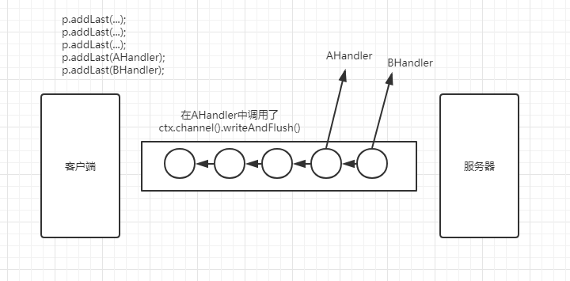
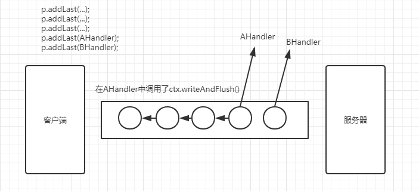

# Netty


## Netty模型

**1、一个`EventLoopGroup`当中会包含一个或者多个`EventLoop`。**

代码在`MultithreadEventExecutorGroup`类中的`EventExecutor[] children`体现，`EventExecutor`是`EventLoop`的父类。

**2、一个`EventLoop`在它的整个生命周期中都只会与唯一一个`Thread`进行绑定。**

具体体现在`SingleThreadEventExecutor`类中的`Thread thread`属性，这个执行事件循环的线程（调用handler回调方法），就是I/O线程。

**3、所有由`EventLoop`所处理的各种I/O事件都将在它所关联的那个`Thread`上进行处理。**

**4、一个`Channel`在它的生命周期中只会注册在一个`EventLoop`上。**

也就是说，一个`Channel`的`Handler`只会由同一个`Thread`来执行，不存在多线程问题。

**5、一个`EventLoop`在运行过程当中，会被分配给一个或者多个`Channel`（一个EventLoop会处理很多Channel）。**


`EventLoop`和`Channel`之间是一对多的关系。因为一个`EventLoop`线程会管理很多`Channel`对象，所以我们尽量不要在`Handler`中写耗时的逻辑，如果有这种操作，尽量将逻辑以多线程的方式启动，使用异步调用。


**重要结论：**

在`Netty`中，`Channel`的实现一定是线程安全的，基于此，我们可以储存一个`Channel`的引用，并且在需要向远程端点发送数据时，通过这个引用调用`Channel`相应的方法，即便当时有很多线程都在使用它也不会出现多线程问题；而且，消息一定会按顺序发送出去。

我们在业务开发中，不要将长时间执行的耗时任务放入到`EventLoop`的执行队列中，因为它将会一直阻塞该线程所对应的所有`Channel`上的其他执行任务，如果我们需要进行阻塞调用或者耗时的操作（实际开发中很常见），那么我们就需要使用一个专门的`EventExecutor`（业务线程池）。


**通常会有两种实现方式：**

1、在`ChannelHandler`的回调方法中，使用自己定义的业务线程池，这样就可以实现异步调用。

2、借助于Netty提供的向`ChannelPipeline`添加`ChannelHandler`时调用的`addLast`方法来传递`EventExecutor`。

说明：默认情况下（调用`addLast(handler)`）,`ChannelHandler`中的回调方法都是由I/O线程所执行，如果调用了`ChannelPipeline addLast(EventExecutorGroup group, ChannelHandler... handlers)；`方法，那么`ChannelHandler`中的回调方法就是由参数中的group线程组来执行的。


`JDK`所提供的`Future`只能通过手工方式检查执行结果（get方法），而这个操作是会阻塞的；`Netty`则对`ChannelFuture`进行了增强，通过`ChannelFutureListener`以回调的方式来获取执行结果，去除了手工检查阻塞的操作；值得注意的是：`ChannelFutureListener`的`operationComplete`方法是由I/O线程执行的，因此要注意的是不要在这里执行耗时操作，否则需要通过另外的线程或线程池来执行。


## Netty中有两种发送消息的方式：


可以直接写到`Channel`中（`channel.writeAndFlush()`）,也可以写到与ChannelHandler关联的那个`ChannelHandlerContext`中（`ctx.writeAndFlush()`）。对于前一种方式来说，消息会从`ChannelPipeline`的末尾开始流动；对于后一种方式来说，消息将从`ChannelPipeline`中的下一个`ChannelHandler`开始流动。

如图：






**结论：**

1、ChannelHandlerContext与ChannelHandler之间的关联关系是永远都不会发生改变的，因此对其进行缓存是没有任何问题的。

2、对于与Channel的同名方法来说，ChannelHandlerContext的方法将会产生更短的事件流，所以我们应该在可能的情况下利用这个特性来提升应用性能。


## Netty零拷贝


## ByteBuf

使用`readerIndex`和`writerIndex`将整个`buffer`分为三部分。

```java
<pre>
      +-------------------+------------------+------------------+
      | discardable bytes |  readable bytes  |  writable bytes  |
      |    已读区域        | (CONTENT) 未读区域 |   可写区域        |
      +-------------------+------------------+------------------+
      |                   |                  |                  |
      0      <=      readerIndex   <=   writerIndex    <=    capacity
 </pre>
```


`discardable bytes`区域是可以回收的，调用`discardReadBytes()`方法，会压缩`buffer`

，牵扯到数据的移动。

```java
AFTER discardReadBytes()
     +------------------+--------------------------------------+
     |  readable bytes  |    writable bytes (got more space)   |
     +------------------+--------------------------------------+
     |                  |                                      |
readerIndex (0) <= writerIndex (decreased)        <=        capacity
```


调用`clear()`方法，会完成指针的重置，不会移动数据，比起`discardReadBytes()`,`clear()`更轻量级。

```java
*  AFTER clear()
*
*      +---------------------------------------------------------+
*      |             writable bytes (got more space)             |
*      +---------------------------------------------------------+
*      |                                                         |
*      0 = readerIndex = writerIndex            <=            capacity
```


1、Netty的B因特尔Buf采用了读写索引分离的策略（readerIndex与writerIndex）,一个初始化（里面尚未有任何数据）的ByteBuf的readerIndex与writerIndex都为0。

2、当读索引与写索引处于同一个位置时，如果我们继续读取，那么会抛出IndexOutOfBoundsException。

3、对于ByteBuf的任何读写操作都会分别单独维护读索引与写索引。maxCapacity最大容量默认的限制就是Integer.MAX_VALUE。


**JDK的ByteBuffer与Netty的ByteBuf对比：**

JDK的ByteBuffer的缺点：

1、final byte[] hb；这是JDK的ByteBuffer对象中用于存储数据的对象声明；可以看到，其字节数组是被声明为final的，也就是不可更改，长度是固定的。一旦分配好后不能动态的扩容与收缩；而且当待储存的数据字节很大时就很有可能出现IndexOutOfBoundException。如果要预防这个异常，那就需要在储存之前完全确定好待储存的字节大小。如果ByteBuffer的空间不足，我们只有一种解决方案；创建一个全新的ByteBuffer对象，然后再将之前的ByteBuffer中的数据复制过去，这一切操作都需要开发者自己手动完成。

2、ByteBuffer只使用一个position指针来标识位置信息，在进行读写切换时就需要调用filp方法或是rewind方法，使用起来很不方便。

Netty的ByteBuf的优点：

1、存储字节的数组是动态的，其最大值默认是Integer.MAX_VALUE。这里的动态性是体现在write方法中的，write方法在执行时会判断buffer容量，如果不足则自动扩容。

2、ByteBuf的读写索引是完全分开的，使用起来方便。


## Netty处理器

重要概念：

1、`Netty`的处理器可以分为两类：入站处理器和出站处理器。

2、入站处理器的顶层是`ChannelInboundHandler`，出站处理器的顶层是`ChannelOutboundHandler`，他们共同的父类是`ChannelHandler`接口。

3、数据处理时常用的各种编码器本质上都是处理器。

4、编解码器：无论我们向网络中写入的数据是什么类型（int、char、String、二进制等），数据在网络中传递时。其都是以字节流的形式呈现的；将数据由原本的形式转换为字节流的操作称为编码（`encode`），将数据由字节转换为它原本的格式或是其他格式的操作称为解码（`decode`），编解码统一称为`codec`

5、编码：从程序到网络，本质上是一种出站处理器，编码是`ChannelOutboundHandler`。

6、解码：从网络到程序，本质上是一种入站处理器，解码是`ChannelInboundHandler`。

7、在Netty中，编码器通常以XXXEncoder命名，解码器通常以XXXDecoder命名。


**关于Netty编解码器的重要结论：**

1、无论是编码器还是解码器，其所接收的消息类型必须要与待处理的参数类型一致，否则该编解码器并不会执行。

2、在解码器进行数据解码时，一定要记得判断缓冲（ByteBuf）中的数据是否足够，否则hui产生一些问题。


## 服务端

```java
EventLoopGroup bossGroup = new NioEventLoopGroup();
EventLoopGroup worker = new NioEventLoopGroup();

try {
    ServerBootstrap serverBootstrap = new ServerBootstrap();
    serverBootstrap.group(bossGroup,worker).channel(NioServerSocketChannel.class).childHandler(new MyServerInitializer());

    ChannelFuture channelFuture = serverBootstrap.bind(8899).sync();
    channelFuture.channel().closeFuture().sync();
}finally {
    bossGroup.shutdownGracefully();
    worker.shutdownGracefully();
}
```

```java
public class MyServerInitializer extends ChannelInitializer<SocketChannel> {
    @Override
    protected void initChannel(SocketChannel ch) throws Exception {

        ChannelPipeline pipeline = ch.pipeline();

        pipeline.addLast(new LengthFieldBasedFrameDecoder(Integer.MAX_VALUE,0,4,0,4));
        pipeline.addLast(new LengthFieldPrepender(4));
        pipeline.addLast(new StringDecoder(CharsetUtil.UTF_8));
        pipeline.addLast(new StringEncoder(CharsetUtil.UTF_8));
        pipeline.addLast(new MyServerHandler());
    }
}
```

```java
public class MyServerHandler extends SimpleChannelInboundHandler<String> {

    @Override
    protected void channelRead0(ChannelHandlerContext ctx, String msg) throws Exception {

        System.out.println(ctx.channel().remoteAddress() + ", " + msg);

        ctx.channel().writeAndFlush("from server：" + UUID.randomUUID());
    }

    @Override
    public void exceptionCaught(ChannelHandlerContext ctx, Throwable cause) throws Exception {
        cause.printStackTrace();
        ctx.channel().close();
    }

}
```