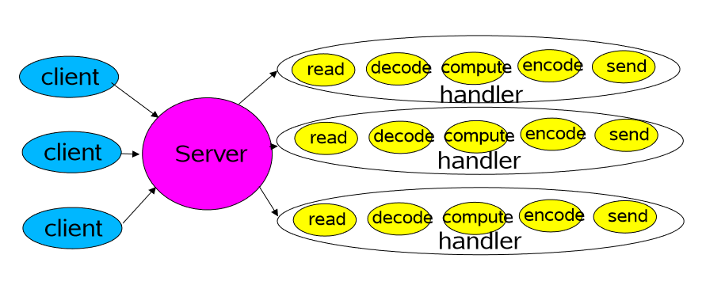
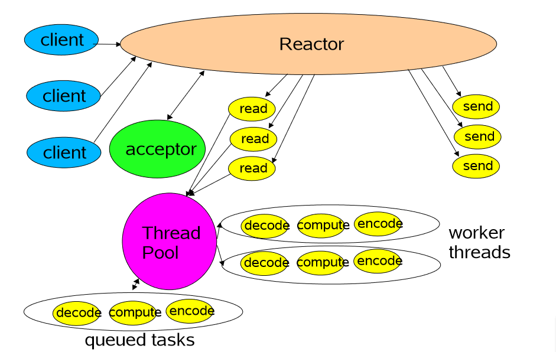
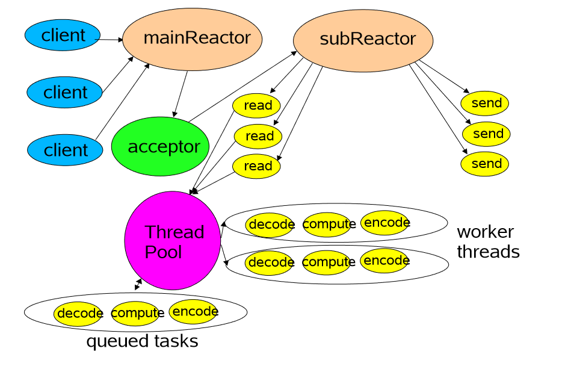

##传统IO模型

## Basic Reactor Design

Reactor负责接收连接，通过dispath分发任务，每个连接分配一个acceptor来获取客户端socketChannel对象，然后调用Handler进行处理。

**问题：Handler处理的时候，IO操作和compute是在同一个线程里的，因为IO比较慢，会拖慢整个处理过程（dispatch分发任务时候，必须Handler处理完整个操作才变得可用）**

##Multithreaded Designs

**解决了单线程Handler处理的问题：将IO操作和计算操作分离，Handler负责IO操作，然后将计算操作丢给线程池，返回，均衡了IO和CPU的速率，提高了效率。**

## Using Multiple Reactors

这更接近了Netty的设计，BossGroup接收连接，通过acceptor派发到workerGroup。

## Reactor模式的五大角色

### Handle（句柄或描述符）

本质上表示一种资源，是由操作系统来提供的，该资源用于表示一个个的事件，比如说文件描述符，socket描述符。事件既可以来自内部，也可以来自外部；外部事件比如说客户端的连接请求，客户端发送过来的数据等等；内部事件比如说，操作系统产生的定时器事件等等。他本质上就是一个文件描述符。**Handle本身是事件产生的发源地。监听事件就是监听的Handle。**

### Synchronous Event Demultiplexer（同步事件分离器）

它本身是一个系统调用，用于等待事件的发生（事件可能是一个，也可能是多个），调用方在调用它的时候会被阻塞，一直阻塞到同步事件分离器上有事件发生为止。对于Linux来说，同步事件分离器指的就是常用的IO多路复用的机制，比如说`select()`,`poll()`,`epoll()`等；在Java Nio领域对应的组件就是`Selector`，阻塞的方法就是`select()`,在不同的操作系统中采用的底层系统调用是不一样的。

### Event Handler（事件处理器）

本身由多个回调方法构成，这些回调方法构成了与应用相关的对于某个事件的反馈事件。在Java Nio领域没有对应的组件，但在Netty中有对应的组件就是`ChannelHandler类及其子类`，他提供了大量的回调方法，供我们在特定事件产生的时候实现响应的回调方法进行业务逻辑处理。