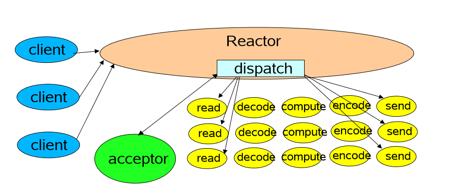

##传统IO模型

## Basic Reactor Design

Reactor负责接收连接，通过dispath分发任务，每个连接分配一个acceptor来获取客户端socketChannel对象，然后调用Handler进行处理。

**问题：Handler处理的时候，IO操作和compute是在同一个线程里的，因为IO比较慢，会拖慢整个处理过程（dispatch分发任务时候，必须Handler处理完整个操作才变得可用）**

##Multithreaded Designs

**解决了单线程Handler处理的问题：将IO操作和计算操作分离，Handler负责IO操作，然后将计算操作丢给线程池，返回，均衡了IO和CPU的速率，提高了效率。**

## Using Multiple Reactors

这更接近了Netty的设计，BossGroup接收连接，通过acceptor派发到workerGroup。

## Reactor模式的五大角色

### Handle（句柄或描述符）

本质上表示一种资源，是由操作系统来提供的，该资源用于表示一个个的事件，比如说文件描述符，socket描述符。事件既可以来自内部，也可以来自外部；外部事件比如说客户端的连接请求，客户端发送过来的数据等等；内部事件比如说，操作系统产生的定时器事件等等。他本质上就是一个文件描述符。**Handle本身是事件产生的发源地。监听事件就是监听的Handle。**

### Synchronous Event Demultiplexer（同步事件分离器）

它本身是一个系统调用，用于等待事件的发生（事件可能是一个，也可能是多个），调用方在调用它的时候会被阻塞，一直阻塞到同步事件分离器上有事件发生为止。对于Linux来说，同步事件分离器指的就是常用的IO多路复用的机制，比如说`select()`,`poll()`,`epoll()`等；在Java Nio领域对应的组件就是`Selector`，阻塞的方法就是`select()`,在不同的操作系统中采用的底层系统调用是不一样的。

### Event Handler（事件处理器）

本身由多个回调方法构成，这些回调方法构成了与应用相关的对于某个事件的反馈事件。在Java Nio领域没有对应的组件，但在Netty中有对应的组件就是`ChannelHandler类及其子类`，他提供了大量的回调方法，供我们在特定事件产生的时候实现响应的回调方法进行业务逻辑处理。

### Concrete Event Handler（具体事件处理器）

它是事件处理器（Event Handler）的实现。它本身实现了事件处理器所提供的各个回调方法，从而实现了特定于业务的逻辑。它本质上就是我们所编写的一个个的处理器实现。在Netty中对应着我们自定义的Handler实现。

### Initiation Dispatcher（初始分发器）

实际上就是Reactor角色，它本身定义了一些规范，这些规范用于控制事件的调度方式，同时提供了应用进行事件处理器的注册、删除等设施。它本身是整个事件处理器的核心所在，Initiation Dispatcher会通过同步事件分离器（Synchronous Event Demultiplexer）来去等待事件的发生。一旦事件发生，Initiation Dispatcher首先会分离出每一个事件（遍历SelectKeySet），然后调用事件处理器，最后调用相关的回调方法来处理这些事件。

## Reactor模式的流程

1、当应用向`Initiaion Dispatcher`注册具体的事件处理器时，应用会标识出该事件处理器感兴趣的事件（将事件和处理器关联起来了）。

2、`Initiaion Dispatcher`会要求每个事件处理器向其传递内部的`Handle`，该`Handle`向操作系统标识了事件处理器。

3、当所有的事件处理器注册完毕后，应用会调用`handle_events`方法来启动`Initiaion Dispatcher`的事件循环。这时，`Initiaion Dispatcher`会将每个注册的事件管理器的`handle`放到一起，并使用同步事件分离器来等待事件的发生。比如说，TCP协议层会使用select同步事件分离器操作来等待客户端发送的数据到达连接的socket的事件。

4、当与某个事件源对应的`Handle`变为ready状态时，比如说TCP Socket变为等待读事件时，同步事件分离器就会通知`Initiaion Dispatcher`。

5、`Initiaion Dispatcher`会触发事件处理器的回调方法，从而响应这个处于ready状态的`Handle`。当事件发生时，`Initiaion Dispatcher`会将被事件源出发的`Handle`作为key来寻找并分发恰当的事件处理器回调方法（之前`Initiaion Dispatcher`把`Handle`和事件处理器的关系都保存好了，只需要遍历获取指定事件的事件处理器进行回调）。

6、`Initiaion Dispatcher`回调事件处理器的`handle_event(type)`回调方法来执行特定于应用的功能（开发者自己写的代码），从而相应这个事件。所发生的事件类型可以作为给方法参数并被该方法内部使用来执行额外的特定于服务的分离与分发。