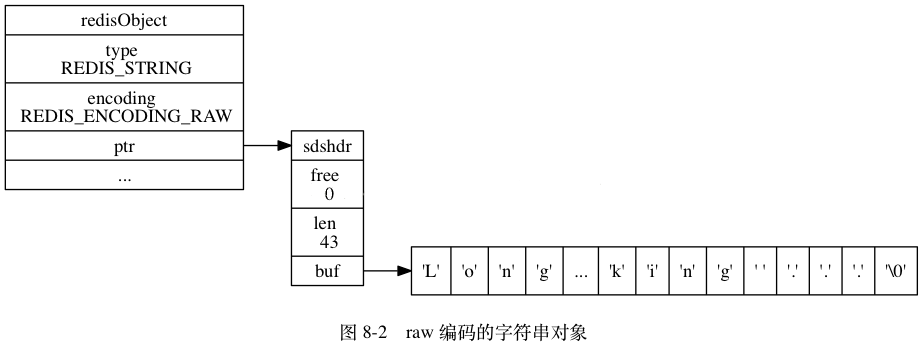
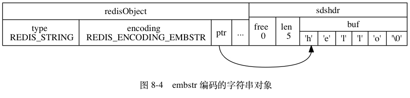
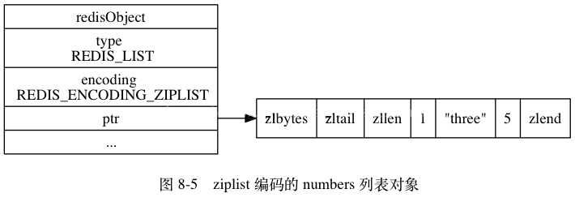
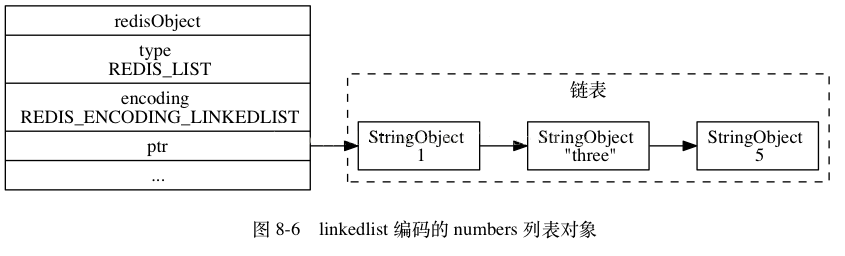
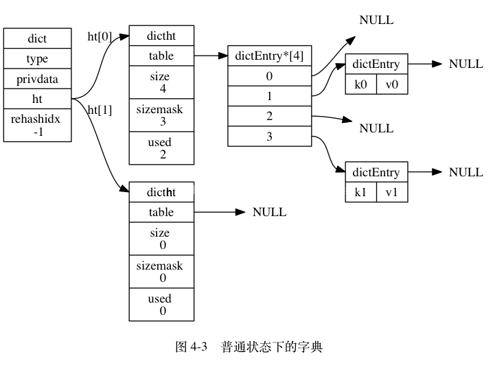
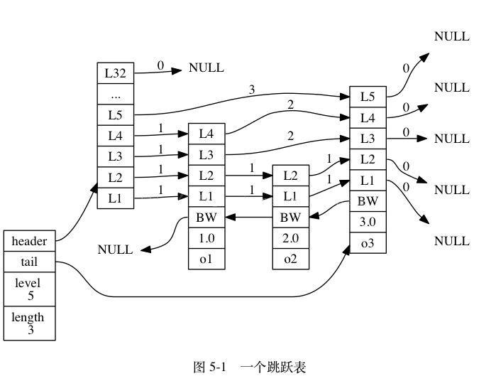

# Redis


[Redis教程](https://www.runoob.com/redis/redis-tutorial.html)


## Redis单线程架构

###单线程模型

​	Redis客户端对服务端的每次调用都经历了发送命令，执行命令，返回结果三个过程。其中执行命令阶段，由于Redis是单线程来处理命令的，所有每一条到达服务端的命令不会立刻执行，所有的命令都会进入一个队列中，然后逐个被执行。并且多个客户端发送的命令的执行顺序是不确定的。但是可以确定的是不会有两条命令被同时执行，不会产生并发问题，这就是Redis的单线程基本模型。

### 单线程模型每秒万级别处理能力的原因

1. 纯内存访问。数据存放在内存中，内存的响应时间大约是100纳秒，这是Redis每秒万亿级别访问的重要基础。
2. 非阻塞I/O，Redis采用epoll作为I/O多路复用技术的实现，再加上Redis自身的事件处理模型将epoll中的链接，读写关闭都转换为了时间，不在I/O上浪费过多的时间。
3. 单线程避免了线程切换和竞态产生的消耗。
4. Redis采用单线程模型，每条命令执行如果占用大量时间，会造成其他线程阻塞，对于Redis这种高性能服务是致命的，所以Redis是面向高速执行的数据库。


## Redis底层原理

### Redis对象类型简介

​	Redis是一种key/value型数据库，其中，每个key和value都是使用对象表示的。比如，我们执行以下代码：

```shell
redis>SET message "hello redis"  
```

​	其中key是message，是一个包含了字符串“message”的对象。而value是一个包含了“hello redis”的对象。

​	Redis共有五种对象的类型，分别是：

| `REDIS_STRING` | 字符串对象   |
| -------------- | ------------ |
| `REDIS_LIST`   | 列表对象     |
| `REDIS_HASH`   | 哈希对象     |
| `REDIS_SET`    | 集合对象     |
| `REDIS_ZSET`   | 有序集合对象 |

​	Redis中的一个对象的结构体(C语言)表示如下：

```c
/* 
 * Redis 对象 
 */  
typedef struct redisObject {  
  
    // 类型  
    unsigned type:4;          
  
    // 不使用(对齐位)  
    unsigned notused:2;  
  
    // 编码方式  
    unsigned encoding:4;  
  
    // LRU 时间（相对于 server.lruclock）  
    unsigned lru:22;  
  
    // 引用计数  
    int refcount;  
  
    // 指向对象的值  
    void *ptr;  
  
} robj;  
```

​	type表示了该对象的对象类型，即上面五种中的一个。但是为了提高存出效率与程序执行效率，每种对象的底层数据结构实现都可能不止一种。encoding就表示了对象底层所使用的编码。下面先介绍每种底层数据结构的实现，再介绍每种对象类型都用了什么底层结构并分析他们之间的关系。


### Redis对象底层数据结构

底层数据结构共有八种，如下表所示：


| `REDIS_ENCODING_INT`        | `long` 类型的整数             |
| --------------------------- | ----------------------------- |
| `REDIS_ENCODING_EMBSTR`     | `embstr` 编码的简单动态字符串 |
| `REDIS_ENCODING_RAW`        | 简单动态字符串                |
| `REDIS_ENCODING_HT`         | 字典                          |
| `REDIS_ENCODING_LINKEDLIST` | 双端链表                      |
| `REDIS_ENCODING_ZIPLIST`    | 压缩列表                      |
| `REDIS_ENCODING_INTSET`     | 整数集合                      |
| `REDIS_ENCODING_SKIPLIST`   | 跳跃表和字典                  |


### 字符串对象

​	字符串对象的编码可以是int、raw或者embstr。

​	如果一个字符串的内容可以转换为long，那么该字符串就会被转换成long类型，对象的ptr指针就会指向该long值，并且对象类型用int类型表示。

​	普通的字符串有两种，embstr和raw。embstr应该是Redis3.0新增的数据结构，在2.8中是没有的。如果字符串对象的长度小于39字节，就用embstr对象。否则用raw对象。可以从下面这段代码看出：

```c
#define REDIS_ENCODING_EMBSTR_SIZE_LIMIT 39  
robj *createStringObject(char *ptr, size_t len) {  
    if (len <= REDIS_ENCODING_EMBSTR_SIZE_LIMIT)  
        return createEmbeddedStringObject(ptr,len);  
    else  
        return createRawStringObject(ptr,len);  
}
```

embstr的好处有如下几点：

* embstr的创建只需分配一次内存，而raw为两次（一次为sds分配对象，另一次为objet分配对象，emstr省略了第一次）
* 相对的，释放内存的次数也由两次变为一次
* embstr的objet和sds放在一起，更好的利用缓存带来的优势。

需要注意的是，redis并未提供任何修改embstr的方式，即embstr是只读形式。对embstr的修改实际上是先转换为raw在进行修改。

raw和embstr的区别可以用下面两幅图所示：






### 列表对象

列表对象的编码可以是ziplist或者linkedlist。

​	ziplist是一种压缩链表，它的好处是更能节省内存空间，因为她所存储的内容都是在连续的内存区域当中。当列表对象元素不大，每个元素也不大的时候，就采用ziplist存储。但当数据量过大时就ziplist就不是那么好用了。因为为了保证他存储内容在内存中的连续性，插入的复杂度是0(N)，即每次插入都会重新进行realloc，如下图所示，对象结构中ptr所指向的就是一个ziplist。整个ziplist只需要malloc一次，它们在内存中是一块连续的区域。

​	使用 ziplist 存储链表，ziplist是一种压缩链表，它的好处是更能节省内存空间，因为它所存储的内容都是在连续的内存区域当中的。





linkedlist是一种双向链表。它的结构比较简单，节点中存放pre和next两个指针，还有节点相关的信息。当每增加一个node的时候，既需要malloc一块内存。




### 哈希对象

哈希对象的底层实现可以是ziplist或者hashtable

ziplist中的哈希对象是按照key1，value1，key2，value2这样的顺序存放来存储的。当对象数目不多且内容不大时，这种方式效率时很高的。

hashtable的是由dict这个结构来实现的。

```c

typedef struct dict {
    dictType *type;
    void *privdata;
    dictht ht[2];
    long rehashidx; /* rehashing not in progress if rehashidx == -1 */
    int iterators; /* number of iterators currently running */

```

dict是一个字典，其中的指针dicht ht[2]指向了两个哈希表

```c
typedef struct dictht {
    dictEntry **table;
    unsigned long size;
    unsigned long sizemask;
    unsigned long used;
} dictht;
```

dict[0]是用于真正存放数据，dict[1]一般在哈希表元素过多进行rehash的时候用于中传数据。dictht中的table用于真正存放元素了，每个key/value对用一个dictEntry表示，放在dictEntry数组中。




### 集合对象

集合对象的编码可以是intset或者hashtable

intset是一个整数集合，里面存的为某种同一类型的证书，支持如下三种长度的整数：

```c
#define INTSET_ENC_INT16 (sizeof(int16_t))
#define INTSET_ENC_INT32 (sizeof(int32_t))
#define INTSET_ENC_INT64 (sizeof(int64_t))
```

intset是一个有序集合，查找元素的复杂度为O(logN)，但插入时不一定为O(logN)，因为可能涉及到升级操作。比如当集合里全是int16_t型的整数，这时要插入一个int32_t，那么为了维持集合中数据类型的一致，那么所有的数据都会被转成int31_t类型，涉及到内存的重新分配，这时插入的复杂度就为O(N)了。intset不支持降级操作。


### 有序集合

有序集合的编码可能两种，一种是ziplist，另一种是skiplist与dict的结合。

ziplist作为集合和作为哈希对象是一样的，member和score顺序存放。按照score从小到大顺序排列。它的结构不再复述。

skiplist是一种跳跃表，它实现了有序集合中的快速查找，在大多数情况下它的速度都可以和平衡树差不多。但她的实现比较简单，可以作为平衡树的替代品，他的结构比较特殊。下面分别是跳表skiplist和它内部的节点skiplistNode的结构体：

```c
/*
 * 跳跃表
 */
typedef struct zskiplist {
    // 头节点，尾节点
    struct zskiplistNode *header, *tail;
    // 节点数量
    unsigned long length;
    // 目前表内节点的最大层数
    int level;
} zskiplist;
/* ZSETs use a specialized version of Skiplists */
/*
 * 跳跃表节点
 */
typedef struct zskiplistNode {
    // member 对象
    robj *obj;
    // 分值
    double score;
    // 后退指针
    struct zskiplistNode *backward;
    // 层
    struct zskiplistLevel {
        // 前进指针
        struct zskiplistNode *forward;
        // 这个层跨越的节点数量
        unsigned int span;
    } level[];
} zskiplistNode;
```


head和tail分别指向头结点和尾节点，然后每个skiplistNode里面的结构又是分层的（即level数组）

如图所示：



每一列都代表一个节点，保存了member和score，按score从小到大排序。每个节点有不同的层数，这个层数是在生成节点的时候随机生成的数值。每一层都是一个指向后面某个节点的指针。这种结构使得跳跃表可以跨越很多节点来快速访问。

前面说到了，有序集合ZSET是有跳跃表和hashtable共同形成的。

```c
typedef struct zset {
    // 字典
    dict *dict;
    // 跳跃表
    zskiplist *zsl;
} zset;
```

​	使用 skiplist(跳跃表)来存储有序集合对象、查找上先从高Level查起、时间复杂度和红黑树相当，实现容易，无锁、并发性好。


## Redis的持久化方式

TODO

[Redis持久化方式](http://doc.redisfans.com/topic/persistence.html)

- RDB方式：定期备份快照，常用于灾难恢复。优点：通过fork出的进程进行备份，不影响主进程、RDB 在恢复大数据集时的速度比 AOF 的恢复速度要快。缺点：会丢数据。
- AOF方式：保存操作日志方式。优点：恢复时数据丢失少，缺点：文件大，回复慢。
- 也可以两者结合使用。


## Redis的回收策略

* volatile-lru：从已设置过期时间的数据集（server.db[i].expires）中挑选最近最少使用的数据淘汰
* volatile-ttl：从已设置过期时间的数据集（server.db[i].expires）中挑选将要过期的数据淘汰
* volatile-random：从已设置过期时间的数据集（server.db[i].expires）中任意选择数据淘汰
* allkeys-lru：从数据集（server.db[i].dict）中挑选最近最少使用的数据淘汰
* allkeys-random：从数据集（server.db[i].dict）中任意选择数据淘汰
* no-enviction（驱逐）：禁止驱逐数据


## Redis的安装

1、用lion账号登入虚拟机

2、wget 下载redis。发现没有wget命令，那么就 yum install wget

3、yum命令必须sudo，然后我的lion用户没有加入sudo组中

4、把lion加入sudo组里

5、安装wget，下载redis

6、解压

7、进入redis目录，make，报错，发现我机器上没有gcc

8、sudo yum install gcc

9、执行make后，Linux让我尝试执行make test

10、报错了，缺少tcl

11、sudo yum install tcl

12、make install PREFIX=指定目录

## Redis高可用哨兵模式搭建

一主二从三哨兵模式

### Redis安装

1、Redis下载

```shell
wget http://download.redis.io/releases/redis-4.0.11.tar.gz
```

2、解压

```shell
tar zxcf redis-4.0.11.tar.gz
```

3、进入目录

```shell
cd redis-4.0.11/
```

4、安装

```shell
 cd src 
 make
 yum install -y tcl
 make test
 make install PREFIX=/home/redis-sentinel #指定目录安装，注意 PREFIX 大写
```

### Redis主从配置

5、配置文件

```shell
mkdir /home/redis-sentinel/conf
cp redis.conf /home/redis-sentinel/conf
cd /home/redis-sentinel/conf
vi redis.conf	#编辑配置文件
```

将`bind 127.0.0.1`注释掉，这个是绑定能访问redis的ip地址，如果指定，那么只有指定的ip可以访问redis

将`daemonize no`修改为`daemonize yes`,设置为后台启动

将`protected-mode yes`修改为`protected-mode no`，设置为非保护模式，这样可以进行远程访问，如果不改，哨兵配置的如果是真实ip地址（非127.0.0.1），则没法访问。

非保护模式会有安全问题，我们可以给redis和哨兵设置密码，增强安全性。

```shell
cp redis.conf redis-6380.conf	
cp redis.conf redis-6381.conf	#复制两份
```

分别修改``redis-6380.conf`和`redis-6381.conf`的端口号等并且加入一下配置。

```tex
slaveof [主节点ip] [主节点端口号]	如：slaveof 192.168.1.27
```

6、启动redis

```shell
./redis-server ../conf/redis.conf 
./redis-server ../conf/redis-6380.conf 
./redis-server ../conf/redis-6381.conf 
```

到此Redis的主从配置就完成了，可以通过

```shell
 ./redis-cli -p [端口号]
```

登录redis进行测试主从复制是否成功。

### Redis哨兵配置

1、从下载文件中复制`sentinel.conf`配置文件到安装目录下

2、在配置文件中修改以下内容

```shell
port 26379	#哨兵的端口
sentinel monitor s1 <ip地址> 6379 2	
sentinel monitor s2 <ip地址> 6379 2	# 这里是主节点的配置，如果有多个master节点，则配置多行，2代表选举的时候新的leader需要获得2票
protected-mode no
```

注意：

- 此处的`<ip地址>`不要写`127.0.0.1`,否则在使用程序连接哨兵的时候，主从切换后，程序自动获取到的IP地址是`127.0.0.1:端口`，这意味着应用程序服务器上可能是没有Redis的（如果有也可能不是同一个Redis）。
- protected-mode ：关闭保护模式（默认情况下，redis node和sentinel的protected-mode都是yes，在搭建集群时，若想从远程连接redis集群，需要将redis node和sentinel的protected-mode修改为no，若只修改redis node，从远程连接sentinel后，依然是无法正常使用的，且sentinel的配置文件中没有protected-mode配置项，需要手工添加。依据redis文档的说明，若protected-mode设置为no后，需要增加密码证或是IP限制等保护机制，否则是极度危险的。）

3、将此配置文件再复制两份，分别是`sentinel-26479.conf`和`sentinel-26579.conf`

4、分别修改复制配置文件中的端口号

5、启动哨兵

```shell
./redis-sentinel ../conf/sentinel.conf
./redis-sentinel ../conf/sentinel-26479.conf
./redis-server ../conf/sentinel-26579.conf	#或者./redis-server ../conf/sentinel-26579.conf --sentinel
```

到此哨兵配置就结束了，可以模拟宕机的情况来测试主从切换。

### Springboot整合哨兵模式

1、依赖引入

```xml
<dependency>
   <groupId>org.springframework.boot</groupId>
   <artifactId>spring-boot-starter-data-redis</artifactId>
</dependency>
```

1、yaml文件的配置

```yml
spring.redis.sentinel.master=mymaster	#哨兵集群的名称
spring.redis.sentinel.nodes=192.168.1.112:26379,192.168.1.112:26479,192.168.1.112:26579	#哨兵节点
#spring.redis.sentinel.password=123456	如果有密码则设置密码
# 以下配置是org.springframework.boot.autoconfigure.data.redis低版本才有的。。
spring.redis.pool.max-active=50	#最大连接数
spring.redis.pool.max-idle=10	#最大等待连接数
spring.redis.pool.max-wait=10000	#最大等待毫秒数
spring.redis.pool.min-idle=5	#最小等待连接数
spring.redis.timeout=0	#超时时间
# 连接池相关配置需要通过spring.redis.lettuce.pool或者spring.redis.jedis.pool进行配置了，选一个就可以
#spring.redis.jedis.pool.max-active=50
#spring.redis.jedis.pool.max-idle=10
#spring.redis.jedis.pool.max-wait=10000ms
#spring.redis.jedis.pool.min-idle=5
#spring.redis.jedis.timeout=0
spring.redis.lettuce.pool.max-active=50
spring.redis.lettuce.pool.max-wait=10000ms
spring.redis.lettuce.pool.max-idle=8
spring.redis.lettuce.pool.min-idle=5
```

2、使用`spring-data-redis`中的`RedisTemplate`可以完成自动配置，开箱即用

```java
@Autowired
private RedisTemplate redisTemplate;
```

注意`redisTemplate`必须是这个名，才能自动注入,这是源码中写好的`org.springframework.boot.autoconfigure.data.redis.RedisAutoConfiguration`

```java
@Bean
@ConditionalOnMissingBean(
    name = {"redisTemplate"}
)
```

### 整合的问题

```xml
<!--整合redis-->
<dependency>
    <groupId>org.springframework.boot</groupId>
    <artifactId>spring-boot-starter-data-redis</artifactId>
    <!-- 1.5的版本默认采用的连接池技术是jedis  2.0以上版本默认连接池是lettuce,
    在这里采用jedis，所以需要排除lettuce的jar -->
    <exclusions>
        <exclusion>
            <groupId>redis.clients</groupId>
            <artifactId>jedis</artifactId>
        </exclusion>
        <exclusion>
            <groupId>io.lettuce</groupId>
            <artifactId>lettuce-core</artifactId>
        </exclusion>
    </exclusions>
</dependency>
<!-- 添加jedis客户端 -->
<dependency>
    <groupId>redis.clients</groupId>
    <artifactId>jedis</artifactId>
</dependency>
<!--spring2.0集成redis所需common-pool2 必须加上，jedis依赖此 -->
<!-- spring boot 2.0 的操作手册有标注
地址是：https://docs.spring.io/spring-boot/docs/2.0.3.RELEASE/reference/htmlsingle/-->
<dependency>
    <groupId>org.apache.commons</groupId>
    <artifactId>commons-pool2</artifactId>
    <version>2.5.0</version>
    <!--<version>2.4.2</version>-->
</dependency>
```


## 缓存

1、配置properties

```properties
spring.cache.type=redis
spring.cache.cache-names=redisCache
```

2、使用缓存（注解方式）

```java
/**
 * @Cacheable(value = "reidsCache",key = "'person' + #id")
 * 表示查询出来的结果放入缓存，value与properties配置名称相同，key代表缓存的key
 * #id 表示该方法的参数id，这是可以取到的
 */
@Cacheable(value = "reidsCache",key = "'person' + #id")
@Override
public Person findById(Integer id) {
    return null;
}
/**
 * @CacheEvict(value = "reidsCache",allEntries = true)
 * 表示添加新数据的时候清空缓存
 */
@CacheEvict(value = "reidsCache",allEntries = true)
@Override
public boolean add(Person person) {
    return false;
}
```

3、使用缓存，手动添加

调用redis的Api进行手动的添加，略。

## 热点缓存问题

如果一个缓存设置了过期问题，那么在高并发的环境下就有可能出现热点缓存问题，更有可能导致缓存雪崩。

**解决方式：**

1、使用双重检测锁解决热点缓存问题


## 分布式锁

```java
/**
 * redis分布式锁
 * setnx:如果不存在这个key才设置
 * @Author: Zer01ne
 * @Date: 2019/2/19 10:11
 * @Version 1.0
 */
public class DistributedLock {

    private static final String host;
    private static final int post;
    private static final JedisPool jedisPool;

    static {
        host = "127.0.0.1";
        post = 6379;
        jedisPool = new JedisPool(host,post);
    }
   
    /**
     * Jedis set的方式（正确方式）
     * @param lockKey 锁
     * @param requestId 请求标识
     * @param timeout 超时时间
     */
    public boolean getLockByJedis(String lockKey, String requestId, int timeout){
        Jedis jedis = getJedis();
        String result = jedis.set(lockKey, requestId, "NX", "EX", timeout);
        if (Objects.equals(result,"OK")){
            return true;
        }
        return false;
    }
  
    /**
     * 释放分布式锁(正确方式，Lua语言)
     * @param jedis Redis客户端
     * @param lockKey 锁
     * @param requestId 请求标识
     * @return 是否释放成功
     */
    public static boolean releaseDistributedLock(Jedis jedis, String lockKey, String requestId) {

        String script = "if redis.call('get', KEYS[1]) == ARGV[1] then return redis.call('del', KEYS[1]) else return 0 end";
        Object result = jedis.eval(script, Collections.singletonList(lockKey), Collections.singletonList(requestId));

        if (Objects.equals(1L,result)) {
            return true;
        }
        return false;

    }
    private static Jedis getJedis(){
        return jedisPool.getResource();
    }
    
}
```
