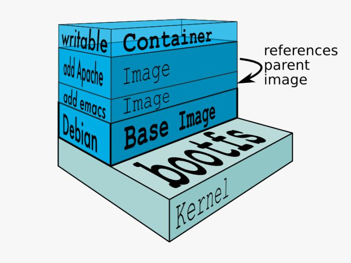

# Docker


## 什么是Docker？

​	将应用程序自动部署到容器


## 特点

* 提供简单轻量的建模方式（上手快）
* 职责的逻辑分离
* 快速高效的开发生命周期
* 鼓励使用面向服务的架构


## 使用场景

* 使用Docker容器开发、测试、部署服务
* 创建隔离的运行环境
* 搭建测试环境
* 构建多用户的平台即服务（Paas）基础设施
* 提供软件即服务（SaaS）应用程序
* 高性能、超大规模的宿主机部署


## 基本组成

* Docker Client客户端

  > Docker是C/S架构，客户端可以是本地也可以是远程

* Docker Daemon守护进程

  > Docker客户端向Docker服务端发送请求，这些请求是由守护进程来处理的

* Docker Image镜像

  > 1、容器的基石，容器基于镜像启动或者运行，镜像好比容器的源代码，保存了启动容器的各种条件
  >
  > 2、层叠的只读文件系统
  >
  > 3、联合加载（union mount）
  >
  > Docker 镜像可以看作是一个特殊的文件系统，除了提供容器运行时所需的程序、库、资源、配置等文件外，还包含了一些为运行时准备的一些配置参数（如匿名卷、环境变量、用户等）。镜像不包含任何动态数据，其内容在构建之后也不会被改变。

* Docker Container容器

  > 1、通过镜像启动
  >
  > 2、启动和执行阶段
  >
  > 3、写时复制（copy on write）

* Docker Registry仓库

  > 公有
  >
  > 私有
  >
  > Docker Hub


### Docker的C/S模式


### Docker镜像




## Docker与Linux

Docker依赖的linux内核特性

* Namespaces命名空间

  > ​	编程语言
  >
  > ​			封装 -> 代码隔离
  >
  > ​	操作系统
  >
  > ​			系统资源的隔离
  >
  > ​			进程、网络、文件系统

  * Docker的命名空间

    > PID（Process ID）：进程隔离
    >
    > NET（Network）：管理网络接口
    >
    > IPC（InterProcess Communication）：管理跨进程通信的访问
    >
    > MNT（Mount）：管理挂载点
    >
    > UTS（Unix TImesharing System）：隔离内核和版本标识

* Control groups（cgroups）控制组

  > 用来分配资源
  >
  > * 资源限制：为进程组设置内存使用上限，超过上限，OOM
  > * 优先级设定：设置哪些进程组使用更大的CPU或内存资源
  > * 资源计量：进程组使用了多少系统资源
  > * 资源控制：将进程组挂起或者恢复

  * Docker中的应用

    > 1、文件系统的隔离：每个容器都有自己的root文件系统
    >
    > 2、进程隔离：每个容器都运行在自己的进程环境中
    >
    > 3、网络隔离：容器间的虚拟网络接口和IP地址都是分开的
    >
    > 4、资源隔离和分组：使用cgroups将CPU和内存之类的资源独立分配给Docker容器


## 安装

```shell
 yum install -y epel-release
 yum install docker-io # 安装docker
 systemctl start docker # 启动
 docker version
```


## 概念（concept）

* Container
  * Docker Container即Docker将宿主机隔开的一个个独立空间
* Image
  * Docker Image可以看做是一个特殊的文件系统，即对某一时刻容器状态的备份
* Registry
  * 官方：https://hub.docker.com/
  * 阿里：https://dev.aliyun.com/search.html


## 配置docker镜像加速

https://blog.csdn.net/qq_37495786/article/details/83246421


## 命令（command）


* 镜像

```shell
# 查看docker命令的详细介绍
man 
# 查看所有镜像 -a -f --no-trunc -q
docker images
# docker存储位置等信息
docker info
# 搜索镜像
docker search <关键词>
# 下载镜像
docker pull <镜像名称>
# 启动容器
# -d 后台运行
# --name 容器名称
# docker run -d -p 8080:8080 --name tomcat-test tomcat
docker run -d -p <宿主机端口号>:<容器端口号> --name <容器别名> <镜像名>
# 查看容器端口映射情况
# 查询所有容器
docker ps -a
# 查询正在运行的容器
docker ps
# 删除容器，多个以空格分隔
docker rm <容器id>/<容器名>
# 进入容器，为容器启动一个新进程
docker exec -it <容器id> /bin/bash
# 退出容器
exit
# 查看容器的状态
docker inspect [容器名]|[容器ID]
# 查看镜像的状态
docker inspect [镜像ID]||[镜像名]:[镜像tag]
# 查看容器的日志
docker logs [-t][-f][--tail]
# 查看运行中容器的进程
docker top
# 停止容器
docker stop <容器id>
docker kill
# 启动容器,-i代表交互的方式
docker start [-i] <容器id>
# 删除已经停止的容器
docker rm <容器id>
# 复制文件到容器中
docker cp <宿主机文件名> <容器id>:<目标目录>
# 复制文件到宿主机中
docker cp <容器id>:<目标目录> <宿主机文件名> 
# 将docker镜像推送到仓库
docker push [镜像名]
```


## Dockerfile

用来创建镜像的文件。

### 内置命令

* FROM：以来的底层镜像
* MAINTAINER：指定镜像创建者
* ENV：设置环境变量
* RUN：运行shell命令（安装软件用）
* COPY：将宿主机S本地文件拷贝到镜像
* EXPOSE：指定监听端口
* ENTRYPOINT：与执行命令，创建容器并启动后才执行