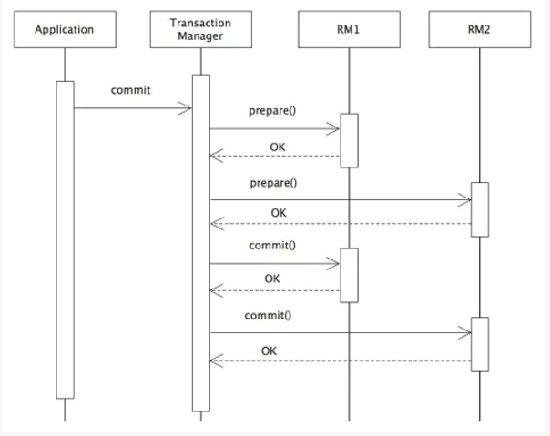

# 互联网架构设计

## 高可用设计手段

### 什么是高可用

​	通常指，通过设计来减少系统不能提供服务的时间。比如`7*24`表示一周七天，一天24小时不间断服务。

### 微服务高可用设计手段

* 服务冗余
* 无状态化
* 负载均衡
* 幂等设计
* 超时机制
* 异步化设计
* 服务限流降级熔断
* 数据复制/缓存/Sharding
* 架构拆分、服务治理
* 服务监控
* 服务分级

## 高并发设计阶段

### 什么是高并发

[高并发场景解决方案](高并发场景解决方案.md)

### 高并发关注点

* 吞吐量（Throughput）
* 响应延迟（Response Delay）

### 性能优化目标

* 缩短响应时间
* 提高并发数（增加吞吐量）
* 让系统处于合理状态

### 优化手段

* 空间换时间
  * 系统时间是瓶颈
  * 例如：缓存复用计算结果，降低时间开销，因为CPU时间较内存容量更加珍贵
* 时间换空间
  * 例如：网络传输是瓶颈，使用系统时间换取传输的空间，使用HTTP的gzip压缩算法
  * 例如：App的请求分类接口，使用版本号判断哪些数据更新了，只下载更新的数据
* 找到系统瓶颈
  * 分析系统业务流程，找到关键路径并分解优化
  * 例如：一个服务集群4万的QPS，调用量前5的接口贡献了3.5万的QPS
  * 对关键路径的代码优化收益最大，当然系统剩下的部分也不能忽视，比如剩下5千QPS的接口，若性能有问题也可能把整体服务性能拖垮

​	调用了多少RPC接口；载入多少数据；使用什么算法；非核心流程能否异步化，没有数据依赖的逻辑能否并行执行。

### 优化层次

* 架构设计层次
  * 拆分，微服务化
  * 分库分表，读写分离，数据分片
  * 无状态化设计，动态水平弹性扩展
  * 调用链路梳理，热点数据尽量靠近用户
  * 分布式Cache、多级多类型缓存
  * 容量规划
  * 提前拒绝，保证柔性可用
* 算法逻辑层次
  * 空间换时间
  * 时间换空间
* 代码优化层次
  * 循环遍历是否合理高效，不要在循环里调RPC接口、查询分布式缓存、执行SQL等
    * 先调批量接口组装好数据，再循环处理
  * 代码逻辑避免生成过多对象或无效对象
    * 输出Log时的log级别判断，避免new无效对象
  * ArrayList、HashMap初始容量设置是否合理
    * 扩容代价
  * 对数据对象是否合理重用，比如通过RPC查到的数据能复用则必须复用
  * 根据数据访问特性选择合适的数据结构，比如读多写少，考虑CopyOnWriteArrayList
  * 拼接字符串的时候是使用String相加还是StringBuilder进行append（再StringBuilder的容量预分配的情况下，StringBuilder的性能比String相加性能高15倍左右）
  * 是否正确初始化数据。有些全局共享的数据，饿汉式模式，在用户访问之前先初始化好
  * 数据库见表语句能尽量小的数据结构
    * 表示状态的字段，如果状态值再255以内使用`unsigned tinyint`，IP使用int而非varchar
  * 使用enum的场景使用tinyint替代，enum扩展需要改表
  * 避免使用select * 查询数据，只查询需要的字段，避免浪费数据IO、内存、CPU、网络传输
  * 分析查询场景建立合适的索引，分析字段的可选择性，索引长度，对长的varchar使用前缀索引
  * 字段尽量为Not NULL类型，Mysql手册说明允许NULL的字段需要额外的存储空间去处理NULL，并且很难查询优化
  * 目的为了降低服务器CPU使用率、IO流量、内存占用、网络小号，降低响应时间

​	局部性原理：例如二维数组的按行遍历和按列遍历，前者比后者快20倍。按行遍历符合局部性原理，CPU多级缓存命中率高。

## 服务无状态化设计与实践

### 什么是无状态化

* 冗余部署的多个模块（进程）完全对等
* 请求提交到冗余部署的任一模块，处理结果完全一样
* 模块不存储业务的上下文信息
* 仅根据每次请求携带数据进行相应的业务逻辑处理

### 目的

* 快速扩容服务
* 弹性缩容服务

### 案例

* 用户Session数据
  * 登陆方式
    * 用户名 + 密码
    * 手机号 + 验证码
  * 登陆成功
    * 生成用户凭证（session）
    * AES（UID + Timestmap + 校验码）
* 用户Session数据存放在哪里？
  * 网关层
* 用户Session数据如何存放？
  * 直接存放网关层
    * 单点
      * 需要水平扩展达到高可用
    * 网关层有状态变化
  * 存在外部存储
    * 网关层无状态化
    * Session数据高可用

## 负载均衡设计与实践

### 负载均衡系统

* 硬件
  * F5
  * A10
  * Radware
* 软件
  * LVS
    * 4层
  * Nginx
    * 7层
  * HaProxy
    * 4层或7层

### 负载均衡算法

 * Dubbo LoadBlalance

    * Random
       * 随机，按权重设置随机概率
   * RoundRobin
     * 轮询，按约定后的权重设置轮询比率
   * ConsistentHash
     * 一致性Hash，相同参数的请求总是发到同一提供者

   ......

### 广义负载均衡

* 完整的故障处理恢复机制
  * 故障自动发现
  * 故障服务自动摘除
    * 服务熔断机制
  * 请求自动重是
  * 服务恢复自动发现

## 幂等设计

###什么是幂等

​	客户端以相同的方式重复调用服务就应该产生相同的结果。

 * 请求层面
    * 保证请求重复执行和执行一次结果相同
    * f···f(f(x)) = f(X)
       * x是参数
       * f是执行函数/方法
* 业务层面
  * 同一用户不重复下单
  * 商品不超买
  * MQ消费端去重

### 为什么需要幂等性

​	请求重试：

​	例如：下订单的时候，点击支付之后没反应，就多点击了几次。在这种情况下，如果接口不是幂等性，那么就会出现重复支付问题。

### 幂等范围

* 读/写请求层面
  * 读请求不会对数据造成改变，不需要做幂等
  * 写请求，可能会对数据造成改变，可能需要做幂等
* 架构层面
  * 哪些层会对数据造成改变
    * 反向代理层？不会
    * 网关层？不会
    * 业务逻辑层？不会
    * 数据访问层？会

### 数据访问层的幂等

* CRUD
  * Create/insert
    * 业务主键代替自增主键
  * Read/select
  * Update
    * Update user set age = 18 where uid = 58;   幂等的；绝对值的修改是幂等的。
    * Update user set age++ where uid = 58;  非幂等的；相对值的修改不是幂等的。可以先查询然后转化为绝对值的修改。
  * Delete
    * Delete from user where uid = 58; 幂等的；绝对值的删除是幂等的。
    * Delete from user where uid in bottom 10; 非幂等的；相对值的删除不是幂等的，可以先查询然后转化为绝对值的删除。

### 业务层面幂等

* 冗余部署多个进程
  * 存在并发消费的可能性
  * 并发转变成串行消费
* 本质
  * 分布式锁的问题

## 分布式锁

### 什么是分布式锁

* 分布式环境下，锁定全局唯一资源
  * 请求处理串行化
  * 实际表现互斥锁

### 为什么使用分布式锁

* 交易订单锁定
  * 防止重复下单
  * 解决业务层幂等问题
* MQ消息消费幂等性
  * 发送消息重复
  * 消息消费端去重
  * 比如手机提现
* 在用户对商品下单后，订单状态为待支付，在某一时刻用户正在对该订单做支付操作，商家对该订单进行改价操作
  * 状态的修改行为需要做串行处理，避免出现数据错乱

### 基于Redis分布式锁

* 基于Redis分布式锁方案
  * 特性：唯一线程串行处理
  * 实现方式
    * Redis Setnx
  * 存在问题
    * 锁时间不可控
      * 无法续租期
    * 单点问题
      * 单实例存在进程一旦死掉，会彻底阻塞业务流程
      * 主从方式，主从数据异步，会存在锁失效问题
  * 官方建议
    * Redis本身建议使用Redlock算法来保证，但是问题是需要至少三个Redis主从实例来完成，维护成本高。Redlock等同于自己实现简单的一致性协议

### 高可用分布式锁设计目的

* 设计目标
  * 强一致性
  * 服务高可用、系统稳健
  * 锁自动续约及其自动释放
  * 代码高度抽象业务接入极简
  * 可视化管理后台，监控及管理

### 高可用分布式锁设计方案对比

|            | redis  |    zookeeper    |    etcd     |
| :--------: | :----: | :-------------: | :---------: |
| 一致性算法 |   无   |      paxos      |    raft     |
|    CAP     |   AP   |       CP        |    CP/AP    |
|   高可用   |  主从  |     N+1可用     |             |
|  接口类型  | 客户端 |     客户端      |  http/grpc  |
|    实现    | setNX  | createEphemeral | restful API |

* 由于Redis无法保证数据一致性

* Zookeeper对锁实现使用创建临时节点和watch机制，执行效率、扩展能力、社区活跃度等方面低于etcd

* 选择基于etcd实现

### 分布式锁存储选型

* etcd
  * 简单KV
  * 强一致
  * 高可用
    * 无单点
  * 数据高可靠
    * 持久化

### 分布式锁整体方案

* 分布式Client + etcd

  * Client TTL模式
    * ClientA -> etcd -> ("key" , "ttl", "value", "uuid")
    * ClientA -> etcd -> ("key" , "ttl", "value", "uuid")
    * ClientA拿锁成功，ClientB拿锁失败
    * A服务需要对etcd保持后台心跳线程
      - 比如key的租期为10ms，后台心跳线程为3ms，心跳线程负责在拿到key之后，没3ms cas唯一凭证uuid
  * Server TTL模式

#### 使用场景

##### 申请锁

* 业务方申请资源所，调用时提供`key,ttl`
* etcd生成uuid，作为当前锁的唯一凭证，将（key，uuid，ttl）写etcd
* 检查etcd中key是否存在，如没有，尝试写入key，写入失败，拿锁失败
* 拿锁后，心跳线程启动，心跳线程维持时间为ttl/3，CAS uuid，从而将key续租
* 相关etcd API
  * 申请锁
    * curl http://127.0.0.1:2379/v2/keys/foo -XPUT -d value=bar -d ttl=5 prevExise=false
  * CAS更新锁租约
    * curl http://127.0.0.1:2379/v2/keys/foo?prevValue=prev_uuid -XPUT -d ttl=5 -d refresh=true -d prevExise=true
  * CAS删除锁
    * curl http://127.0.0.1:2379/v2/keys/foo?prevValue=prev_uuid -XDELETE

##### 申请锁，但锁已被持有

* 业务方申请资源锁，调用时提供key，ttl
* 检查etcd中key的存在，若已存在，拿锁失败

##### 锁的清理

* 如果调用方正常结束，通过CAS接口调用delete方法自动清理etcd中的key值
* 如果调用方异常终止，等待原有锁ttl过期后，锁资源释放

#### etcd兼容性测试

* etcd提供了独有的集群管理模式，方便进行极端case下的测试，以三个节点的etcd集群为例
  * 单节点停机，不影响持续写入，不影响读，结果有一致性
  * 当只有一个节点时，读会停机，写入正常
  * 理论上只要不是多节点同时停机，线上服务不会受影响

#### etcd恢复/版本

* etcd有自有的数据恢复方式，如果服务停机后，可以将所有数据转移重启
* etcd的增删节点、节点转移等部署相关，均有相关操作方式
* etcd版本选择，选择使用etcd3.2.9，但是因为V3 API暂时不够完备建议用V2方式实现
  * V3提供gRPC接口
  * 天然提供分布式锁
    * 只需要申请锁、释放锁
    * 不用关注锁的租期问题

#### etcd分布式锁特殊场景

* 特殊场景一：分布式锁只是在同一自然时间的互斥锁，本身不解决幂等性性问题
  * 接入业务需要完善从获得锁到释放锁中间的数据幂等性逻辑
* 特殊场景二：锁没有按照预期续租
  * 心跳续租没成功
  * 马上启动GC，GC时间长
* 特殊场景三：etcd内部协调发生问题
  * Leader节点挂了，选主从
  * Raft日志数据同步发生错误或者不一致问题

## 分布式事务设计与实践

### 数据不一致的原因

* 数据分散在多处
  * 多个DB
  * DB和缓存

### 案例

* 电商微服务架构
  * 用户、商品、库存
    * 用户微服务 => 用户缓存 => 用户数据库
    * 商品微服务 => 商品缓存 => 商品数据库
    * 库存微服务 => 库存缓存 => 库存数据库
  * 下单、减库存、支付
    * 下单 => 操作订单数据库
    * 减库存 => 操作库存数据库
    * 支付 => 交易数据库

#### 分布式事务场景

* 电商下单场景
  * 下单
  * 发送消息到MQ
* 一致性保证
  * 本地事务
    * 下单操作
    * 发送MQ消息操作
    * 放进一个本地事务
  * 上述做法有什么问题？
    * MQ超时会造成成功失败的不确定性

### 分布式事务分类

#### 刚性分布式事务

* 强一致性 
* XA模型
* CAP
  * CP

#### 柔性分布式事务

* 最终一致性
* CAP、BASE理论
  * AP

### 刚性分布式事务

* 满足传统事务特性

  * ACID（Atomicity-原子性、Consistency-一致性、lsolation-隔离性、Durability-持久性）

    * 原子性是指事务包含的所有操作要么全部成功，要么全部失败回滚

    * 一致性是指事务必须使数据库从一个一致性状态变换到另一个一致性状态，也就是说一个事务执行之前和执行之后都必须处于一致性状态。

      拿转账来说，假设用户A和用户B两者的钱加起来一共是5000，那么不管A和B之间如何转账，转几次账，事务结束后两个用户的钱相加起来应该还得是5000，这就是事务的一致性。

    * 隔离性是当多个用户并发访问数据库时，比如操作同一张表时，数据库为每一个用户开启的事务，不能被其他事务的操作所干扰，多个并发事务之间要相互隔离。

      即要达到这么一种效果：对于任意两个并发的事务T1和T2，在事务T1看来，T2要么在T1开始之前就已经结束，要么在T1结束之后才开始，这样每个事务都感觉不到有其他事务在并发地执行。

    * 持久性是指一个事务一旦被提交了，那么对数据库中的数据的改变就是永久性的，即便是在数据库系统遇到故障的情况下也不会丢失提交事务的操作。

* XA模型

  * XA是X/Open CAE Specification（Distributed Transaction）模型中定义，XA规范由AP、RM、TM组成。
  * 其中应用程序（Application Program，简称AP），AP定义事务边界（定义事务的开始和结束）并访问事务边界内的资源。简单理解是事务的发起方。
  * 资源管理器（Resource Manager，简称RM）RM管理计算机共享的资源，资源即数据库等。简单理解是事务的操作对象
  * 事务管理器（Transaction Manager，简称TM）负责管理全局事务，分配事务唯一标识，监控事务的执行进度，并负责事务提交、回滚、失败恢复等。简单理解是事务驱动，事物本身。
  * 

* 2PC

  * 过程
    * 二阶段提交，是XA规范标准实现
    * TM发起prepare投票
    * RM都同意后，TM再发起commit
    * Commit过程出现宕机等异常，根据XA recover再次进行commit补偿
  * 缺点
    * 同步阻塞模型
    * 数据库资源锁定时间过长
    * 全局锁（隔离级别串行化），并发低
    * 不适合长事务场景

### 柔性分布式事务

* CAP
  * 分布式环境下P一定需要，CA权衡中，强一致性的实现方式2PC，会对多个数据库进行锁定，并发度低，我们通常选择A，达到最终一致性就可以了
* BASE理论
  * Basically Avaliable基本可用
  * Soft state 柔性状态
  * Eventual consistency最终一致性
* 架构思考
  * 柔性事务是对XA协议的妥协，他通过降低强一致性要求，从而降低数据库资源的锁定时间，提升可用性
* 典型架构实现
  * TCC模型
    * Try-Confirm-Cancel
    * TCC模型完全交由业务实现，每个子业务都需要实现Try-Confirm-Cancel接口，对业务侵入大
      * 资源锁定交由业务方
    * Try
      * 尝试执行业务，完成所有业务检查，预留必要的业务资源
    * Confirm
      * 真正执行业务，不再做业务检查
    * Cancel
      * 释放Try阶段预留的业务资源
    * 汇款服务、收款服务案例
      * A用户向B用户汇款500元
  * Saga模型
    * 起源于1987年Hector&Kenneth发表的论文Sagas
    * Sagas模型把一个分布式事务拆分为多个本地事务，每个本地事务都有相应的执行模块和补偿模块（对应TCC中Configrm和Cannel）
    * 当Saga事务中任意一个本地事务出错时，可以通过相关的补偿方法恢复之前的事务，达到事务最终一致性
    * 当每个Saga子事务T1，T2。。。Tn都有对应的补偿定义C1,C2..Cn-1，那么Saga系统可以保证
      * 子事务序列T1，T2.。。Tn得以完成（最佳情况）
      * 或者序列T1，T2...Tj，Tj-1.。。C2，C1，0<j<n,得以完成
    * Saga隔离性
      * 业务层控制并发
        * 在应用层加锁
        * 应用层预先冻结资源等
    * Saga恢复方式
      * 向后恢复，补偿所有已完成的事务，如果任一子事务失败
      * 向前回复，重试失败的事务，假设每个子事务最终都会成功

### 分布式事务对比

|          |  刚性事务（XA）  |     柔性事务     |
| :------: | :--------------: | :--------------: |
| 业务改造 |        无        |        有        |
|   回滚   |       支持       |   实现补偿接口   |
|  一致性  |      强一致      |     最终一直     |
|  隔离性  |     原生支持     | 实现资源锁定接口 |
| 并发性能 |     严重衰退     |    l略微衰退     |
| 适合场景 | 短事务，并发较低 |  长事务，高并发  |

### 解决思路

* 问题解决通用思路
  * 解决这个问题本身
  * 让问题本身消失
* 方案一：从业务场景消除分布式事务
  * 思路：核心业务先处理，其他业务异步处理
* 方案二：柔性分布式事务
  * 长事务转变为多个短事务，分布式事务转变为本地事务
  * A[下单]->B[减库存]->C[支付]
    * A -> DB1
    * AB-> DB2
    * C -> DB3
    * A/B/C都成功
    * A/B成功，C失败
      * 补偿

### 柔性分布式事务场景

* 业务场景

  * 异步场景

    * 基于MQ消息驱动分布式事务

    * 商品交易，下单支付

      

  * 同步场景

    * 业务逻辑层驱动
      * 比如在业务逻辑层中，调用完下单后返回结果，再调用支付等等，整体是同步的
    * 基于异步补偿分布式事务

#### 异步场景分布式事务设计

* 方案一：业务方提供本地操作成功回查功能
  * 事务消息：MQ提供类似X/Open XA的分布式事务功能，通过MQ事务消息能达到分布式事务的最终一致性
  * 半消息：暂不能投递的消息，发送方已经j将消息成功发送到了MQ服务端，但是服务端未收到生产者对该消息的二次确认，此时该消息被标记成“暂不能投递”状态，处于该状态的消息即半消息。
  * 消息回查：由于网络闪断、生产者应用重启等原因，导致某条事务消息的二次确认丢失，MQ服务端通过扫描发现某条消息长期处于“半消息”状态时，需要主动向消息生产者询问该消息的最终状态（Commit或Rollback），即消息回查

* MQ分布式事务设计方案

  

  * MQ事务消息设计事务消息作为一种异步确保型事务，将两个事务分支通过MQ进行异步解耦，MQ事务消息设计过程同样借鉴了两阶段提交理论
    * 1. 事务发起方首先发送prepare消息到MQ
      2. 在发送prepare消息成功后执行本地事务
      3. 根据本地事务执行结果返回commit或者rollback
      4. 如果消息是rollback，MQ将删除该prepare消息不进行下发，如果是commit消息，MQ将把消息发送给consumer端
      5. 如果执行本地事务过程中，执行端挂掉，或者超时，MQ服务器端将不停的询问producer来获取事务状态
      6. Consumer端的消费成功机制有MQ保证
  * 优点
    * 通用
  * 缺点
    * 业务方需提供回查接口，对业务侵入大
    * 发送消息非幂等（如果MQ服务端没有及时回复半消息是否发送成功，发送方可能发送多次半消息给MQ服务端，造成非幂等）
    * 消息端需要处理幂等

* 方案二：本地事务消息表

  * 本地操作和发送消息通过本地事务强一致性
    * 本地事务操作表
    * 本地事务消息表
      * mqMessages（msgid，content，topic）

* 发送端消息不幂等
  * At least once
  * Only once
  * At more once
* 消费端处理消息幂等
  * 分布式锁
* A -> B -> C
  * A/B成功，C失败
    * 记录错误日志
    * 报警
    * 人工介入
* 优点
  * 业务侵入小

​	

#### 同步场景分布式事务设计

* 解决方案
  * 基于异步补偿的分布式事务
  * 记录请求调用链，基于补偿机制，提供幂等补偿接口