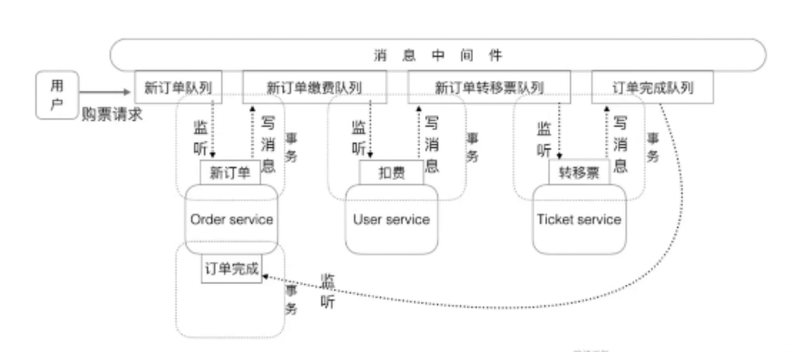
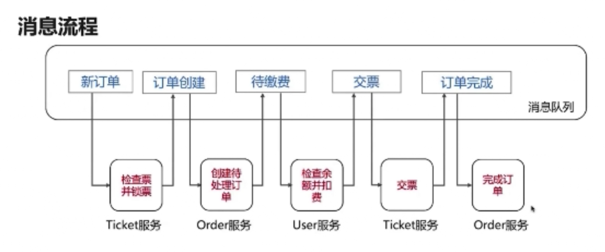
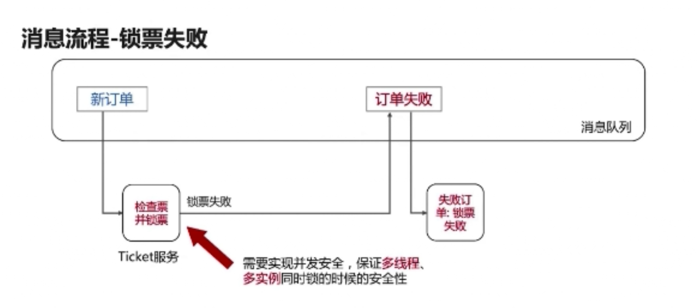
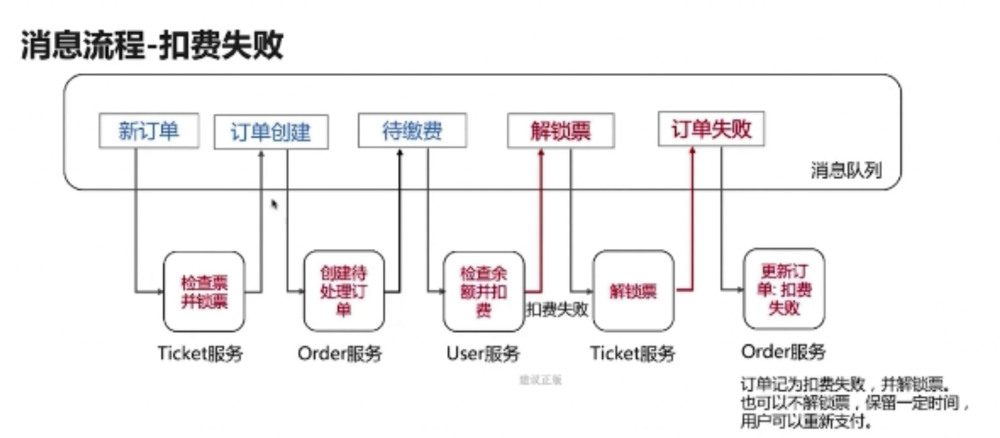

# 分布式事务

##概念

* 分布式事务就是将多个节点的事务看成一个整体处理
* 分布式事务由事务参与者、资源服务器、事务管理器等组成
* 常见的分布式事务的例子：支付、下订单等

## 分布式事务实现模式

* 消息驱动模式：Message Driven
  * 使用消息队列控制整个流程
* 事件溯源模式：Event Sourcing
  * EventStore
* TCC模式：Try-Confirm-Cancel

### 消息驱动的分布式事务

#### 购票案例：

#### 正常流程：

#### 异常流程：

锁票失败：

扣费失败：

#### 异常订单处理

* 定时任务处理异常订单：1.未被处理完的 2.虽然被处理但未被标记为已完成
* 解锁票、撤销交票
* 对于余额之类的重要数据，可能使用人工处理

#### 实现锁票的安全性

* 利用@JmsLIstener设置一个消费者，不适用于多实例
* 使用事务和数据库锁的特性
* 分布式锁

#### 系统错误的处理

* 方法1：将出错未处理的消息写到失败队列，进行相应的回滚操作
* 方法2：通过定时任务检查超时订单，对未完成的订单自动回滚（比较推荐）
* 方法3：保存出错消息，人工处理

## 幂等性

* 幂等操作：任意多次执行所产生的影响，与一次执行的影响相同
* 方法的幂等性：使用同样的参数调用一个方法多次，与调用一次结果相同
* 接口的幂等性：接口被重复调用，结果一致

### 微服务接口的幂等性：

如：消息的重试、网关调用失败重试

* 重要性：经常需要通过重试实现分布式事务的最终一致性
* Get方法不会对系统产生副作用、天然幂等
* POST、PUT、DELETE方法的实现需要满足幂等性

##2pc、3pc

https://zhuanlan.zhihu.com/p/35298019

