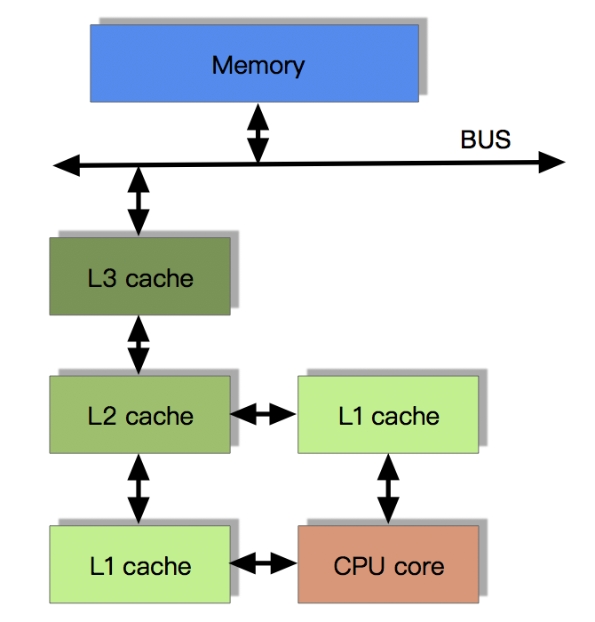
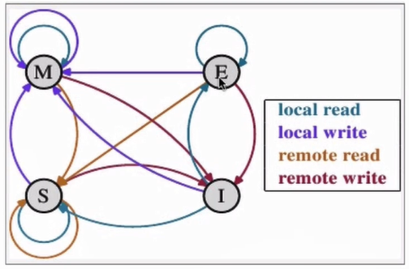
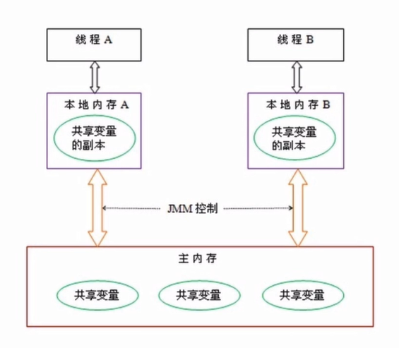
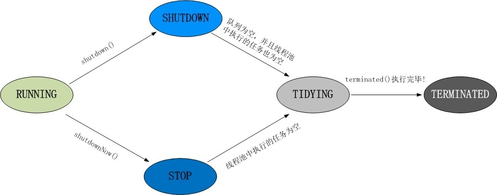

# 多线程


##概念

**并发**：同时拥有两个或者多个线程，如果程序在单核处理器上运行，多个线程将交替的换入或者换出内存，这些线程是同时“存在”的，每个线程都处于执行过程中的某个状态，如果运行在多核处理器上，此时，程序中的每个线程都将分配到一个处理器上，因此可以同时运行。

> 并发的关注点是：多个线程操作相同的资源，保证线程安全，合理使用资源。

**高并发（High Concurrency）**：是互联网分布式系统架构设计中必须考虑的因素之一，他通常指，通过设计保证系统能够**同时并行处理**很多请求。

> 高并发的关注点是：服务能同时处理很多请求，提高程序性能。


## CPU高速缓存


### CPU的多级缓存


CPU缓存（Cache Memory）是位于CPU与内存之间的临时存储器，它的容量比内存小的多但是交换速度却比内存要快得多。

CPU高速缓存的出现是为了解决主存的读写速度和CPU运算速度之间的不匹配的问题。

CPU有三级缓存，关于该部分内容，[详细内容请看这篇博客](https://blog.csdn.net/huayushuangfei/article/details/80717815)


####带有高速缓存的CPU执行计算流程

1. 程序以及数据被加载到主内存
2. 指令和数据被加载到CPU的高速缓存
3. CPU执行指令，把结果写到高速缓存
4. 高速缓存中的数据写回主内存


#### 目前流行的多级缓存结构

由于CPU的运算速度超越了1级缓存的数据I\O能力，CPU厂商又引入了多级的缓存结构。




### 缓存局部性原理


局部性原理是缓存技术的底层理论基础。局部性包含两种形式：

1. **时间局部性**，一个具有良好时间局部性的程序中。被引用过一次的存储器位置非常可能在不远的将来再被多次引用。

2. **空间局部性**，一个具有良好空间局部性的程序中，假设一个存储器位置被引用了一次，那么程序非常可能在不远的将来引用附近的一个存储器位置。


### 缓存一致性（MESI）


​	多核CPU的情况下有多个一级缓存，如何保证缓存内部数据的一致,不让系统数据混乱。用于保证多个CPU cache之间缓存共享数据的一致。


#### MESI协议缓存状态

MESI是指4种状态的首字母。每个Cache line有4个状态，可用2个bit表示：

> 缓存行（Cache line）：缓存存储数据的单元。

| 状态                     | 描述                                                         | 监听任务                                                     |
| ------------------------ | ------------------------------------------------------------ | ------------------------------------------------------------ |
| M 修改 (Modified)        | 该Cache line有效，数据被修改了，和内存中的数据不一致，数据只存在于本Cache中。 | 缓存行必须时刻监听所有试图读该缓存行相对于主存的操作，这种操作必须被延迟到缓存将该缓存行写回主存并将状态变成S（共享）状态之后。 |
| E 独享、互斥 (Exclusive) | 该Cache line有效，数据和内存中的数据一致，数据只存在于本Cache中。 | 缓存行也必须监听其它缓存读主存中该缓存行的操作，一旦有这种操作，该缓存行需要变成S（共享）状态。 |
| S 共享 (Shared)          | 该Cache line有效，数据和内存中的数据一致，数据存在于很多Cache中。 | 缓存行也必须监听其它缓存使该缓存行无效或者独享该缓存行的请求，并将该缓存行变成无效（Invalid）。 |
| I 无效 (Invalid)         | 该Cache line无效。                                           | 无                                                           |


####协议状态转换



​	在上图中，`Local Read`表示本内核读本Cache中的值，`Local Write`表示本内核写本Cache中的值，`Remote Read`表示其它内核读其它Cache中的值，`Remote Write`表示其它内核写其它Cache中的值，箭头表示本Cache line状态的迁移，环形箭头表示状态不变。


####MESI状态之间的迁移过程

| 当前状态     | 事件         | 行为                                                         | 下一个状态 |
| ------------ | ------------ | ------------------------------------------------------------ | ---------- |
| I(Invalid)   | Local Read   | 如果其它Cache没有这份数据，本Cache从内存中取数据，Cache line状态变成E； 如果其它Cache有这份数据，且状态为M，则将数据更新到内存，本Cache再从内存中取数据，2个Cache 的Cache line状态都变成S； 如果其它Cache有这份数据，且状态为S或者E，本Cache从内存中取数据，这些Cache 的Cache line状态都变成S | E/S        |
|              | Local Write  | 从内存中取数据，在Cache中修改，状态变成M； 如果其它Cache有这份数据，且状态为M，则要先将数据更新到内存； 如果其它Cache有这份数据，则其它Cache的Cache line状态变成I | M          |
|              | Remote Read  | 既然是Invalid，别的核的操作与它无关                          | I          |
|              | Remote Write | 既然是Invalid，别的核的操作与它无关                          | I          |
| E(Exclusive) | Local Read   | 从Cache中取数据，状态不变                                    | E          |
|              | Local Write  | 修改Cache中的数据，状态变成M                                 | M          |
|              | Remote Read  | 数据和其它核共用，状态变成了S                                | S          |
|              | Remote Write | 数据被修改，本Cache line不能再使用，状态变成I                | I          |
| S(Shared)    | Local Read   | 从Cache中取数据，状态不变                                    | S          |
|              | Local Write  | 修改Cache中的数据，状态变成M， 其它核共享的Cache line状态变成I | M          |
|              | Remote Read  | 状态不变                                                     | S          |
|              | Remote Write | 数据被修改，本Cache line不能再使用，状态变成I                | I          |
| M(Modified)  | Local Read   | 从Cache中取数据，状态不变                                    | M          |
|              | Local Write  | 修改Cache中的数据，状态不变                                  | M          |
|              | Remote Read  | 这行数据被写到内存中，使其它核能使用到最新的数据，状态变成S  | S          |
|              | Remote Write | 这行数据被写到内存中，使其它核能使用到最新的数据，由于其它核会修改这行数据， 状态变成I | I          |


[参考](https://blog.csdn.net/cl2010abc/article/details/80745185)


### CPU乱序执行优化

​	处理器为提高运算速度而做出违背代码原有顺序的优化。比如下面，在多核时代CPU的乱序优化会带来一些问题。

```shell
# 优化前
a = 10;
b = 20;
result = a * b;

# 优化后
b = 20;
a = 10;
result = a * b;
```


## Java内存模型

​	

​	在处理器层面上，内存模型定义了一个充要条件，“让当前的处理器可以看到其他处理器写入到内存的数据”以及“其他处理器可以看到当前处理器写入到内存的数据”。

​	Java内存模型（Java Memory model，JMM），他是一种规范。描述了在多线程代码中哪些行为是合法的，以及线程如何通过内存进行交互，它描述了“程序中的变量”和“从内存或者寄存器获取或存储它们的底层细节”之间的关系。Java内存模型通过使用各种各样的硬件和编译器的优化来正确实现以上事情。

​	由于CPU的CPU缓存以及乱序执行优化导致的指令重排的导致了一些问题。所以就需要Java内存模型规范来解决。它规范了Java虚拟机和内存是如何协同工作的。


### JMM抽象结构图



​	在多线程环境下，多线程访问同一个资源的时候，他们是各自持有了一份资源的私有copy，也就是上图中的共享变量副本。

​	Java多线程中，每个线程都有自己的工作内存，需要和主存进行交互。这里的工作内存和计算机硬件的缓存并不是一回事儿，只是可以相互类比。所以，并发编程的可见性问题，是因为各个线程之间的本地内存数据不一致导致的，和计算机缓存并无关系。


### 原子性操作与内存操作规则


#### 八种原子性操作


**lock（锁定）**：作用于主内存，它把一个变量标记为一条线程独占状态；

**read（读取）**：作用于主内存，它把变量值从主内存传送到线程的工作内存中，以便随后的load动作使用；

**load（载入）**：作用于工作内存，它把read操作的值放入工作内存中的变量副本中；

**use（使用）**：作用于工作内存，它把工作内存中的值传递给执行引擎，每当虚拟机遇到一个需要使用这个变量的指令时候，将会执行这个动作；

**assign（赋值）**：作用于工作内存，它把从执行引擎获取的值赋值给工作内存中的变量，每当虚拟机遇到一个给变量赋值的指令时候，执行该操作；

**store（存储）**：作用于工作内存，它把工作内存中的一个变量传送给主内存中，以备随后的write操作使用；

**write（写入）**：作用于主内存，它把store传送值放到主内存中的变量中。

**unlock（解锁）**：作用于主内存，它将一个处于锁定状态的变量释放出来，释放后的变量才能够被其他线程锁定；


#### 原子性操作规则


Java内存模型还规定了执行上述8种基本操作时必须满足如下规则:

1、不允许read和load、store和write操作之一单独出现（即不允许一个变量从主存读取了但是工作内存不接受，或者从工作内存发起写操作但是主存不接受的情况），以上两个操作必须按顺序执行，但没有保证必须连续执行，也就是说，read与load之间、store与write之间是可插入其他指令的。

2、不允许一个线程丢弃它的最近的assign操作，即变量在工作内存中改变了之后必须把该变化同步回主内存。

3、不允许一个线程无原因地（没有发生过任何assign操作）把数据从线程的工作内存同步回主内存中。

4、一个新的变量只能从主内存中“诞生”，不允许在工作内存中直接使用一个未被初始化（load或assign）的变量，换句话说就是对一个变量实施use和store操作之前，必须先执行过了assign和load操作。

5、一个变量在同一个时刻只允许一条线程对其执行lock操作，但lock操作可以被同一个条线程重复执行多次，多次执行lock后，只有执行相同次数的unlock操作，变量才会被解锁（重入）。

6、如果对一个变量执行lock操作，将会清空工作内存中此变量的值，在执行引擎使用这个变量前，需要重新执行load或assign操作初始化变量的值。

7、如果一个变量实现没有被lock操作锁定，则不允许对它执行unlock操作，也不允许去unlock一个被其他线程锁定的变量。

8、对一个变量执行unlock操作之前，必须先把此变量同步回主内存（执行store和write操作）。


##线程安全性

​	当多个线程访问某个类时，不管运行时环境采用**何种调度方式**或者这些进程将如何交替执行，并且在主调代码中**不需要任何额外的同步或协同**，这个类都能表现出**正确的行为**，那么就称这个类是线程安全的。


线程安全性包括三点：

- 原子性：提供了互斥访问，同一时刻只能有一个线程来对它进行操作。
- 可见性：一个线程对主内存的修改可以及时的被其他线程观察到。
- 有序性：一个线程观察其他线程中的指令执行顺序，由于指令重排序的存在，该观察结果一般杂乱无序。


### 原子性


​	**原子性**就是指该操作是不可再分的。单纯的原子性也不能保证线程安全，需要整体的原子性操作，才能保证线程安全。**比如说两条语句，每一句都是原子性操作，但是多线程的情况，可能会在语句之间进来，依然线程不安全**。


#### Java中的原子操作


* 除long和double之外的基本类型的赋值操作
* 所有引用reference的赋值操作
* `java.concurrent.Atomic.* `包中所有类的一切操作。	


#### Java实现原子性操作方式


##### Synchronized

1、修饰代码块：大括号括起来的代码，作用于调用的对象

2、修饰方法：整个方法，作用于调用的对象

3、修饰静态方法：整个静态方法，作用于类

适用场景：悲观认为并发很高，需要阻塞，需要上锁

特点：语言层面的优化，锁粗化、偏向锁、轻量锁等等；可读性高。


##### Lock


##### Atomic

通过`compareAndSwap`，也就是`CAS`，来保证了对数据操作的原子性。先把当前值和底层的值（线程工作空间的值）进行比较，如果相等，也就是说该值未被其他线程改变，则执行更新的操作，否者那么就不停的循环判断。

适用场景：乐观认为并发不高，不需要阻塞，可以不上锁。 

特点：不断比较更新，直到成功。

缺点：高并发cpu压力大；ABA问题。

ABA问题： 

CAS机制生效的前提是，取出内存中某时刻的数据，而在下时刻比较并替换。 

如果在比较之前，数据发生了变化，例如：A->B->A，即A变为B然后又变化A，那么这个数据还是发生了变化，但是CAS还是会成功。

Java中CAS机制使用版本号进行对比，避免ABA问题。


#### 不同实现方式的区别


**Synchronized**：不可中断锁，竞争激烈的时候性能下降，不过JDK8中做了优化，实际和Lock差不多，可读性好。

**Lock**：可中断锁，多样化同步，竞争激烈时能维持常态。

**Atomic**：竞争激烈时能维持常态，但浪费CPU资源严重，以为需要不停的失败重试，比Lock性能好；只能同步一个值。


### 有序性


​	有序性即程序执行的顺序按照代码的先后顺序执行。在Java内存模型中，允许编译器和处理器对指令进行重排序，但是重排序过程不会影响到单线程程序的执行，却会影响到多线程并发执行的正确性。（例如：重排的时候某些赋值会被提前），这一点在[CPU高速缓存](#CPU乱序执行优化)已经介绍过了。

​	在Java里面，可以通过`volatile`关键字来保证一定的“有序性”。另外可以通过`synchronized`和`Lock`来保证有序性，很显然`synchronized`和`Lock`保证每个时刻是仅有一个线程执行同步代码，相当于是让线程顺序执行同步代码，这样就无所谓指令重排了。这里需要注意的是，`synchronized`是无法禁止指令重排和处理器优化的。

​	Java虚拟机天生存在一些有序性规则，会根据是否符合`happens-before`原则，来确定是否对指令进行重排序优化。如果符合，则不对指令进行重排序优化，否则虚拟机无法保证有序性，会对其进行随意的重排序。


#### happens-before原则

1. **程序次序规则**：一个线程内，按照代码顺序，书写在前面的操作先行发生于书写后面的操作。（这里说的是具有依赖性的代码，如果代码之间不存在依赖性，那么还是会出现指令重排序的情况，这条规则是用来保证单线程的执行的有序性）
2. **锁定规则**：一个`unlock`操作先行发生于后面对同一个锁的`lock`操作。
3. **volatile变量原则**：对一个变量的写操作先行发生于后面对这个变量的读操作。
4. **传递规则**：如果操作A先行发生于操作B，而操作B又先行发生于操作C，则可以得出操作A先行发生于操作C。
5. **线程启动规则**：Thread对象的`start()`方法先行发生于此线程的每一个动作。
6. **线程中断规则**：对线程`interrupt()`方法的调用先行发生于被中断线程的代码检测到中断事件的发生。
7. **线程终结规则**：线程中所有的操作都先行发生于线程的终止检测，我们可以通过`Thread.join()`方法结束、`Thread.isAlive()`的返回值手段检测到线程已经终止执行。
8. **对象终结规则**：一个对象的初始化完成先行发生于他的`finalize()`方法的开始。


### 可见性


​	**可见性**是指当多个线程访问同一个变量时，一个线程修改了这个变量的值，其他线程能够立即看得到修改的值。


​	**共享变量在线程间不可见的原因**主要是共享变量更新后的值没有在工作内存与主存间及时更新，所以导致工作内存共享变量数据和主内存共享变量数据不一致。


#### Java中实现可见性


​	Java提供了`volatile`关键字来保证可见性。单纯的volatile只保证了内存可见性，还需要操作是原子性（8种原子性操作）的，才能保证线程的安全。

​	当一个共享变量被`volatile`修饰时，他会保证修改的值会立即被更新到主存，当其他线程需要读取时，他会去内存中读取新值。而普通的共享变量不能保证可见性，因为普通共享变量被修改之后，什么时候被写入主存是不确定的，当其他线程去读取时，此时内存中可能还是原来的旧值。

​	通过`synchronized`和`Lock`也能保证可见性，Java内存模型规范中规定，线程解锁前，必须把共享变量的最新值刷新到主内存，线程加锁时，将清空工作内存中共享变量的值，从而使用共享变量时需要从主内存中重新读取最新的值（加锁与解锁是同一把锁）。

​	**加锁的含义不仅仅局限于互斥行为，还包括内存可见性。为了确保所有线程都能看到共享变量的最新值，所有执行读操作或者写操作的线程都必须在同一个锁上同步。**


###  volatile关键字原理关键字原理


​	volatile是通过**内存屏障**和**禁止指令重排优化**来实现内存可见性和有序性的。


#### 内存屏障

- 硬件层的内存屏障分为两种：`Load Barrier` 和 `Store Barrier`即读屏障和写屏障。
- 内存屏障有两个作用：

> 1. 阻止屏障两侧的指令重排序；
> 2. 强制把写缓冲区/高速缓存中的脏数据等写回主内存，让缓存中相应的数据失效。

- 对于Load Barrier来说，在指令前插入Load Barrier，可以让高速缓存中的数据失效，强制从新从主内存加载数据；
- 对于Store Barrier来说，在指令后插入Store Barrier，能让写入缓存中的最新数据更新写入主内存，让其他线程可见。


####Java内存屏障

​	**内存屏障** （Memory Barrier，或有时叫做内存栅栏，Memory Fence）是一种CPU指令，用于控制特定条件下的重排序和内存可见性问题。Java编译器也会根据内存屏障的规则禁止重排序。

​	内存屏障可以被分为以下几种类型：

​	1.、`LoadLoad`屏障：对于这样的语句`Load1；LoadLoad；Load2`，在`Load2`及后续读取操作要读取的数据被访问前，保证`Load1`要读取的操作被读取完毕。

​	2、`StoreStore`屏障：对于这样的语句`Store1；StoreStore；Store2`，在`Store2`及后续写入操作执行之前，保证`Store1`的写入操作必须写入主存，并对其它处理器可见。

​	3、`LoadStore`屏障：对于这样的语句`Load1；LoadStore；Store2`，在`Store2`及后续写入操作执行之前，保证`Load1`读取的数据读取完毕。

​	4、`StoreLoad`屏障：对于这样的语句`Store1；StoreLoad；Load2`，在`Load2`及后续读取操作读取完毕之前，保证`Store1`的写入操作必须写入完毕，并对其他处理器可见。 **它的开销是四种屏障中最大的。在大多数处理器的实现中，这个屏障是个万能屏障，兼具其它三种内存屏障的功能**


#### volatile中内存屏障的使用

​	在每个`volatile`写操作前插入`StoreStore`屏障，在写操作后插入`StoreLoad`屏障，将工作内存中的共享变量值刷新到主内存中； 在每个`volatile`读操作前插入`LoadLoad`屏障，在读操作后插入`LoadStore`屏障，从主内存中读取共享变量；


####volatile的使用场景

​	只能在有限的一些情形下使用 volatile 变量替代锁。要使 volatile 变量提供理想的线程安全，必须同时满足下面两个条件：

- 对变量的写操作不依赖于当前值，或者你能确保只有单个线程更新变量的值
- 该变量不会与其他状态变量一起纳入不变性条件中。
- 在访问变量时不需要加锁。


#### 双重检测中指令重排问题

```java
public class Singleton {
	//变量single为什么要用volatile修饰？
    private static volatile Singleton singleton = null;

    private Singleton(){}

    public static Singleton getInstance(){
            if (singleton == null){
                synchronized (Singleton.class){
                    if (singleton == null){
                        singleton = new Singleton();
                    }
                }
            }
        return singleton;
    }
}
```


**在双重检测（Double Check）的懒汉式单例模式中，变量single为什么要用volatile修饰？**

在构造对象的时候分为三步：

1、为对象分配内存空间

2、初始化对象

3、将这块内存空间的引用返回

虚拟机在实例化对象的时候，可能出现指令重排变成了：

1、为对象分配内存空间

3、将这块内存空间的引用返回

2、初始化对象

​	因为第二步和第三步没有依赖关系。这就导致了在双重检测中的线程安全问题，有可能返回的`singleton`引用其实并没有初始化，导致错误。通过`volatile`关键字来防止指令重排。


## 安全发布对象

​	如果在对象构造完成之前就发布该对象，就会破坏线程安全性。当一个不该发布的对象被发布时，这种情况被称为“逸出”；


### 安全发布对象的常用模式

​	要安全的发布一个对象，对象的引用以及对象的状态必须同时对其他线程可见，一个**正确构造的对象**可以通过以下方式来安全的发布：

* 在静态初始化函数中初始化一个对象引用（静态方法或者静态代码块，静态初始化器由JVM在类的初始化阶段执行。由于在JVM内部存在着同步机制，通过这种方式初始化的任何对象都可以被安全的发布）
* 将对象的引用保存到volatile类型域或者AtomicRefrence对象中（volatile防止对象构造期间的指令重排，保证对象的正确构造）
* 将对象的引用保存到某个正确构造对象的final类型域中（Java内存模型为final域提供了特殊的初始化安全性保证）
* 将对象的引用保存到一个由锁保护的域中（同步操作或者同步容器中）


### 线程封闭

当访问共享的可变数据时，通常需要使用同步。一种避免使用同步的方式就是不共享数据。如果仅在单线程内访问数据，就不需要同步。这种技术被称为线程封闭（Thread Confinement）。

* Ad-hoc线程封闭
* 栈封闭（尽量使用局部变量）
* ThreadLocal


### 安全的共享对象

在并发程序中使用和共享对象时，可以使用一些实用的策略。包括：

**线程封闭**。线程封闭的对象只能由一个线程拥有，对象封闭在该线程中，并且只能有这个线程修改。

**只读共享**。在没有额外同步的情况下，共享的制度对象可以由多个线程并发访问，但任何线程都不能修改它。共享的只读对象包括不可变对象和事实不可变对象。

**线程安全共享**。线程安全的对象或者容器在其内部实时同步，因此多个线程可以通过对象的共有接口来进行访问而不需要进一步的同步。

**保护对象**。被保护的对象只能通过持有特定的锁来访问。保护对象包括封装在其他线程安全对象中的对象，以及已发布的并且有某个特定锁保护的对象。


## 设计线程安全的类

在设计线程安全的类的过程中，需要包含以下**三个基本要素**：

* 找出构成对象状态的所有变量
* 找出约束状态变量的不变性条件
* 建立对象状态的并发访问管理策略


## 同步容器

### ConcurrentHashMap


## AQS

​	`AQS`是`AbstractQueuedSynchronizer`的简称。`AQS`是一个用于构建锁和同步器的框架，许多同步器都可以通过`AQS`很容易并且高效的构造出来。`ReentrantLock`、`Semaphore`、`CountDownLatch`、`ReetrantReadWriteLock`、`SynchronousQueue`和`FutureTask`都是基于`AQS`来构建的。

​	同步队列是`AQS`很重要的组成部分，它是一个双端队列，遵循FIFO原则，主要作用是用来存放在锁上阻塞的线程，当一个线程尝试获取锁时，如果已经被占用，那么当前线程就会被构造成一个`Node`节点（内部类）假如到同步队列的尾部，队列的头节点是成功获取锁的节点，当头节点线程是否锁时，会唤醒后面的节点并释放当前头节点的引用。 


[参考博客链接](https://blog.csdn.net/zhangdong2012/article/details/79983404)

[AQS源码分析](AQS源码分析.md)

### CountDownLatch


​	`CountDownLatch`是`AQS`共享锁的一种实现。是通过计数器的方式来实现，计数器的初始值为线程的数量。每当一个线程完成了自己的任务之后，就会对计数器减1，当计数器的值为0时，表示所有线程完成了任务，此时等待在闭锁上的线程才继续执行，从而达到等待其他线程完成任务之后才继续执行的目的。

​	**CountDownLatch能够使一个或多个线程等待其他线程完成各自的工作后再执行**；他是闭锁的一种实现。

​	**闭锁（Latch）**：一种同步方法，可以延迟线程的进度直到线程到达某个终点状态。通俗的讲就是，一个闭锁相当于一扇大门，在大门打开之前所有线程都被阻断，一旦大门打开所有线程都将通过，但是一旦大门打开，所有线程都通过了，那么这个闭锁的状态就失效了，门的状态也就不能变了，只能是打开状态。也就是说闭锁的状态是一次性的，它确保在闭锁打开之前所有特定的活动都需要在闭锁打开之后才能完成。


**常用方法**：

```java
public void await() throws InterruptedException{}
//设置超时时间（任务执行的超时时间）
public boolean await(long timeout, TimeUnit unit){}
public void countDown(){}
```


**使用场景**

（1）开启多个线程分块下载一个大文件，每个线程只下载固定的一截，最后由另外一个线程来拼接所有的分段。

（2）应用程序的主线程希望在负责启动框架服务的线程已经启动所有的框架服务之后再执行。

（3）确保一个计算不会执行，直到所需要的资源被初始化。

......


### Semaphore

 	Semaphore是一种在多线程环境下使用的设施，该设施负责协调各个线程，以保证它们能够正确、合理的使用公共资源的设施，也是操作系统中用于控制进程同步互斥的量。Semaphore是一种计数信号量，用于管理一组资源，内部是基于**AQS的共享模式**。它相当于给线程规定一个量从而控制允许活动的线程数。 **Semaphore**是一个计数信号量，常用于限制可以访问某些资源（物理或逻辑的）线程数目。


**理解**

>  	以一个停车场是运作为例。为了简单起见，假设停车场只有三个车位，一开始三个车位都是空的。这时如果同时来了五辆车，看门人允许其中三辆不受阻碍的进入，然后放下车拦，剩下的车则必须在入口等待，此后来的车也都不得不在入口处等待。这时，有一辆车离开停车场，看门人得知后，打开车拦，放入一辆，如果又离开两辆，则又可以放入两辆，如此往复。这个停车系统中，每辆车就好比一个线程，看门人就好比一个信号量，看门人限制了可以活动的线程。假如里面依然是三个车位，但是看门人改变了规则，要求每次只能停两辆车，那么一开始进入两辆车，后面得等到有车离开才能有车进入，但是得保证最多停两辆车。对于Semaphore类而言，就如同一个看门人，限制了可活动的线程数。


**常用方法**：

```java
public void acquire() throws InterruptedException {}
public void acquire(int permits) throws InterruptedException {}
public boolean tryAcquire(int permits) {}
public boolean tryAcquire(int permits, long timeout, TimeUnit unit){} 
public void release(int permits) {}
```


### ReentrantLock


在Java中通常实现锁有两种方式，一种是synchronized关键字，另一种是Lock。


`synchronized`关键字提供了一种独占的加锁方式。`synchronized`的获取和释放锁由JVM实现，用户不需要显示的释放锁，非常方便。然而`synchronized`也有一定的局限性，例如：

1. 当线程尝试获取锁的时候，如果获取不到锁会一直阻塞。
2. 如果获取锁的线程进入休眠或者阻塞，除非当前线程异常，否则其他线程尝试获取锁必须一直等待。


`ReentrantLock`是`Lock`的默认实现之一。


**相较synchronized，ReentrantLock的特点：**

* 可指定是公平锁还是非公平锁

  > 公平锁是指多个线程同时尝试获取同一把锁时，获取锁的顺序按照线程达到的顺序，而非公平锁则允许线程“插队”。

* 提供了一个Condition类，可以分组唤醒需要唤醒的线程

* 提供能够中断等待锁的机制，`lock.lockInterruptibly()`


**常用方法：**

```java
public void lock(){}
public void unlock(){}
```


### CyclicBarrier

​		`CyclicBarrier`他允许一组线程互相等待，知道到达某个公共屏障点（common barrier point）。它采用加计数的方式，并且是可重用的。比如将计数器设置为10，那么计数器增加到10的时候，计数器就会归0，然后继续下一批。


**常用方法：**

```java
public int await(long timeout, TimeUnit unit){}
//线程到达屏障的时候，优先执行这个任务
public CyclicBarrier(int parties, Runnable barrierAction) {}
```


### 区别

**CountDownLatch和Semaphore的区别：**

​	`CountDownLatch`表示的是所有预备动作完成后，才能进行下一步，一旦执行下一步，这个`CountDownLatch`就是失效了，是不能重新利用的。

​	`Semaphore`表示拿到相应的许可才能做下一步，这个许可时可以释放然后让他人获取的。

虽然感觉有相交的地方。但两者的着重点不一样。


**CountDownLatch和CyclicBarrier的区别：**

​	`CountDownLatch`采用减计数的方式，计算为0时释放所有等待的线程，计数为0时，无法重置，调用`countDown()`方法计数减一，调用`await()`方法只进行阻塞，对技术没有任何影响，他是不可重复利用的。

​	`CyclicBarrier`采用加计数的方式，计数达到指定值时释放所有等待线程，计数达到指定值时，计数置为0重新开始。调用`await（）`方法计数加`1`，若加`1`后的值不等于构造方法的值，则线程阻塞。他是可重复利用的。


`CountDownLatch`强调**一个线程(或者多个)等待**多个线程完成某件事情

`CyclicBarrier`强调**多个线程，大家相互等待**，只要有一个没完成，所有人都得等着。


**ReentrantLock和synchronized区别：**

​	ReentrantLock可以实现synchronized的所有功能，并且还有设置是否是公平锁，分组唤醒需要唤醒的线程，中断锁等特性。

​	在JDK1.6之前，ReentrantLock的性能要明显优于synchronized，但是JDK1.6中加入了很多针对锁的优化措施，synchronized和ReentrantLock的性能基本完全持平了。


## J.U.C其他组件


### FutureTask


### BlockingQueue


#### ArrayBlockingQueue

#### DelayQueue

#### PriorityBlockingQueue

#### SynchronousQueue

#### LinkedBlockingDeque


## 线程池

​	**线程池**（英语：thread pool是一种线程使用模式。传统的手动创建线程会造成对系统资源浪费以及一些奇怪的问题。线程池的可以维护几个线程，当有任务需要执行的时候，用户直接从池中取线程用就可以了。


###线程池的好处

 * 重用存在的线程，减少对象创建、消亡的开销，性能好。
 * 可有效控制最大并发线程数，提高系统资源利用率，同时可以避免过多资源竞争，避免阻塞。
 * 提供定时执行、定期执行、单线程、并发数控制等功能。


###线程池核心参数

```java
public ThreadPoolExecutor(int corePoolSize,
                          int maximumPoolSize,
                          long keepAliveTime,
                          TimeUnit unit,
                          BlockingQueue<Runnable> workQueue,
                          ThreadFactory threadFactory,
                          RejectedExecutionHandler handler) {}
```

**corePoolSize**：核心线程数量

> * 核心线程会一直存活，即使线程处于空闲状态
>
> * 如果线程池中的线程数量小于corePoolSize，无论是否线程空闲，都会创建新的线程处理任务

**maximumPoolSize**：线程最大线程数

> * 如果corePoolSize == maximumPoolSize的时候，线程池是固定大小。
> * 如果线程池中的线程数量大于等于corePoolSize ，小于maximumPoolSize，并且任务队列已满时，线程池会创建新新来处理任务。
> * 如果线程池中的线程数量等于maximumPoolSize，切任务队列已满时，线程池会执行拒绝策略。

**keepAliveTime**：线程池中的线程存活时间（准确来说应该是没有任务执行时的回收时间）

**unit**：keepAliveTime的时间单位

**workQueue**：任务阻塞队列，存储等待执的任务，很重要，会对线程池运行过程产生重大影响。

**threadFactory**：线程工厂，用来创建线程

**rejectHandler**：当拒绝处理任务时的策略

> AbortPolicy：直接抛出异常的策略（默认策略）
>
> CallerRunsPolicy：利用调用者所在线程执行任务
>
> DiscardOldestPolicy：丢弃掉阻塞队列中最靠前的任务，并执行当前任务
>
> DiscardPolicy：丢弃当前任务


### 线程池状态




​	线程池调用`shutdown()`方法时，线程池会停止接收新任务，将线程池中的任务

（包括任务队列中的任务）全部处理完毕后，再关闭。

​	线程池调用`shutdownNow()`方法时，相比`shutdown()`方法，不会处理在任务队列中的任务，就关闭。


### 常用方法

```java
//提交任务，交给线程池执行，无返回值
public void execute(Runnable command){}
//提交任务，交给线程池执行，有返回值
public <T> Future<T> submit(Callable<T> task){}
//关闭线程池方法
public void shutdown(){}
public List<Runnable> shutdownNow(){}
//线程池已执行和未执行的任务总数
public long getTaskCount(){}
//已完成的任务数量
public long getCompletedTaskCount() {}
//线程池当前的线程数量
public int getPoolSize() {}
//当前正在执行任务的线程数量
public int getActiveCount(){}   
```


### Executors


**newCachedThreadPool()**：创建一个可缓存线程池，如果线程池长度超过处理需要，可灵活回收空闲线程，如果没有线程可用，则新建线程。

**newFixedThreadPool(int nThreads)**：创建一个定长线程池，可控制线程最大并发数，超出的线程会在队列中等待。

**newScheduledThreadPool(int corePoolSize)**：创建一个定长线程池，支持定时及周期性任务执行。

**newSingleThreadExecutor()**： 创建一个单线程化的线程池，它只会用唯一的工作线程来执行任务，保证所有任务按照指定顺序(FIFO, LIFO, 优先级)执行。


### 线程池合理配置

* CPU密集型任务，就需要尽量压榨CPU，参考值可以设为NCPU + 1。
* IO密集型任务，参考值可以设置为2*CPU


## 多线程并发最佳实践

* 使用本地变量
* 使用不可变类
* 最小化锁的作用域范围：`S=1/(1-a+a/n)`
* 使用线程池的`Executor`，而不是直接`new Thread()`执行
* 宁可使用同步也不要使用线程的`wait`和`notify`
* 使用`BlockingQueue`实现生产-消费模式
* 使用并发集合而不是加了锁的同步集合
* 使用Semaphore控制访问有限资源的线程数
* 宁可使用同步代码块，也不使用同步方法
* 避免使用静态变量，如果使用尽量是final


## 注意

1、缓存一致性（Cache Coherence），解决的是多个缓存副本之间的数据的一致性问题。Java内存模型屏蔽计算机硬件问题，主要来解决并发编程中的原子性、有序性和一致性问题。

[友情链接](https://www.zhihu.com/question/268021813)

2、 volatile关键字原理[ volatile关键字原理](#volatile关键字原理)

3、final语义中的内存屏障

- 对于final域，编译器和CPU会遵循两个排序规则：

> 1. 新建对象过程中，构造体中对final域的初始化写入和这个对象赋值给其他引用变量，这两个操作不能重排序；（废话嘛）
> 2. 初次读包含final域的对象引用和读取这个final域，这两个操作不能重排序；（晦涩，意思就是先赋值引用，再调用final值）

- 总之上面规则的意思可以这样理解，必需保证一个对象的所有final域被写入完毕后才能引用和读取。这也是内存屏障的起的作用：
- 写final域：在编译器写final域完毕，构造体结束之前，会插入一个StoreStore屏障，保证前面的对final写入对其他线程/CPU可见，并阻止重排序。
- 读final域：在上述规则2中，两步操作不能重排序的机理就是在读final域前插入了LoadLoad屏障。
- X86处理器中，由于CPU不会对写-写操作进行重排序，所以StoreStore屏障会被省略；而X86也不会对逻辑上有先后依赖关系的操作进行重排序，所以LoadLoad也会变省略。

4、Atomic类虽然能保证原子操作，但并不能保证可见性。

5、常见的线程不安全的写法：

* StringBuilder

* SimpleDateFormat

* 非同步集合

* **先检查再执行**：

  > ```java
  > if（condition(a)){	
  > 	handle(a);
  > }
  > ```

当存在这些场景时，应该考虑是否在操作共享资源。


6、进程和线程的区别？

进程是资源分配的最小单位，线程是CPU调度的最小单位

* 所有与进程相关的资源，都被记录在PCB中
* 进程是抢占处理机的调度单位；线程属于某个进程没共享其资源
* 线程只由堆栈寄存器、程序计数器和线程控制表（TCB）组成

总结：

* 线程不能看作独立的应用，而进程可看做独立的应用
* 进程有独立的地址空间，相互不影响，线程只是进程的不同执行路径
* 线程没有独立的地址空间，多进程的程序比多线程程序健壮
* 进程的切换比线程的切换开销大

Java进程和线程的关系

* Java对操作系统提供的功能进行封装，包括进程和线程
* 运行一个程序会产生一个进程，进程包含至少一个线程
* 每个进程对应一个JVM实例，多个线程共享JVM里的堆
* Java采用单线程编程模型，程序会自动创建主线程
* 主线程可以创建子线程，原则上要后于子线程完成执行


7、如何等待处理线程的返回值？

* 主线程等待法：主线程轮训等待处理线程的返回值
* 使用Thread类的join()阻塞当前线程以等待子线程处理完毕
* 通过Callable接口实现：通过Future Task 或 线程池获取

8、线程的状态

六个状态：

* **新建（NEW）**：创建后尚未启动的线程的状态

* **运行（RUNNABLE）**：包含Running和Ready

* **阻塞（BLOCKED）**：等待获取排它锁

* **无限期等待（WAITING）**：不会被分配CPU执行时间，需要显式的被唤醒
  * 没有设置Timeout参数的Object.wait()方法
  * 没有设置Timeout参数的Thread.join()方法
  * LockSupport.park()方法

* **限期等待（TIMED_WAITING）**：在一定时间后又系统自动唤醒
  * Thread.sleep()方法
  * 设置了Timeout参数的Object.wait()方法
  * 设置了Timeout参数的Thread.join()方法
  * LockSupport.parkNanos()方法
  * LockSupport.parkUntil()方法

* **结束（TERMINATED）**：已终止线程的状态，线程已经结束执行


9、sleep和wait的区别

* sleep是Thread类的方法，wait是Object类中定义的方法
* sleep方法可以在任何地方使用
* wait方法只能在synchronized方法或synchronized块中使用

* Thread.sleep只会让出CPU，不会导致锁行为的改变
* Object.wait不仅让出CPU，还会释放已经占有的同步资源锁