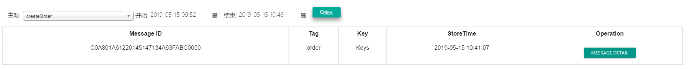
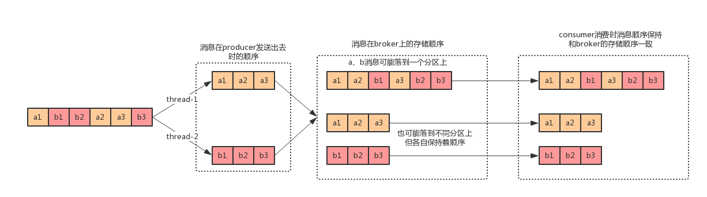
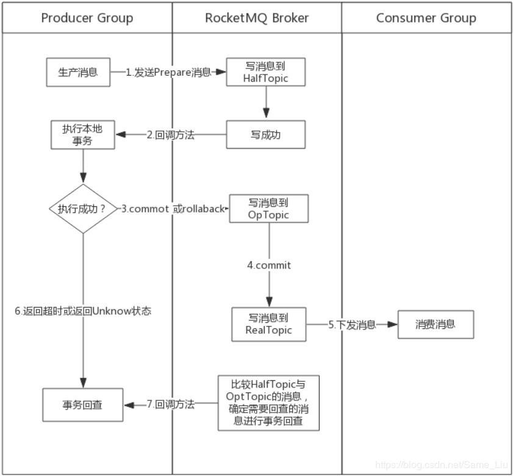

# 消息队列


## 消息中间件的优缺点

优点：

* 异步、

* 解耦、

* 限流、路由
* 削峰

缺点：

* 增加了系统复杂性，比如重复消息，消息丢失，消息堆积的解决

* 导致系统可用性降低。比如MQ挂掉了，那所有的下游服务是不是不可用了
* 异步处理时，给前端返回成功，但后台处理错误，业务一致性问题


## 推与拉模式学习


消息中间件的主要功能是消息的**路由(Routing)**和**缓存(Buffering)**。


一种分类是推和拉 。

还有一种分类是 Queue 和 Pub/Sub 。

 


降低耦合性,提高系统性能。


消息中间件利用高效可靠的消息传递机制进行平台无关的数据交流，并基于数据通信来进行[分布式系统](https://baike.baidu.com/item/%E5%88%86%E5%B8%83%E5%BC%8F%E7%B3%BB%E7%BB%9F)的集成。通过提供消息传递和消息排队模型，它可以在分布式环境下扩展进程间的通信。 ----------From baidu.com

## JMS

定义了一系列的接口规范，像是JDBC， 各大厂商遵从这个规范进行开发自己的消息中间件。

JMS定义了五种不同的消息正文格式，以及调用的消息类型，允许你发送并接收以一些不同形式的数据，提供现有消息格式的一些级别的兼容性。 


### JMS元素

Provider提供方：服务提供者

Producer生产者：创建和发送JMS消息的客户端

Consumer消费者：接受JMS消息的客户端

Client客户端：生产或消费消息的应用&进程

Message消息：服务端与客户端之间的传输数据对象

Queue队列：包含待读取消息的准备区域

Topic主题：发布消息的分布机制


###消息类型

· MapMessage--一套名称-值对

· TextMessage--一个字符串对象

· ObjectMessage--一个序列化的 Java对象

· BytesMessage--一个未解释字节的数据流

· StreamMessage -- Java原始值的数据流

### 消息传递类型


JMS中定义了两种消息模型：点对点（point to point， queue）和发布/订阅（publish/subscribe，topic）。主要区别就是是否能重复消费。


####1）点对点模式


a）在点对点通信模式中，应用程序由消息队列，发送方，接收方组成。每个消息都被发送到一个特定的队列，接收者从队列中获取消息。队列保留着消息，直到他们被消费或超时。 

b）特点：

* 每个消息只要一个消费者
* 发送者和接收者在时间上是没有时间的约束，也就是说发送者在发送完消息之后，不管接收者有没有接受消息，都不会影响发送方发送消息到消息队列中。
* 发送方不管是否在发送消息，接收方都可以从消息队列中去到消息（The receiver can fetch message whether it is running or not when the sender sends the message）
* 接收方在接收完消息之后，需要向消息队列应答成功

####2）发布/订阅模式


a）在发布/订阅消息模型中，发布者发布一个消息，该消息通过topic传递给所有的客户端。该模式下，发布者与订阅者都是匿名的，即发布者与订阅者都不知道对方是谁。并且可以动态的发布与订阅Topic。Topic主要用于保存和传递消息，且会一直保存消息直到消息被传递给客户端。 

b）特点：

* 一个消息可以传递个多个订阅者（即：一个消息可以有多个接受方）
* 发布者与订阅者具有时间约束，针对某个主题（Topic）的订阅者，它必须创建一个订阅者之后，才能消费发布者的消息，而且为了消费消息，订阅者必须保持运行的状态。
* 为了缓和这样严格的时间相关性，JMS允许订阅者创建一个可持久化的订阅。这样，即使订阅者没有被激活（运行），它也能接收到发布者的消息


### 两种模式的区别


#### 点对点模式

​	生产者发送一条消息到queue，一个queue可以有很多消费者，但是一个消息只能被一个消费者接受，当没有消费者可用时，这个消息会被保存直到有 一个可用的消费者，所以Queue实现了一个可靠的负载均衡。

#### 发布订阅模式

​	发布者发送到topic的消息，只有订阅了topic的订阅者才会收到消息。topic实现了发布和订阅，当你发布一个消息，所有订阅这个topic的服务都能得到这个消息，所以从1到N个订阅者都能得到这个消息的拷贝。


## 2、ActiveMQ

### 2.1、原生的模式

####2.1.1、点对点模式

生产者：

```java
@Test
public void testActiveMQProducer() throws JMSException {
   //1.创建连接工厂
   ConnectionFactory connectionFactory = new ActiveMQConnectionFactory("tcp://192.168.1.127:61616");
   //2.创建连接
   Connection connection = connectionFactory.createConnection();
   //3.启动连接
   connection.start();
   //4.获取session(会话对象)，参数1：是否启用事物 false代表自动提交 ;参数2：消息确认方式
   Session session = connection.createSession(false, Session.AUTO_ACKNOWLEDGE);
   //5、创建队列对象
   Queue queue = session.createQueue("test-queue");
   //6、创建消息的生产者对象
   MessageProducer producer = session.createProducer(queue);
   //7、创建消息对象（文本消息）
   TextMessage textMessage = session.createTextMessage("It's dangerous!");
   //8、发送消息
   producer.send(textMessage);
   //9、关闭资源
   producer.close();
   session.close();
   connection.close();
}
```

消费者：

```java
@Test
public void testActiveMQConsumer() throws JMSException, IOException {
   //1.创建连接工厂
   ConnectionFactory connectionFactory = new ActiveMQConnectionFactory("tcp://192.168.1.127:61616");
   //2.创建连接
   Connection connection = connectionFactory.createConnection();
   //3.启动连接
   connection.start();
   //4.获取session(会话对象)，参数1：是否启用事物 false代表自动提交 ;参数2：消息确认方式
   Session session = connection.createSession(false, Session.AUTO_ACKNOWLEDGE);
   //5、创建队列对象
   Queue queue = session.createQueue("test-queue");
   //6、创建消息的消费者对象
   MessageConsumer consumer = session.createConsumer(queue);
    //7、创建消息监听器
   consumer.setMessageListener((message)->{
      TextMessage textMessage = (TextMessage) message;
      try {
         System.out.println("Content:" + textMessage.getText());
      } catch (JMSException e) {
         e.printStackTrace();
      }
   });
   //8、等待键盘输入（为了在资源关闭前获取消息，因为这是一个客户端程序）
   System.in.read();
   //9、关闭资源
   consumer.close();
   session.close();
   connection.close();
}
```

#### 2.1.2、发布/订阅模式

生产者：

```java
@Test
public void testTopicProducer() throws JMSException {
   //1.创建连接工厂
   ConnectionFactory connectionFactory = new ActiveMQConnectionFactory("tcp://192.168.1.127:61616");
   //2.创建连接
   Connection connection = connectionFactory.createConnection();
   //3.启动连接
   connection.start();
   //4.获取session(会话对象)，参数1：是否启用事物 false代表自动提交 ;参数2：消息确认方式
   Session session = connection.createSession(false, Session.AUTO_ACKNOWLEDGE);
   //5.创建Topic对象
   Topic topic = session.createTopic("test-topic");
   //6、创建消息的生产者对象
   MessageProducer producer = session.createProducer(topic);
   //7、创建消息对象（文本消息）
   TextMessage textMessage = session.createTextMessage("It's dangerous!");
   //8、发送消息
   producer.send(textMessage);
   //9、关闭资源
   producer.close();
   session.close();
   connection.close();
}
```

消费者：

```java
@Test
public void testTopicConsumer() throws JMSException, IOException {
   //1.创建连接工厂
   ConnectionFactory connectionFactory = new ActiveMQConnectionFactory("tcp://192.168.1.127:61616");
   //2.创建连接
   Connection connection = connectionFactory.createConnection();
   //3.启动连接
   connection.start();
   //4.获取session(会话对象)，参数1：是否启用事物 false代表自动提交 ;参数2：消息确认方式
   Session session = connection.createSession(false, Session.AUTO_ACKNOWLEDGE);
   //5、创建队列对象
   Topic topic = session.createTopic("test-topic");
   //6、创建消息的消费者对象
   MessageConsumer consumer = session.createConsumer(topic);
   //7、创建消息监听器
   /*consumer.setMessageListener(new MessageListener() {
      @Override
      public void onMessage(Message message) {
         TextMessage textMessage = (TextMessage) message;
         try {
            System.out.println("Content:" + textMessage.getText());
         } catch (JMSException e) {
            e.printStackTrace();
         }
      }
   });*/
   consumer.setMessageListener((message)->{
      TextMessage textMessage = (TextMessage) message;
      try {
         System.out.println("Content:" + textMessage.getText());
      } catch (JMSException e) {
         e.printStackTrace();
      }
   });
   //8、等待键盘输入（为了在资源关闭前获取消息，因为这是一个客户端程序）
   System.in.read();
   //9、关闭资源
   consumer.close();
   session.close();
   connection.close();
}
```

注意：消息发布订阅模式，消费者必须在生产这发布消息之前开启，否则收不到消息，类似于广播。

### 2.2与springboot整合

[详情参见SpringBoot整合篇。](springboot整合篇.md)


## RabbitMQ


## ZeroMQ


## RocketMQ


### 什么是RocketMQ

​	RcoketMQ 是一款低延迟、高可靠、可伸缩、易于使用的消息中间件。具有以下特性：

1. 支持发布/订阅（Pub/Sub）和点对点（P2P）消息模型
2. 在一个队列中可靠的先进先出（FIFO）和严格的顺序传递
3. 支持拉（pull）和推（push）两种消息模式
4. 单一队列百万消息的堆积能力
5. 支持多种消息协议，如 JMS、MQTT 等
6. 分布式高可用的部署架构,满足至少一次消息传递语义
7. 提供 docker 镜像用于隔离测试和云集群部署
8. 提供配置、指标和监控等功能丰富的 Dashboard


### 名词解释

**Producer**

​	消息生产者，生产者的作用就是将消息发送到MQ，生产者本身既可以生产消息，如读取文本消息等。也可以对外提供接口，由外部应用来调用接口，再由生产者将收到的消息发送到MQ。

**Producer Group**

​	生产者组，简单来说就是多个发送同一类消息的生产者称之为一个生产者组。在这里可以不用关心，只要知道有这么一个概念即可。

**Consumer**

​	消息消费者，简单来说，消费MQ上的消息的应用程序就是消费者，至于消息是否进行逻辑处理，还是直接存储到数据库等，取决于业务需要。

**Consumer Group**

​	消费者组，和生产者类似，消费同一类消息的多个consumer实例组成一个消费者组。

**Topic**

​	Topic是一种消息的逻辑分类，比如说你有个订单类的消息，也有库存类的消息，那么就需要进行分类，一个是订单Topic存放订单相关的消息，一个是库存Topic存储库存相关的消息。

**Message**

​	Message是消息的载体。一个Message必须指定topic，相当于寄信的地址。Message还有一个可选的tag设置，一边消费端可以基于tag进行过滤消息。也可以添加额外的键值对，例如你需要一个业务key来查找broker上的消息，方便在开发期间诊断问题。

**Tag**

​	标签可以被认为是对Topic进一步细化。一般在相同业务模块中通过引入标签来标记不同用途的消息。

**Broker**

​	Broker是RocketMQ系统的主要角色，其实就是前面一直说的MQ。Broker接受来自生产者的消息，储存以及为消费者拉取消息的请求做好准备。

**Name Server**

​	Name Server 为 producer 和 consumer 提供路由信息。


### RocketMQ 架构


​	由这张图可以看到有四个集群，分别是NameServer集群、Broker集群、Producer集群和Consumer集群：

1. NameServer：类似注册中心，提供轻量级的服务发现和路由。每个NameServer记录完整的路由信息，提供等效的读写服务，并支持快速存储扩展。
2. Broker：通过提供轻量级的Topic和Queue机制来处理消息存储，同时支持（push）和拉（pull）模式以及主从结构的容错机制。
3. Producer：生产者，产生消息的实例，拥有相同Producer Group的Producer组成一个集群。
4. Consumer：消费者，接受消息进行消费的实例，拥有相同Consumer Group的Consumer组成一个集群。

简单说明一下图中箭头的含义，从Broker开始，Broker Master1和Broker Slave1是主从结构，他们之间会进行数据同步，即Date Sync。同时每个Broker与NameServer集群中的所有节点建立长连接，定时注册Topic信息到所有NameServer中。

Producer与NameServer集群中的其中一个节点（随机选择）建立长连接，定期从NameServer获取Topic路由信息，并向提供Topic服务的Broker Master建立长连接，且定时向Broker发送心跳。Producer只能将消息发送到Broker Master，但是，Consumer则不一样，他同时和提供Topic服务的Master和Slave建立长连接，既可以从Broker Master订阅信息，也可以从Broker Slave订阅消息。


#### 消息生产和消费

​	使用RocketMQ可以发送普通消息、顺序消息、事务消息，顺序消息能实现有序消费，事务消息可以解决分布式事务实现数据最终一致性。

​	RocketMQ有两种常见的消费模式，分别是`DefaultMQPushConsumer`和`DefaultMQPullConsumer`模式，这两种模式字面理解一个是推送消息，一个是拉取消息。其实无论是Push还是Pull，**其本质都是拉取消息**，只是实现机制不同。

​	`DefaultMQPushConsumer `其实并不是`broker`主动向`consumer`推送消息，而是`consumer`向`broker`发出请求，保持了一种长连接，`broker`会每5秒会检测一次是否有消息，如果有消息，则将消息推送给`consumer`。使用`DefaultMQPushConsumer `实现消息消费，`broker`会主动记录消息消费的偏移量。

​	`DefaultMQPullConsumer`是消费方主动去`broker`拉取数据，一般会在本地使用定时任务实现，使用它获取消息方便、负载均衡性能可控，但消息的及时性差，而且需要手动记录消息消费的偏移量信息，所以在工作中多数情况推荐使用`Push`模式。

​	`RocketMQ`发送的消息默认会存储到4个队列中，当然创建几个队列存储数据，可以自己定义。

​	`RocketMQ`作为MQ消息中间件，`ack机制`必不可少，在RocketMQ中常见的应答状态如下：

```java
/**
 * LocalTransactionState:主要针对事务消息的应答状态
 */

public enum LocalTransactionState {
    COMMIT_MESSAGE,		//消息提交
    ROLLBACK_MESSAGE,	//消息回滚
    UNKNOW,			   //未知状态，一般用于处理超时等现象
}
```

```java
/**
 * 注意：4.4已经发生了改变，此处已过时
 * ConsumeConcurrentlyStatus:主要针对消息消费的应答状态
 */
public enum ConsumeConcurrentlyStatus {
    //消息消费成功
    CONSUME_SUCCESS,
    
    //消息重试，一般消息消费失败后，RocketMQ为了保证数据的可靠性，具有重试机制
    RECONSUME_LATER;
}
```

重发时间是:(broker.log中有)

```tex
messageDelayLevel=1s 5s 10s 30s 1m 2m 3m 4m 5m 6m 7m 8m 9m 10m 20m 30m 1h 2h
```


### RocketMQ 安装


####安装准备

#####下载

`wget http://mirrors.tuna.tsinghua.edu.cn/apache/rocketmq/4.5.0/rocketmq-all-4.5.0-bin-release.zip`

##### 解压

`unzip rocketmq-all-4.2.0-bin-release.zip -d /root/svr/rocketmq`

##### 重命名

`mv rocketmq-all-4.5.0-bin-release rocketmq`

##### 创建RocketMQ存储文件的目录

```shell
[root@localhost rocketmq]# cd rocketmq
[root@localhost rocketmq]# mkdir logs
[root@localhost rocketmq]# mkdir -p data/store
[root@localhost rocketmq]# cd data/store
[root@localhost rocketmq]# mkdir commitlog
[root@localhost rocketmq]# mkdir consumequeue
[root@localhost rocketmq]# mkdir index
```

`logs`：存储RocketMQ日志目录

`store`：存储RocketMQ数据文件目录

`commitlog`：存储RocketMQ消息信息

`consumequeue、index`：存储消息的索引数据


**conf目录配置文件说明：**

`2m-2s-async`：2主2从，主从异步复制

`2m-2s-sync`：2主2从，主从同步复制

`2m-noslave`：2主没有从


#### RocketMQ 单机部署

​	对于单机部署，可以进入任意一个配置文件目录中修改对应的配置文件即可。我们以`2m-2s-async`为例。

**配置文件说明：**

broker-a.properties：配置一个单机节点broker-a

broker-a-s.properties：配置一个broker-a单机节点的子节点

broker-b.properties：配置一个单机节点broker-b

broker-b-s.properties：配置一个broker-b单机节点的子节点

> 如果配置单机节点，只需配置一个配置文件即可，如broke-a


##### 配置hosts

`vi  /etc/hosts`

```shell
192.168.1.155 rocketmq1
192.168.1.156 rocketmq2
```


##### 配置环境变量

`vi /etc/profile`

```shell
export ROCKETMQ_HOME=/home/rocketmq
export PATH=$PATH::$ROCKETMQ_HOME/bin
```


##### 修改配置文件

```shell
[root@localhost 2m-2s-async]# vi broker-a.properties
```

用如下配置覆盖该文件的原始配置：

```shell
# 所属集群名字
brokerClusterName=rocketmq-cluster
# broker的名字，注意此处不同的配置文件填写的不一样
brokerName=broker-a
# 0表示Master，大于0表示slave
brokerId=0
# NameServer地址，分号分割；因为配置了hosts映射，所以不用写ip
namesrvAddr=rocketmq1:9876
# 在发送消息时，自动创建服务器不存在的Topic，默认创建的队列数
defaultTopicQueueNums=4
# 是否允许Broker自动创建Topic，建议线下开启，线上关闭
autoCreateTopicEnable=true
# 是否允许Broker自动创建订阅组，建议线下开启，线上关闭
autoCreateSubscriptionGroup=true
# Broker对外服务的监听端口
listenPort=10911
# 删除文件时间点，默认是凌晨4点
deleteWhen=04
# 文件停留时间，默认48小时
fileReservedTime=120
# commitlog每个文件的大小，默认1G
mapedFileSizeCommitLog=1073741824
# ConsumeQueue每个文件默认存30W条，根据业务情况调整
mapedFileSizeConsumeQueue=300000
destroyMapedFileIntervalForcibly=120000
redeleteHangedFileInterval=120000
# 检测物理文件磁盘空间
diskMaxUsedSpaceRatio=88
# 存储路径
storePathRootDir=/home/rocketmq/data/store
# commitlog存储路径
storePathCommitLog=/home/rocketmq/data/store/commitlog
# 消息队列存储路径
# 消息索引存储路径
# checkpoint文件存储路径
# abort文件存储路径
# 限制的消息大小
maxMessageSize=65536
flushCommitLogLeastPages=4
flushConsumeQueueLeastPages=2
flushCommitLogThoroughInterval=10000
flushConsumeQueueThoroughInterval=60000
checkTransactionMessageEnable=false
sendMessageThreadPoolNums=128
pullMessageThreadPoolNums=128
# Broker 的角色 
# - ASYNC_MASTER 异步复制Master 
# - SYNC_MASTER 同步双写Master 
#- SLAVE
brokerRole=ASYNC_MASTER 
# 刷盘方式
# - ASYNC_FLUSH 异步刷盘
# - SYNC_FLUSH 同步刷盘
flushDiskType=SYNC_FLUSH
#checkTransactionMessageEnable=false
# 发消息线程池数量
#sendMessageThreadPoolNums=128
# 拉消息线程池数量
#pullMessageThreadPollNums=128
```

> 刷盘是消息从内存到硬盘的过程。
>
> 异步刷盘：broker接收到producer的消息后，直接响应，之后将消息存放到硬盘
>
> 同步刷盘：broker接收到producer的消息后，将消息存放到硬盘然后响应


进入`conf`目录，替换所有`xml`中的`${user.home}`，替换成自己创建的`logs`的父目录，保证日志路径正确

```shell
sed -i 's#${user.home}#/home/rocketmq#g' *.xml
```

注意：`sed -i`在这里起一个批量替换的作用

```shell
sed -i 's#源字符串#新字符串#g' [替换的文件]
```


RocketMQ对内存要求比较高，最少1G，如果内存太少，会影响RocketMQ的运行效率和执行性能。我们需要修改`bin`目录下的`runbroker.sh`和`runserver.sh`文件


**runbroker.sh**

```shell
改前：
JAVA_OPT="${JAVA_OPT} -server -Xms8g -Xmx8g -Xmn8g"
改后:
JAVA_OPT="${JAVA_OPT} -server -Xms512m -Xmx512m -Xmn512m"
```


**runserver.sh**

```shell
改前：
JAVA_OPT="${JAVA_OPT} -server -Xms4g -Xmx4g -Xmn4g -XX:MetaspaceSize=128m -XX:MaxMetaspaceSize=320m"
改后:
JAVA_OPT="${JAVA_OPT} -server -Xms512m -Xmx512m -Xmn512m -XX:MetaspaceSize=128m -XX:MaxMetaspaceSize=320m"
```


##### 启动


先启动namesrv

```shell
nohup sh mqnamesrv &
```

再启动broker

```shell
nohup sh mqbroker -c /home/rocketmq/conf/2m-2s-async/broker-a.properties > /dev/null 2>&1 &
```

输入jps查看进程

```shell
[root@localhost bin]# jps
1443 Jps
1380 NamesrvStartup
1412 BrokerStartup
```


##### 关闭

进入`bin`目录：


关闭namesrv服务：

```shell
sh mqshutdown namesrv
```

关闭broker服务 ：

```shell
sh mqshutdown broker
```


#### RocketMQ 集群部署模式


[双主双从同步复制异步刷盘](https://www.cnblogs.com/kevingrace/p/9015836.html )


### RocketMQ控制台安装


#### 项目地址

https://github.com/apache/rocketmq-externals


将项目克隆到本地，修改一下配置文件，就可以运行了。或者下载jar包运行。

注意：要记住**设置mq服务器的防火墙**。否则控制台连不上broker，报以下错误：

```tex
org.apache.rocketmq.remoting.exception.RemotingConnectException: connect to <null> failed  
```


### 生产者、消费者 Demo

####添加Maven依赖

```xml
<dependency>
    <groupId>org.apache.rocketmq</groupId>
    <artifactId>rocketmq-client</artifactId>
    <version>${rocketmq.version}</version>
</dependency>
```

#### 消息生产者

消息发送的步骤：

消息发送有这么几个步骤：

> 1. 创建DefaultMQProducer
> 2. 设置Namesrv地址
> 3. 开启DefaultMQProducer
> 4. 创建消息Message
> 5. 发送消息
> 6. 关闭DefaultMQProducer
>   

我们创建一个Producer类，按照上面步骤实现消息发送，代码如下：

```java
public class Producer {


    //指定namesrv地址
    private static String NAMESRV_ADDRESS = "192.168.1.155:9876";


    public static void main(String[] args) throws MQClientException, RemotingException, InterruptedException, MQBrokerException {
        //1. 创建DefaultMQProducer
        DefaultMQProducer producer = new DefaultMQProducer("rocketmq-producer");
        //2. 设置Namesrv地址
        producer.setNamesrvAddr(NAMESRV_ADDRESS);
        //3. 开启DefaultMQProducer
        producer.start();
        //4. 创建消息Message
        Message message = new Message("createOrder","order","Keys","Now is creating first order.".getBytes());
        //5. 发送消息
        SendResult result = producer.send(message);
        System.out.println(result);
        //6. 关闭DefaultMQProducer
        producer.shutdown();
    }
}
```


我们可以在控制台查看到对应的消息,控制台地址：<http://localhost:8080/#/message> 




注意：这里时间查询以消息存储时间为准，注意服务器的时间有可能不准确。


#### 消息消费者

消费者消费消息有这么几个步骤：

> 1. 创建DefaultMQPushConsumer
> 2. 设置namesrv地址
> 3. 设置subscribe，这里是要读取的主题信息
> 4. 创建消息监听MessageListener
> 5. 获取消息信息
> 6. 返回消息读取状态

创建Consumer类，按照上面步骤实现消息消费，代码如下：

```java
public class Consumer {

    //指定namesrv地址
    private static String NAMESRV_ADDRESS = "192.168.1.155:9876";

    public static void main(String[] args) throws MQClientException {
        //1. 创建DefaultMQPushConsumer
        DefaultMQPushConsumer pushConsumer = new DefaultMQPushConsumer("rocketmq-consumer");
        //2. 设置namesrv地址
        pushConsumer.setNamesrvAddr(NAMESRV_ADDRESS);
        //3. 设置subscribe，这里是要读取的主题信息
        pushConsumer.subscribe("createOrder",//指定要读取的消息主题
                "order");//指定要读取的消息过滤信息,多个标签数据，则可以输入"tag1 || tag2 || tag3"
        //4. 创建消息监听MessageListener
        pushConsumer.setMessageListener(new MessageListenerConcurrently() {
            @Override
            public ConsumeConcurrentlyStatus consumeMessage(List<MessageExt> list, ConsumeConcurrentlyContext consumeConcurrentlyContext) {


                //获取第一个消息
                MessageExt messageExt = list.get(0);
                //获取主题
                String topic = messageExt.getTopic();
                //获取标签
                String tags = messageExt.getTags();
                //5. 获取消息信息
                String message = new String(messageExt.getBody(),CharsetUtil.UTF_8);

                System.out.println("topic: " + topic + ", tags: " + tags + ", message: " + message);
                //6. 返回消息读取状态
                //消息消费成功
                return ConsumeConcurrentlyStatus.CONSUME_SUCCESS;
            }
        });

        //启动消费监听
        pushConsumer.start();

    }
}
```


[RocketMQ 实战之快速入门](https://www.jianshu.com/p/824066d70da8)


### RocketMQ消息的有序性

​	消息有序指的是可以按照消息的发送顺序来消费。RocketMQ可以严格的保证消息有序。但这个顺序，不是全局顺序，只是分区（queue）顺序。哟啊想全局顺序，那么只能有一个分区。

#### 如何保证消息的有序性

在MQ模型中，顺序需要由3个阶段去保障：

* 消息被发送时保持顺序
* 消息被存储时保持和发送的顺序一致
* 消息被消费时保持和存储的顺序一致


​	发送时保持顺序意味着对于有顺序要求的消息，用户应该在同一线程中采用同步的方式发送。

​	存储保持和发送的顺序一致则要求在同一线程中被发送出来的消息A和B，存储时在空间上A一定在B之前。

​	而消费保持和存储一致则要求消息A、B到达Consumer之后必须按照先A后B的顺序被处理





#### 有序消息生产者

​	只需要在普通的消息生产者的基础上更改第五步发送消息的过程就可以了：

```java
//5、发送消息
 //第1个参数：发送的消息信息
//第2个参数：选中指定的消息队列对象（会将所有的消息队列传入进来）
//第3个参数：指定消息队列的下标
SendResult result = producer.send(message,
                                  new MessageQueueSelector() {
                                      @Override
                                      public MessageQueue select(List<MessageQueue> list, Message message, Object o) {
                                          //获取队列的下标
                                          Integer index  = (Integer) o;
                                          return list.get(index);
                                      }
                                  },1);//设置存入第几个队列中,这里是下标，从0开始
```


#### 有序消息消费者

​	这需要在普通消费者中将`MessageListenerConcurrently`修改为`MessageListenerOrderly`。

```java
 pushConsumer.setMessageListener(new MessageListenerOrderly() {
            @Override
            public ConsumeOrderlyStatus consumeMessage(List<MessageExt> list, ConsumeOrderlyContext consumeOrderlyContext) {
                //获取第一个消息
                MessageExt messageExt = list.get(0);
                //获取主题
                String topic = messageExt.getTopic();
                //获取标签
                String tags = messageExt.getTags();
                //5. 获取消息信息
                String message = new String(messageExt.getBody(),CharsetUtil.UTF_8);

                System.out.println("topic: " + topic + ", tags: " + tags + ", message: " + message);
                //6. 返回消息读取状态
                //消息消费成功
                return ConsumeOrderlyStatus.SUCCESS;
            }
        });
```


### RocketMQ事务消息

​	在RocketMQ4.3.0版本后，开放了事务消息这一特性，对于分布式事务而言，最常说的还是二阶段提交协议。


#### RocketMQ事务消息流程

​	RocketMQ的事务消息，主要是通过消息的异步处理，可以保证本地事务和消息发送同时成功执行或失败，从而保证数据的最终一致性，这里我们先看看一条事务消息从诞生到结束的整个时间线流程：



事务消息的成功投递是需要经历三个Topic的，分别是：

- Half Topic：用于记录所有的prepare消息
- Op Half Topic：记录已经提交了状态的prepare消息
- Real Topic：事务消息真正的Topic,在Commit后会才会将消息写入该Topic，从而进行消息的投递


#### 事务消息生产者

```java
public class TransactionProducer {


    //指定namesrv地址
    private static String NAMESRV_ADDRESS = "192.168.1.155:9876";

    public static void main(String[] args) throws MQClientException {

        //1. 创建TransactionMQProducer
        TransactionMQProducer transactionMQProducer = new TransactionMQProducer("rocketmq-transaction-consumer");
        //2. 设置Namesrv地址
        transactionMQProducer.setNamesrvAddr(NAMESRV_ADDRESS);
        //3. 设置事务监听
        transactionMQProducer.setTransactionListener(new TransactionListener() {

            private ConcurrentMap<String,Integer> localTrans = new ConcurrentHashMap<>();
            /**
             * 执行本地事务
             * */
            @Override
            public LocalTransactionState executeLocalTransaction(Message message, Object o) {
                //事务ID
                String transactionId = message.getTransactionId();

                //0：执行中，状态未知；1：执行成功；2：执行失败
                localTrans.put(transactionId,0);

                //业务执行，service，处理本地事务

                try {
                    System.out.println("正在执行本地事务。。。");
                    Thread.sleep(61000);
                    //执行成功
                    localTrans.put(transactionId,1);
                } catch (InterruptedException e) {
                    e.printStackTrace();
                    //执行失败
                    localTrans.put(transactionId,2);
                    return LocalTransactionState.ROLLBACK_MESSAGE;
                }

                return LocalTransactionState.COMMIT_MESSAGE;
            }
            /**
             * 消息回查
             * */
            @Override
            public LocalTransactionState checkLocalTransaction(MessageExt messageExt) {
                //获取对应的事务ID
                String transactionId = messageExt.getTransactionId();
                //获取对应的事务ID执行状态
                Integer status = localTrans.get(transactionId);

                System.out.println("消息回查：transactionId : " + transactionId + ", status：" + status);
                switch (status){
                    case 0:
                        return LocalTransactionState.UNKNOW;
                    case 1:
                        return LocalTransactionState.COMMIT_MESSAGE;
                    case 2:
                        return LocalTransactionState.ROLLBACK_MESSAGE;
                    default:
                        return LocalTransactionState.UNKNOW;
                }
            }
        });

        //4. 设置线程池
        transactionMQProducer.setExecutorService(new ThreadPoolExecutor(2,
                5,
                100,
                TimeUnit.SECONDS, new ArrayBlockingQueue<Runnable>(2000), new ThreadFactory() {
            @Override
            public Thread newThread(Runnable r) {
                Thread thread = new Thread(r);
                thread.setName("client-transaction-msg-check-thread");
                return thread;
            }
        }));

        //4. 开启DefaultMQProducer
        transactionMQProducer.start();


        //5. 创建消息Message
        Message message = new Message("reduceStock","stock","Keys",("Now is reducing stock transaction message.").getBytes());

        //6. 发送消息
        SendResult result = transactionMQProducer.sendMessageInTransaction(message,"transaction");
        System.out.println(result);

        //7. 关闭DefaultMQProducer
        transactionMQProducer.shutdown();
    }
}
```


#### RocketMQ实现分布式事务流程

​	MQ事务消息解决分布式事务问题，但第三方MQ支持事务消息的中间件不多，比如RocketMQ，他们支持事务消息的方式也是类似于采用的二阶段提交，但是市面上一些主流的MQ都是不支持事务消息的，比如 RabbitMQ 和 Kafka 都不支持。
​	以阿里的 RocketMQ 中间件为例，其思路大致为：

> 第一阶段Prepared消息，会拿到消息的地址。
> 第二阶段执行本地事务，第三阶段通过第一阶段拿到的地址去访问消息，并修改状态。
> 也就是说在业务方法内要想消息队列提交两次请求，一次发送消息和一次确认消息。如果确认消息发送失败了RocketMQ会定期扫描消息集群中的事务消息，这时候发现了Prepared消息，它会向消息发送者确认，所以生产方需要实现一个check接口，RocketMQ会根据发送端设置的策略来决定是回滚还是继续发送确认消息。这样就保证了消息发送与本地事务同时成功或同时失败。


### 消息广播/批量发送

​	上面发送消息，我们测试的时候，可以发现消息只有一个消费者能收到，如果我们想实现消息广播，让每个消费者都能收到消息也是可以实现的。而且上面发送消息的时候，每次都是发送单条Message对象，能否批量发送呢？答案是可以的。


#### 广播消息生产者

```java
public class BroadcastingProducer {

    //指定namesrv地址
    private static String NAMESRV_ADDRESS = "192.168.1.155:9876";


    public static void main(String[] args) throws MQClientException, RemotingException, InterruptedException, MQBrokerException {
        //1. 创建DefaultMQProducer
        DefaultMQProducer producer = new DefaultMQProducer("rocketmq-broadcasting-producer");
        //2. 设置Namesrv地址
        producer.setNamesrvAddr(NAMESRV_ADDRESS);
        //3. 开启DefaultMQProducer
        producer.start();
        //4. 创建消息Message
        List<Message> messages = new ArrayList<Message>();
        for (int i = 0; i <10 ; i++) {

            Message message = new Message("broadcasting","broadcasting","Keys" + i,("Now is broadcasting" + i).getBytes());

            messages.add(message);
        }
        //5. 发送消息
        SendResult result = producer.send(messages);
        System.out.println(result);
        //6. 关闭DefaultMQProducer
        producer.shutdown();
    }
}
```


#### 广播消息消费者

广播消费模式其实就是每个消费者都能读取到消息，我们这里只需要将消费者的消费模式设置成广播模式即可。`consumer.setMessageModel(MessageModel.BROADCASTING);`，代码如下：

```java
public class BroadcastingConsumer {
    //指定namesrv地址
    private static String NAMESRV_ADDRESS = "192.168.1.155:9876";

    public static void main(String[] args) throws MQClientException {
        //1. 创建DefaultMQPushConsumer
        DefaultMQPushConsumer pushConsumer = new DefaultMQPushConsumer("rocketmq-consumer");
        //2. 设置namesrv地址
        pushConsumer.setNamesrvAddr(NAMESRV_ADDRESS);
        //3. 设置subscribe，这里是要读取的主题信息
        pushConsumer.subscribe("broadcasting",
                "broadcasting");
        //默认为集群消费模式，集群消费模式只有一个消费者能消费消息，广播消费模式则每个消费者都能消费消息
        pushConsumer.setMessageModel(MessageModel.BROADCASTING);
        //4. 创建消息监听MessageListener
        pushConsumer.setMessageListener(new MessageListenerConcurrently() {
            @Override
            public ConsumeConcurrentlyStatus consumeMessage(List<MessageExt> list, ConsumeConcurrentlyContext consumeConcurrentlyContext) {

                for (MessageExt messageExt :
                        list) {
                    //获取主题
                    String topic = messageExt.getTopic();
                    //获取标签
                    String tags = messageExt.getTags();
                    //5. 获取消息信息
                    String message = new String(messageExt.getBody(), CharsetUtil.UTF_8);

                    System.out.println("topic: " + topic + ", tags: " + tags + ", message: " + message);
                }


                //6. 返回消息读取状态
                //消息消费成功
                return ConsumeConcurrentlyStatus.CONSUME_SUCCESS;
            }
        });

        //启动消费监听
        pushConsumer.start();

    }
}
```


### RocketMQ-源码结构说明


源码地址：

https://github.com/apache/rocketmq


结构：

rocketmq-broker：主要的业务逻辑，消息收发，主从同步，pagecache

rocketmq-client：客户端接口：比如生产者和消费者

rocketmq-example：示例，比如生产者和消费者

rocketmq-common：公共数据结构等等

rocketmq-distribution：编译模块，编译输出等

rocketmq-fliter：进行Broker过滤的不感兴趣的消息传输，减少带宽压力

rocketmq-logappender、rocketmq-logging日志相关

rocketmq-namesrv：Namesrv服务，用于服务协调

rocketmq-openmessaging：对外提供服务

rocketmq-remoting：远程调用接口，封装Netty底层通信

rocketmq-srvutil：提供工具方法

rocketmq-store：消息存储

rocketmq-test

rocketmq-tools：管理工具，比如有名的mqadmin等


### RocketMQ高可用

https://blog.csdn.net/meilong_whpu/article/details/76922456


### RocketMQ保证消息不丢失

https://www.jianshu.com/p/3213d8c29fd0


## Kafka


