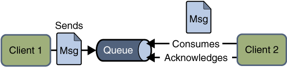

# 消息中间件

降低耦合性,提高系统性能。


消息中间件利用高效可靠的消息传递机制进行平台无关的数据交流，并基于数据通信来进行[分布式系统](https://baike.baidu.com/item/%E5%88%86%E5%B8%83%E5%BC%8F%E7%B3%BB%E7%BB%9F)的集成。通过提供消息传递和消息排队模型，它可以在分布式环境下扩展进程间的通信。 ----------From baidu.com

## 1、JMS

定义了一系列的接口规范，像是JDBC， 各大厂商遵从这个规范进行开发自己的消息中间件。

JMS定义了五种不同的消息正文格式，以及调用的消息类型，允许你发送并接收以一些不同形式的数据，提供现有消息格式的一些级别的兼容性。 

###1.1、消息类型

· MapMessage--一套名称-值对

· TextMessage--一个字符串对象

· ObjectMessage--一个序列化的 Java对象

· BytesMessage--一个未解释字节的数据流

· StreamMessage -- Java原始值的数据流

###1.2、消息传递类型

1）点对点模式



a）在点对点通信模式中，应用程序由消息队列，发送方，接收方组成。每个消息都被发送到一个特定的队列，接收者从队列中获取消息。队列保留着消息，直到他们被消费或超时。 

b）特点：

* 每个消息只要一个消费者
* 发送者和接收者在时间上是没有时间的约束，也就是说发送者在发送完消息之后，不管接收者有没有接受消息，都不会影响发送方发送消息到消息队列中。
* 发送方不管是否在发送消息，接收方都可以从消息队列中去到消息（The receiver can fetch message whether it is running or not when the sender sends the message）
* 接收方在接收完消息之后，需要向消息队列应答成功

2）发布/订阅模式


a）在发布/订阅消息模型中，发布者发布一个消息，该消息通过topic传递给所有的客户端。该模式下，发布者与订阅者都是匿名的，即发布者与订阅者都不知道对方是谁。并且可以动态的发布与订阅Topic。Topic主要用于保存和传递消息，且会一直保存消息直到消息被传递给客户端。 

b）特点：

* 一个消息可以传递个多个订阅者（即：一个消息可以有多个接受方）

* 发布者与订阅者具有时间约束，针对某个主题（Topic）的订阅者，它必须创建一个订阅者之后，才能消费发布者的消息，而且为了消费消息，订阅者必须保持运行的状态。

* 为了缓和这样严格的时间相关性，JMS允许订阅者创建一个可持久化的订阅。这样，即使订阅者没有被激活（运行），它也能接收到发布者的消息

## 2、ActiveMQ

### 2.1、原生的模式

####2.1.1、点对点模式

生产者：

```java
@Test
public void testActiveMQProducer() throws JMSException {
   //1.创建连接工厂
   ConnectionFactory connectionFactory = new ActiveMQConnectionFactory("tcp://192.168.1.127:61616");
   //2.创建连接
   Connection connection = connectionFactory.createConnection();
   //3.启动连接
   connection.start();
   //4.获取session(会话对象)，参数1：是否启用事物 false代表自动提交 ;参数2：消息确认方式
   Session session = connection.createSession(false, Session.AUTO_ACKNOWLEDGE);
   //5、创建队列对象
   Queue queue = session.createQueue("test-queue");
   //6、创建消息的生产者对象
   MessageProducer producer = session.createProducer(queue);
   //7、创建消息对象（文本消息）
   TextMessage textMessage = session.createTextMessage("It's dangerous!");
   //8、发送消息
   producer.send(textMessage);
   //9、关闭资源
   producer.close();
   session.close();
   connection.close();
}
```

消费者：

```java
@Test
public void testActiveMQConsumer() throws JMSException, IOException {
   //1.创建连接工厂
   ConnectionFactory connectionFactory = new ActiveMQConnectionFactory("tcp://192.168.1.127:61616");
   //2.创建连接
   Connection connection = connectionFactory.createConnection();
   //3.启动连接
   connection.start();
   //4.获取session(会话对象)，参数1：是否启用事物 false代表自动提交 ;参数2：消息确认方式
   Session session = connection.createSession(false, Session.AUTO_ACKNOWLEDGE);
   //5、创建队列对象
   Queue queue = session.createQueue("test-queue");
   //6、创建消息的消费者对象
   MessageConsumer consumer = session.createConsumer(queue);
    //7、创建消息监听器
   consumer.setMessageListener((message)->{
      TextMessage textMessage = (TextMessage) message;
      try {
         System.out.println("Content:" + textMessage.getText());
      } catch (JMSException e) {
         e.printStackTrace();
      }
   });
   //8、等待键盘输入（为了在资源关闭前获取消息，因为这是一个客户端程序）
   System.in.read();
   //9、关闭资源
   consumer.close();
   session.close();
   connection.close();
}
```

#### 2.1.2、发布/订阅模式

生产者：

```java
@Test
public void testTopicProducer() throws JMSException {
   //1.创建连接工厂
   ConnectionFactory connectionFactory = new ActiveMQConnectionFactory("tcp://192.168.1.127:61616");
   //2.创建连接
   Connection connection = connectionFactory.createConnection();
   //3.启动连接
   connection.start();
   //4.获取session(会话对象)，参数1：是否启用事物 false代表自动提交 ;参数2：消息确认方式
   Session session = connection.createSession(false, Session.AUTO_ACKNOWLEDGE);
   //5.创建Topic对象
   Topic topic = session.createTopic("test-topic");
   //6、创建消息的生产者对象
   MessageProducer producer = session.createProducer(topic);
   //7、创建消息对象（文本消息）
   TextMessage textMessage = session.createTextMessage("It's dangerous!");
   //8、发送消息
   producer.send(textMessage);
   //9、关闭资源
   producer.close();
   session.close();
   connection.close();
}
```

消费者：

```java
@Test
public void testTopicConsumer() throws JMSException, IOException {
   //1.创建连接工厂
   ConnectionFactory connectionFactory = new ActiveMQConnectionFactory("tcp://192.168.1.127:61616");
   //2.创建连接
   Connection connection = connectionFactory.createConnection();
   //3.启动连接
   connection.start();
   //4.获取session(会话对象)，参数1：是否启用事物 false代表自动提交 ;参数2：消息确认方式
   Session session = connection.createSession(false, Session.AUTO_ACKNOWLEDGE);
   //5、创建队列对象
   Topic topic = session.createTopic("test-topic");
   //6、创建消息的消费者对象
   MessageConsumer consumer = session.createConsumer(topic);
   //7、创建消息监听器
   /*consumer.setMessageListener(new MessageListener() {
      @Override
      public void onMessage(Message message) {
         TextMessage textMessage = (TextMessage) message;
         try {
            System.out.println("Content:" + textMessage.getText());
         } catch (JMSException e) {
            e.printStackTrace();
         }
      }
   });*/
   consumer.setMessageListener((message)->{
      TextMessage textMessage = (TextMessage) message;
      try {
         System.out.println("Content:" + textMessage.getText());
      } catch (JMSException e) {
         e.printStackTrace();
      }
   });
   //8、等待键盘输入（为了在资源关闭前获取消息，因为这是一个客户端程序）
   System.in.read();
   //9、关闭资源
   consumer.close();
   session.close();
   connection.close();
}
```

注意：消息发布订阅模式，消费者必须在生产这发布消息之前开启，否则收不到消息，类似于广播。

### 2.2与springboot整合

[详情参见SpringBoot整合篇。](springboot整合篇.md)

## RabbitMQ

## ZeroMQ

## Kafka

