# 深入计算机系统


## 计算机系统漫游

1、像`hello.c`这样只有ASCII字符构成的文件称为`文本文件`，所有其他文件都称为`二进制文件`。

基本思想：系统中所有的信息——包括磁盘文件、内存中的程序、内存中存放的用户数据以及网络上传送的数据，都是由一串比特表示的。区分不同数据对象的唯一方法是我们读到这些数据对象时的上下文。比如，在不同的上下文中，一个同样的字节序列可能表示一个整数、浮点数、字符串或者机器指令。


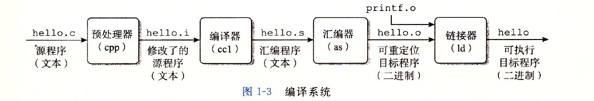


2、一个switch语句是否总是比一系列的if-else语句高效得多？一个函数调用的开销有多大？while循环比for循环更有效吗？指针引用比数组索引更有效吗？为什么将循环求和的结果放到一个本地变量中，会比将其放到一个通过引用传递过来的参数中，运行起来快很多呢？为什么我们只是简单的重新排列一下算术表达式中的括号就能让函数运行的更快？


### 系统的硬件组成

#### 1、总线

​	贯穿整个系统的是一组电子管道，称作总线，他携带信息字节并负责在各个部件间传递。通常总线被设计成传送定长的字节块，也就是字（word）。字中的字节数（即字长）是一个基本的系统参数，各个系统中都不尽相同。现在的大多数机器字长要么是4个字节（32位），要么是8个字节（64位）。

#### 2、I/O设备

​	鼠标、键盘、显示器、磁盘

​	每个I/O设备都通过一个控制器或适配器与I/O总线相连。控制器和适配器的区别主要在于他们的封装方式。控制器是IO设备本身或者系统的主印制电路板（通常称作主板）上的芯片组。而适配器则是一块插在主板槽上的卡，无论如何，他们的功能都是在IO总线和IO设备之间传递信息。

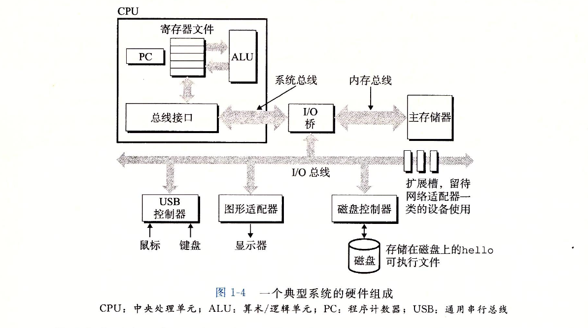

#### 3、主存

​	从物理上来说，主存是一组`动态随机存取存储器（DRAM）`芯片组成的。从逻辑上来说，存储器是一个线性的字节数组，每个字节都有其唯一的地址（数组索引），这些地址是从零

#### 4、处理器

​	CPU，是解释（或执行）存储在在主存中指令的引擎。处理器的核心是一个大小为一个字的存储设备（或寄存器），称为程序计数器（PC）。在任何时刻，PC都指向主存中的某条机器语言指令（即含有该条指令的地址）。

​	处理器从程序计数器指向的内存处读取指令，解释指令中的位，执行该指令指示的简单操作，然后更新PC，使其指向下一条指令，而这条指令并不一定和在内存中刚刚执行的指令相邻。这样的简单操作并不多，他们围绕着主存、寄存器文件和算数/逻辑单元（ALU）进行。寄存器文件是一个小的存储设备，由一些单个字长的寄存器组成，每个寄存器都有唯一的名字。ALU计算新的数据和地址值。下面是一些简单操作的例子，CPU在指令的要求下可能会执行这些操作。

* 加载：从主存复制一个字节或者一个字到寄存器，以覆盖寄存器原来的内容。
* 存储：从寄存器复制一个字节或者一个字到主存的某个位置，以覆盖这个位置上原来的内容。
* 操作：把两个寄存器的内容复制到ALU，ALU对这两个字做算术运算，并将结果存放到一个寄存器中，以覆盖该寄存器中原来的内容。
* 跳转：从指令本身中抽取一个字，并将这个字复制到程序计数器（PC）中，以覆盖PC中原来的值。


### 运行hello程序

​	当执行`./hello`时，shell执行一系列指令来加载可执行的hello文件，这些指令将hello目标文件中的代码和数据从磁盘复制到主存。数据包括最终会被输出的字符串“hello world\n”。

​	利用`直接存储器存取（DMA）`技术，数据可以不通过处理器而直接从磁盘到达主存。

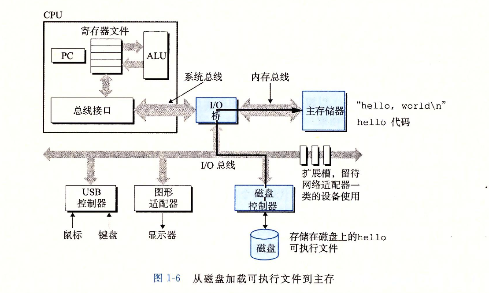

一旦目标文件hello中的代码和数据被加载到主存，处理器就开始执行hello程序的main程序中的机器语言指令。这些指令将“hello world\n”字符串中的字节从主存复制到寄存器文件，再从寄存器文件中复制到显示设备，最终显示在屏幕上。

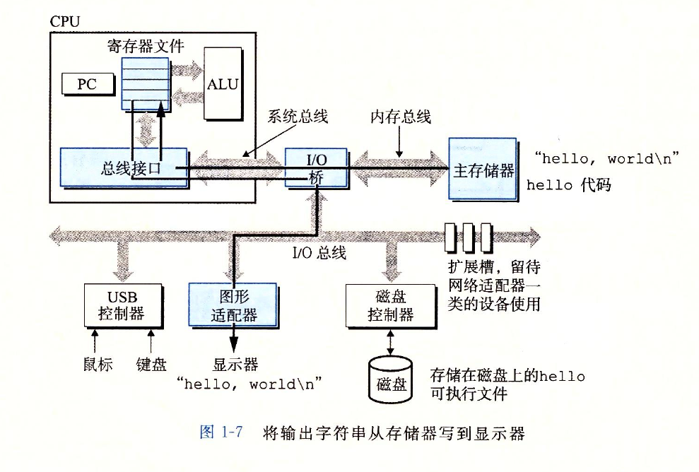


### 高速缓存处理器

​	针对处理器与主存之间的速度差异，系统设计者采用更小更快的存储设备，称为高速缓存存储器（cache memory，简称为cache或高速缓存），作为暂时的集结区域，存放处理器近期可能会需要的信息。

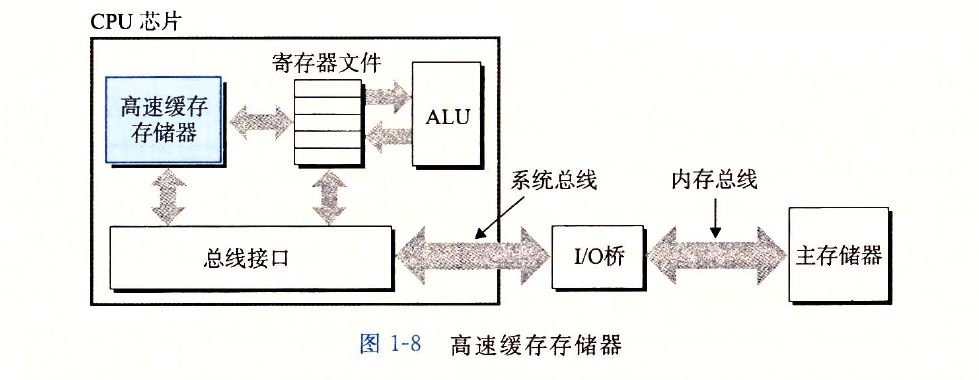

​	位于处理器芯片上的L1告诉缓存的容量可以达到数万字节，访问速度几乎和访问寄存器堆一样快。一个容量为数十万到数百万字节的更大的L2高速缓存通过一条特殊的总线链接到处理器。进程访问L2告诉缓存的时间要比访问L1高速缓存的时间长5倍。但是这仍然比访问主存的时间快5-10倍。L1和L2高速缓存是用一种叫做`静态随机访问存储器（SRAM）`的硬件技术实现的。利用高速缓存的局部性原理，即程序具有访问局部区域里的数据和代码的趋势。通过让高速缓存里存放可能经常访问的数据，大部分的内存操作都能在快速的高速缓存中完后。


#### 存储设备形成层次结构

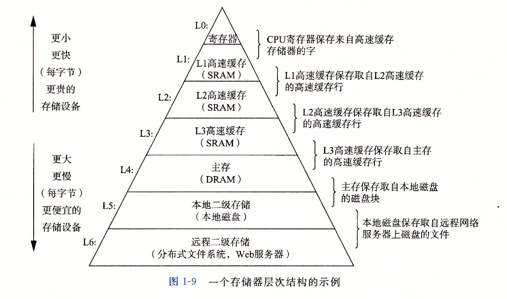

​	从上至下，设备的访问速度越来越慢、容量越来越大，并且每字节的造价越来越便宜。

​	存储器层次结构的主要思想是上一层的存储器作为低一层存储器的高速缓存。因此，寄存器文件就是L1的高速缓存，L1是L2的高速缓存，L2是L3的高速缓存，L3是主存的高速缓存，而主存又是磁盘的高速缓存。在某些分布式文件系统的网络系统中，本地磁盘就是存储在其他系统中磁盘上数据的高速缓存。


#### 操作系统管理硬件

​	操作系统有两个基本功能：1、防止硬件被失控的应用程序滥用；2、向应用程序提供简单一致的机制来控制复杂而又通常大不相同的低级硬件设备。操作系统通过几个基本的抽象概念（**进程、虚拟内存和文件**）来实现这两个功能。

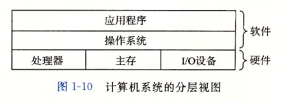

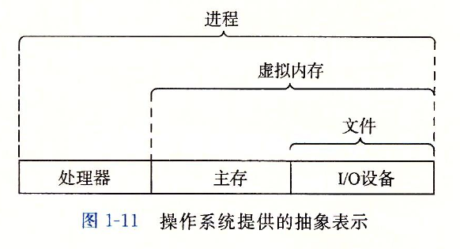

​	文件是对IO设备的抽象表示，虚拟内存是对主存和磁盘IO设备的抽象表示，进程则是对处理器、主存和IO设备的抽象表示。


#### 进程

​	进程是操作系统对一个正在运行的程序的一种抽象。无论是单核还是多核系统，一个CPU看上去都像是在并发的执行多个进程，这是通过处理器的进程间切换来实现的。操作系统实现这种交错执行的机制称为**上下文切换**。

​	操作系统保持跟踪进程运行所需的所有状态信息。这种状态，也就是上下文，包括许多信息，比如PC和寄存器文件的当前值，以及主存的内容。在任何一个时刻，单处理器系统都只能执行一个进程代码。当操作系统决定要把控制权从当前进程转移到某个新进程时，就会进行上下文切换，即保存当前进程的上下文、恢复新进程的上下文，然后将控制权传递到新进程。新进程就会从他上次停止的地方开始。

​	比如使用shell执行hello程序，有两个进程。shell进程和hello进程。最开始，只有shell进程在运行，即等待命令行上的输入。当我们让它运行hello程序时，shell通过调用一个专门的函数，即**系统调用**，来执行我们的请求，系统调用会将控制权传递给操作系统。操作系统保存shell进程的上下文，创建一个新的hello进程及其上下文，然后将控制权交给新的hello进程。hello进程终止后，操作系统恢复shell进程的上下文，并将控制权传回给它，shell进程会继续等待下一条命令的输入。

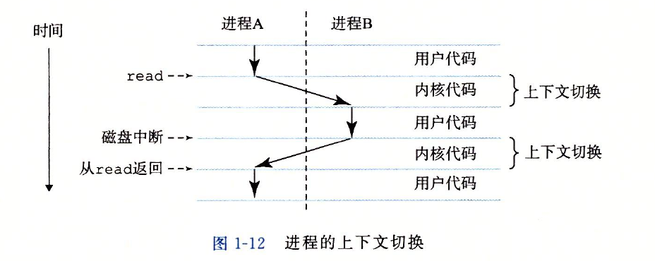

​	从一个进程到另一个进程的转换是由操作系统内核（kernel）管理的。内核是操作系统代码常驻内存的部分。当应用程序需要操作系统的某些操作时，比如读写文件，他就执行一条特殊的系统调用（system call）指令，将控制权传递给内核。然后内核执行被请求的操作并返回应用程序。内核不是一个独立的进程。相反，他是系统管理全部进程所用代码和数据结构的集合。

#### 虚拟内存

**虚拟内存**是一个抽象的概念，他为每个进程提供了一个假象，即每个进程都在独占的使用主存。每个进程看到的内存是都是一致的，称为**虚拟地址空间**。在Linux中，地址空间最上面的区域是保留给操作系统中的代码和数据的，这对所有进程来说都是一致的。

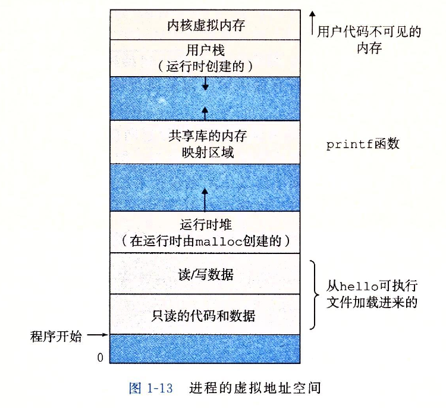

​	每个进程看到的虚拟地址空间由大量准确定义的区构成，每个区有专门的功能。

​	我们从最低的地址开始，逐步往上介绍。

	* **程序代码和数据。**对所有进程来说，代码是从同一固定位置开始，紧接着的是和C全局变量相对应的数据位置。代码和数据区是直接按照可执行目标文件的内容初始化的。
	* **堆。**代码和数据区后紧随着的是运行时堆。代码和数据区在进程一开始运行时就被指定了大小，与此不同，当调用像malloc和free这样的C标准库函数时，堆可以在运行时动态的扩展和收缩。
	* **共享库。**大约在地址空间的中间部分是一块用来存放像C标准库和数学库这样的共享库的代码和数据的区域。
	* **栈。**位于用户虚拟地址空间顶部的是**用户栈**，编译器用它来实现函数调用。和堆一样，用户栈在程序执行期间可以动态的扩展和收缩。
	* **内核虚拟内存。**地址空间顶部的区域是为内核保留的。不允许应用程序读写这个区域的内容或者直接调用内核代码定义的函数。相反，他们必须调用内核来执行这些操作


​	虚拟内存运作的基本思想是把一个进程虚拟内存的内容存储在磁盘上，然后用主存作为磁盘的高速缓存。


#### 文件

​	文件就是字节序列。每个IO设备，包括磁盘、键盘、显示器，甚至网络都可以看成是文件。系统中的所有输入输出都是通过使用一小组称为Unix I/O的系统函数调用读写文件来实现的。


### Amdahl定律

​	主要思想：当我们对系统的某个部分加速时，其对系统整体性能的影响取决于该部分的重要性和加速程度。若系统执行某应用程序需要的时间为T(old)。假设系统某部分所需执行时间与该时间的比例为α，而该部分性能提升比例位k。即该部分初始所需时间为αT(old)，现在所需时间为（αT(old)）/k，因此，总的执行时间应为

​		T(new) = (1-α)T(old) + (αT(old))/k = T(old)[ (1-α) + α/k]

​	由此，可以计算加速比S= T(old)/T(new) 为

​	S = 1 / ((1-α) + α/k)

​	举个例子，考虑这样一种情况，系统的某个部分初始耗时比例为60%（α = 0.6）,其加速比例因子3（k=3）。则我们可以获得的加速比为1/[0.4 + 0.6/3] = 1.67倍。虽然我们对系统的一个主要部分做出了重大改进但是获得的系统加速比却明显小鱼这部分的加速比。这就是Amdahl定律的主要观点，要想显著加速整个系统，必须提升全系统中相当大的部分和速度。


- **练习题1.1**　假设你是个卡车司机，要将土豆从爱达荷州的Boise运送到明尼苏达州的Minneapolis，全程2500公里。在限速范围内，你估计平均速度为100公里/小时，整个行程需要25个小时。
  A.你听到新闻说蒙大拿州刚刚取消了限速，这使得行程中有1500公里卡车的速度可以为150公里/小时。那么这对整个行程的加速比是多少？
  B.你可以在www.fasttrucks.com网站上为自己的卡车买个新的涡轮增压器。网站现货供应各种型号，不过速度越快，价格越高。如果想要让整个行程的加速比为1.67×，那么你必须以多快的速度通过蒙大拿州？
- 答：A. 1.25倍 B. 300km/h，根据时间的比值算，约数。
- **练习题1.2**　公司的市场部向你的客户承诺，下一个版本的软件性能将改进2×。这项任务被分配给你。你已经确认只有80%的系统能够被改进，那么，这部分需要被改进多少（即k取何值）才能达到整体性能目标？
- 答：k = 2.67，利用Amdahl定律来做，2= 1 / ((1-0.8) + 0.8/k) ，k约等于2.67。


#### 并发和并行

并发是一个通用概念，指一个同时具有多个活动的系统

并行指的是用并发来使一个系统运行的更快。


​	超线程，有时称为**同时多线程（simultaneous multi-threading）**，是意向允许一个CPU执行多个控制流的技术。它涉及CPU的某些硬件有多个备份，比如程序计数器和寄存器文件；而其他的硬件部分只有一份，比如浮点算数运算的单元。常规的处理器需要大约20000个时钟周期做不同线程间的转换，而超线程的处理器可以再单个周期的基础上决定要执行哪一个线程。这使得CPU能够更好的利用它的处理器资源。例如一个线程必须等到被装载到高速缓存中，那CPU就可以继续去执行另一个线程。举例来说，Intel core i7处理器可以让一个核执行两个线程，所以一个4核的系统实际上可以并行地执行8个线程。

​	多处理器的使用可以从两方面提高系统性能。首先，他减少了在执行多个任时模拟并发的需要（不需要线程切换，本来就是两个核）。其次，他可以使应用程序运行的更快，者必须要求程序是以多线程的方式来书写的。

​	如果处理器可以达到比一个时钟周期一条指令更快的执行速率，就称为超标量（super-scalar）处理器。


#### 抽象的重要性

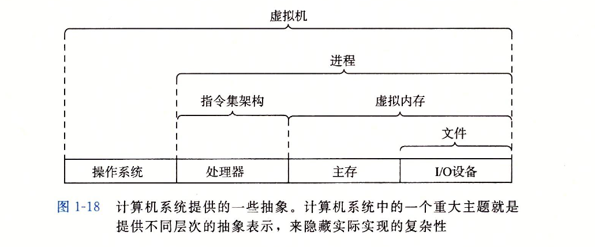


​	虚拟机，他提供对整个计算机的抽象，包括操作系统、处理器和程序。


## 信息的表示和处理

### 信息存储

​	大多数计算机使用**8位的块**，或者**字节（byte）**，作为最小的可寻址的内存单位，而不是访问内存中单独的位。机器级程序将内存视为一个非常大的字节数组，称为**虚拟内存（virtual memory）**。内存的每个字节都由一个唯一的数字来标识，称为他的地址（address），所有可能地址的集合就称为**虚拟地址空间（virtual address space）**。顾名思义，这个虚拟地址空间只是一个展现给机器级程序的概念性映像。实际的实现是将动态随机访问存储器（DRAM）、内存、磁盘储存器、特殊硬件和操作系统软件结合起来，为程序提供一个看上去同一的字节数组。

​	编译器和运行时系统是如何将存储器空间划分为更可管理的单元，来存放不同的程序对象（program object），即程序数据、指令和控制信息。可以用各种机制来分配和管理程序不同部分的存储。这种管理完全是在虚拟地址空间里完成的。例如，C语言中一个指针的值（无论他指向一个整数、一个结构或是某个其他程序对象）存储块的第一个字节的虚拟地址。C编译器还把每个指针和类型信息联系起来，这样就可以根据指针值的类型，生成不同的机器级代码来访问存储在指针所只想位置处的值。尽管C编译器维护者这个类型信息，但是他生成的实际机器级程序并不包含关于数据类型的信息。每个程序对象可以简单的视为一个字节块，而程序本身就是一个字节序列。


#### 十六进制表示法

​	一个字节由8位组成。

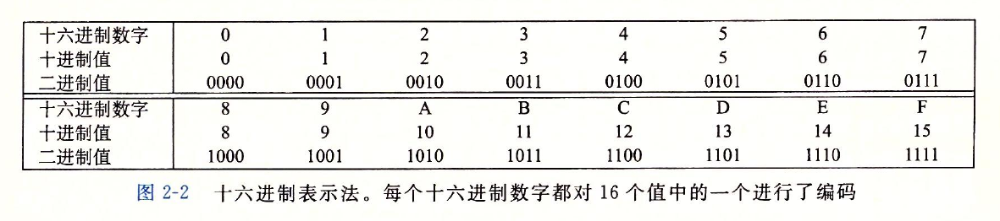

​	当值X是2的非负整数n次幂时，很容易将X写成十六进制形式，只要记住X的二进制表示就是1后面跟n个0。十六进制数字0代表4个二进制0.所以当n表示成i+4j的形式，其中0<=i<=3，我们可以把X写成开头的十六进制数字为1（i=0），2（i=1），4（i=2），8（i=3），后面跟随着j个十六进制的0。例如，X=2048=2的11次方，我们有n=11=3+4\*2,从而得到十六进制表示0x800。


#### 字数据大小

​	每台计算机都有一个字长（word size），指明指针数据的标称大小（nominal size）。因为虚拟地址是以这样的一个字来编码的，所以字长决定的最重要的系统参数就是虚拟地址空间的最大大小。也就是说，对于一个字长为w位的机器而言，虚拟地址的范围为0 ~ 2^w-1，程序最多访问2^w个字节。所以说32位的操作系统，寻址范围就是最大到2^32 = 2^10 * 2^10 * 2^10 * 4 (B)，也就是4GB。


#### 寻址和字节顺序

​	某些机器选择在内存中按照从最低有效字节到最高有效字节的顺序存储对象，而另一些机器则按照从最高有效字节到最低有效字节的顺序存储。前一种规则——最低有效字节在前面的方式，成为**小端法（little endian）**。后一种规则——最高有效字节在前面的方式，成为**大端法（big endian）**。

​	假设变量x的类型为int，位于地址0x100处，他的十六进制值为0x01234567地址范围0x100~0x103的字节顺序依赖于机器的类型：

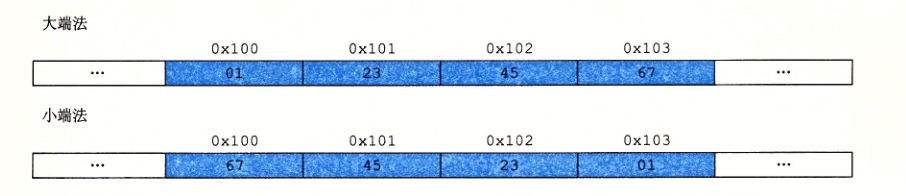

​	注意，在字ox01234567中，高位字节的十六进制值为0x01，而低位字节值为0x67。

​	浮点数和整型数据对数值的编码是不同的。比如12345：整型为0x00003039，而浮点数为0x4640哦00。一般而言，这两种格式使用不同的编码方法。如果我们将这些十六进制模式扩展为二进制形式，并且适当的将他们移位，就会发现一个有13个相匹配位的序列，用一串星号标识出来：

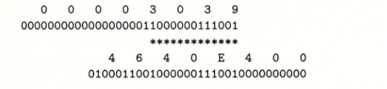


#### 布尔代数简介


​	位向量一个很有用的应用就是表示有限集合。我们可以用位向量[a(w-1)，...，a1，a0]编码任何子集A⊆{0,1,...,w-1}Ai = 1当且仅当i∈A。例如，（记住我们是把a(w-1)写在左边，而将a0写在右边），位向量a =3 [01101001] 表示集合A = {0, 3, 5, 6}，而b =3 [01010101]表示集合B = {0，2，4，6}。使用这种编码集合的方法，布尔运算 | 和&分别对应于集合的并和交，而~对应于于集合的补。还是用前面那个例子，运算a & b得到位向量[01000001]，而A∩B = {0, 6}。

​	在大量实际应用中，我们都能看到用位向量来对集合编码。例如，我们会看到有很多不同的信号会中断程序执行。我们能够通过指定一个位向量掩码，有选择地使能或是不能屏蔽一些信号，其中某一位位置上为1时，表明信号i是有效的，而0表明该信号是被屏蔽的。因而，这个掩码表示的就是设置为有效信号的集合。

​	位级运算的一个常见用法就是实现**掩码运算**，这里掩码是一个位模式，表示从一个字中选出的位的集合。让我们来看一个例子，掩码0xFF（最低的8位为1）表示一个字的低位字节。位级运算x&0xFF生成一个由x的最低有效字节组成的值，而其他的字节就被置为0。比如，对于x=0x89ABCDEF，其表达式将得到0x000000EF。表达式~0将生成一个全1的掩码，不管机器的字大小是多少。尽管对于一个32位机器来说，同样的掩码可以写成0xFFFFFFFF，但是这样的代码不是可移植的。


#### 移位运算

​	Java对于如何进行右移有明确的定义。表达式x>>k会将x算数右移k个位置，而x>>>k会对x做逻辑右移。

​	**逻辑移位**：逻辑移位是指逻辑左移和逻辑右移，移出的空位都用0来补。

​	**算术移位** ：就需要分有符号型值和无符号型值 
​	对于无符号型值，算术移位等同于逻辑移位。 
​	而对于有符号型值 ，算术左移等同于逻辑左移，算术右移补的是符号位，正数补0，负数补1。


### 整数表示


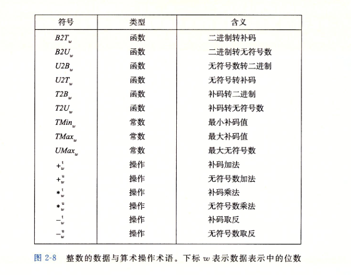


Java只支持有符号数。


#### 无符号数的编码


##### 无符号数编码定义


例如：把[01011110]转换为十进制数值 
1,加下标：0(7)1(6)0(5)1(4)1(3)1(2)1(1)0(0)
2,下标转化为2的幂并乘以相应的位，然后相加： 
0∗2^7+1∗2^6+0∗2^5+1∗2^4+1∗2^3+1∗2^2+1∗2^1+0∗2^0=94


> 无符号数全都是正数


#### 补码编码

​	对于许多应用，我们还希望表示负数值。最常见的有符号数的计算机表示方式就是**补码**（two`s-complement）形式。在这个定义中，将字的最高有效位解释为**负权**（negative weight）。

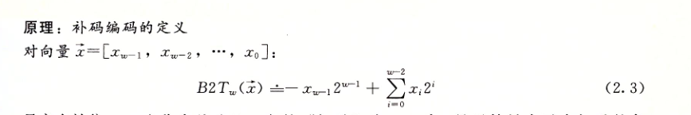

​	最高有效位x(w-1)也称为符号位，他的权重为 `-2^(w-1)`，是无符号表示中权重的负数。符号为被设置为1时，表示值为负，设置为0时，值为非负。

​	例如：

​	B2T（[0001] ） = -0 * 2^3 + 0 * 2^2 + 0 * 2^1 + 1 * 2^0 = 1

​	B2T（[0101] ） = -0 * 2^3 + 1 * 2^2 + 0 * 2^1 + 1 * 2^0 = 5

​	B2T（[1011] ） = -1 * 2^3 + 0 * 2^2 + 1 * 2^1 + 1 * 2^0 = -5

​	B2T（[1111] ） = -1 * 2^3 + 1 * 2^2 + 1 * 2^1 + 1 * 2^0 = -1


​	在这个图中，我们向左指的条表示符号为具有负权重。于是，与一个位向量相关联的数值是有可能的向左指的条和向右指的条加起来决定的。


#### 表示范围

​	让我们来考虑一下w位补码所能表示的值的范围。他能表示的最小值是位向量`[10···0]`（也就是设置这个位为负权，但是清楚其他所有位），其整数值为 `-2^(w-1)`。而最大值是位向量`[01···1]`(清除具有负权的位，而设置其他所有的位)，其整数值位`2^(w-1) - 1`。以长度4为例，`TMin = B2T([1000]) = -2^3 = -8`，`TMax = B2T([0111]) = 2^2 + 2^1 + 2^0 = 7`。

​	补码的范围是不对称的：`|TMin| = |TMax| + 1 `，也就是说，TMin没有与之对应的正数。正如我们将会看到的，这导致了补码运算的某些特殊的属性。**之所以会有这样的不对称性，是因为一半的位模式（符号为设置为1的数）表示负数，而另一半（符号位设置为0的数）表示非负数。因为0是非负数，也就意味着能表示的正数比负数少一个。**最大的无符号数值刚好比补码的最大值的两倍大一点：UMax = 2TMax + 1。补码表示中所有表示负数的位模式在无符号表示中都变成了正数。

​	关于正数数据类型的取值范围和表示，Java标准是非常明确的。他要求采用补码表示，取值范围与64的位的情况一直，在Java中，单字节数据类型称为byte，而不是char（2个字节）。这些非常具体的要求都是为了保证无论在什么机器上运行，Java程序都能表现的完全一样。


#### 有符号数和无符号数的转换


##### 补码转无符号数


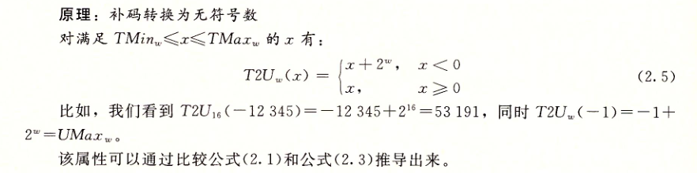


​	其实很容易理解，对于正数而言，补码和无符号数相同；对于负数而言，补码的计算时从最高为的负权，加后面的数，相比无符号为时多减去了一个`2^(w-1)`，所以要转无符号数，就需要加回来，就是加`两倍的2^(w-1)`，也就是`2^w`。

​	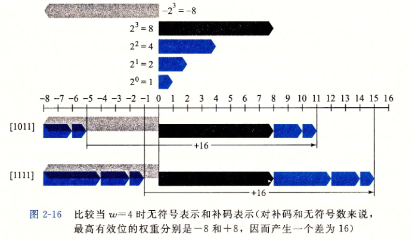

​	如图所示，当将一个有符号数映射为它相应的无符号数时，负数就被转换成了大的正数，而非负数会保持不变。


##### 无符号数转补码

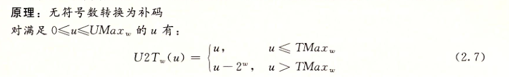


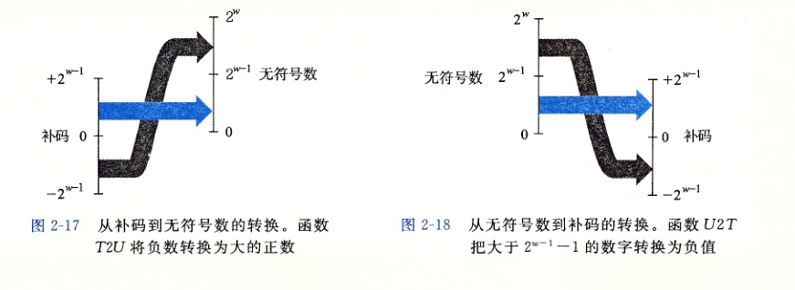

​	总结一下，我们考虑无符号与补码表示之间互相转换的结果。对于在范围0<=x<=TMax(w)之内的值x来言，我们得到T2U(x) = x 和U2T(x) = x。也就是说在这个范围内的数字有相同的无符号和补码表示。对这个范围以外的数值，转换需要加上或者减去2^w。例如，我们有`T2U(-1) = -1 + 2^w = UMax`——最靠近0的负数映射为最大的无符号数。在另一个极端，我们可以看到`T2U(TMin) = -2^(w-1) + 2^w = 2^(w-1) = TMax + 1`——最小的负数映射为一个刚好在补码的证书范围之外的无符号数。


##### 扩展一个数字的位表示

​	一个常见的运算是在不同字长的正数之间转换，同时又保持数值不变。当然，当目标数据类型太小以至于不能表示想要的值时，这根本就是不可能的。然而，从一个较小的数据类型转换到一个较大的数据类型，应该总是可能的。

​	要将一个无符号数转换位一个更大的数据类型，我们只要简单的在表示的开头添加0。这种运算被称为**零扩展（zero extension）**。

​	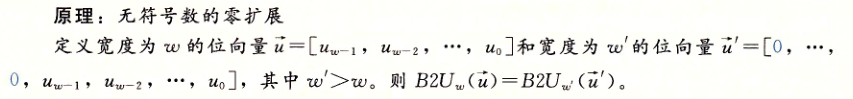

​	要将一个补码数字转换为一个更大的数据类型，可以执行一个符号扩展（sign extension），在表示中添加最高有效位的值。


​	下图给出了从字长w=3到w=4的符号扩展的结果。位向量`[101]`表示值`-4 + 1 = -3`。对它应用符号扩展，得到位向量[1101]，表示的值`-8 + 4 + 1 = -3`。我们可以看到对于w=4，最高两位的组合值是`-8 + 4 = -4`，与w=3时符号位的值相同。类似的，位向量`[111]`和`[1111]`都表示值-1。

​	


##### 截断数字


##### 无符号数截断


​	该原理背后的直觉就是所有被截去的位其权重形式都为`2^i`，其中`i>=k`，因此，每一个权在取模操作下结果都为零。

​	补码的阶段也具有相似的属性，只不过要将最高位转换为符号位。


##### 补码截断


​	**假设将一个4位数值**（用十六进制数字0～F表示）**截断到一**个3位数值（用十六进制数字0～7表示）。填写下表，根据那些位模式的无符号和补码解释，说明这种截断对某些情况的结果。


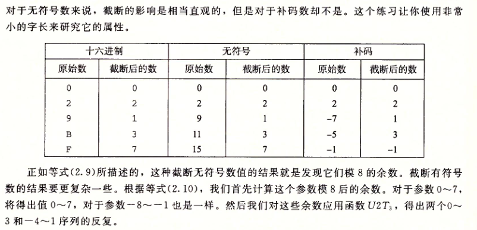


##### 关于有符号数与无符号数的建议

​	就像我们看到的那样，有符号数和无符号数的隐式类型强制转换导致了某些废纸管的行为。

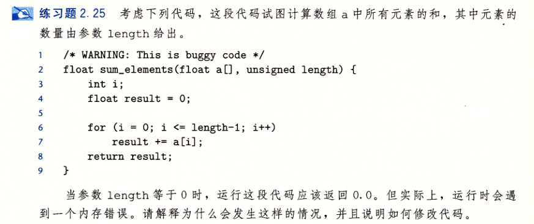

​	设计这个问题是要说明从有符号到无符号数的隐式强制类型转换很容易引起错误。将参数length作为一个无符号数来传递看上去是件很自然的事情，因为没有人会想到使用一个长度为负数的值。停止条件`i <= length - 1`看上去也很自然。但是把这两点组合到一起，将产生意想不到的结果！

​	因为参数length是无符号的，计算`0-1`将使用无符号运算，这等价于模数加法。结果得到UMax。<=比较同样使用无符号数比较，而因为任何数都是小于或者等于UMax的，所以这个比较总是为真！因此，代码将试图访问a的非法元素。

​	有两种方法可以改正这段代码，其一是将length声明为int类型，其二是将for循环的测试条件改为`i<length`。


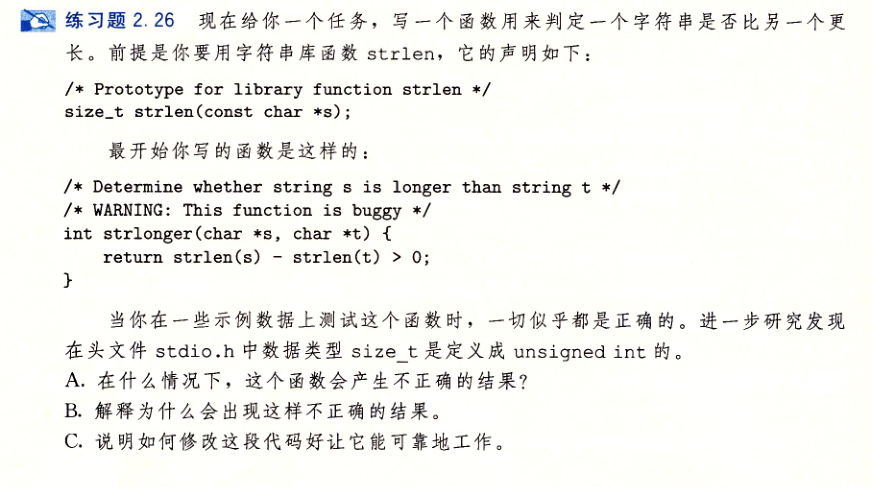

​	这个 例子说明了无符号运算的一个细微的特性，同时也是我们执行无符号运算时不会意识到的属性。这会导致一些非常棘手的错误。

A. 在什么情况下，这个函数会产生不正确的结果？当 s 比 t 短的时候，该函数会不正确的返回1。

B. 解释为什么会出现这样不正确的结果。有于strlen被定义为产生一个无符号的结果，差和比较都采用无符号运算来计算。当 s 比 t 短的时候，`strlen(s) - strlen(t)`的差会为负，但是变成了一个很大的无符号数，且大于0。


​	我们已经看到了许多无符号运算的细微特性，尤其是有符号到无符号数的隐式转换，会导致错误或者漏洞方式。避免这类错误的一种方法就是绝不使用无符号数。实际上，比如，Java只支持有符号整数，并且要求以补码运算来实现。正常的右移运算符>>被定义为执行算数右移。特殊的运算符>>>被指定为执行逻辑右移。


### 整数运算


#### 无符号加法

​	考虑两个非负正数 x 和 y，满足`0<=x,y<2^w`。每个数都能表示为w位无符号数字。然而，如果计算他们的和，我们就有一个可能的范围`0 <= x + y <= 2^(w+1) - 2`。表示这个和可能需要`w+1`位。


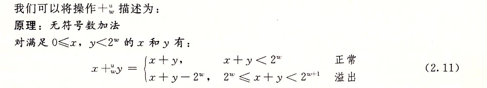

​	比如，考虑一个4位数字表示，x=9和y=12的位表示分别为`[1001]`和`[1100]`。他们的和是21，5位的表示位`[10101]`。但是如果丢弃最高位，我们就得到`[0101]`，也就是说，十进制值的5。这就和值`21 mod 16 = 5`一致。


​	左边的和x+y映射到右边的无符号w位的和x+y。正常情况下x+y的值保持不变，而溢出情况则是该和数减去2^w的结果。

​	一般而言，我们可以看到，如果`x+y < 2^w`，和的`w+1`位表示中的最高位会等于0，因此丢弃它不会改变这个数的值。另一方面，如果`2^w <= x+y < 2^(w+1)`，和的`w+1`位表示中的最高位会等于1，因此丢弃它就相当于从和中减去了`2^w`。


#### 补码加法

​	对于补码加法，我们必须确定当结果太大（为正）或者太小（为负）时，应该做些什么。

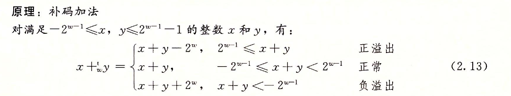


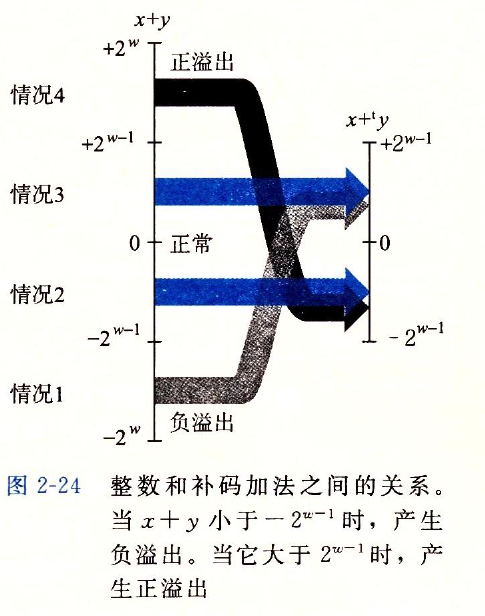

​	其中，左边的和x+y的取值范围为`-2^w <=x+y<=2^w-2`，右边显示的是该和数截断位w位补码的结果。当和x+y超过TMax时（情况4），我们说发生了**正溢出**。在这种情况下，截断的结果是从和数中减去2^w。当和x+y小于TMin时（情况1），我们说发生了**负溢出**。在这种情况下，截断的结果是把数加上2^w。

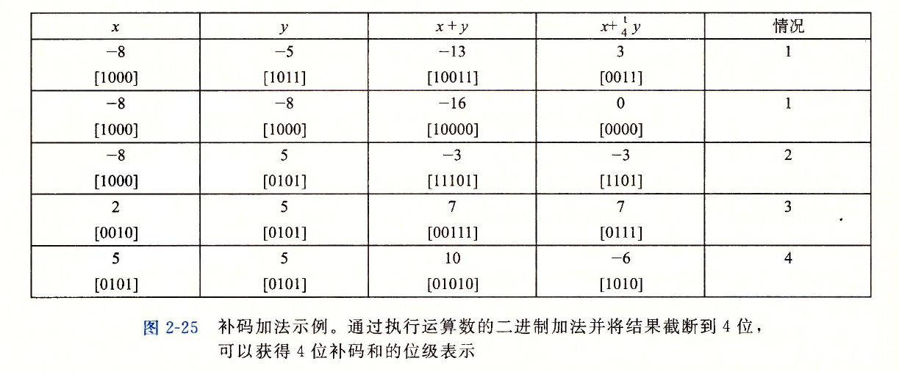

​	该图阐述了字长w=4的补码加法。运算数范围为`-8~7`之间。当`x+y<-8`时，补码加法就会负溢出，导致和增加了16。当`-8<=x+y<8`时，加法就产生`x+y`。当`x+8>=8`，加法就会正溢出，使得和减少了16。


#### 补码的非

补码的相反数就是按位取反+1。


#### 无符号乘法

​	范围在`0<=x，y<=2^w-1`内的整数x和y可以被表示为w位的无符号数，但是他们的乘积x*y的取值范围为0到`（2^w-1）^2=2^2w - 2^(w+1) +１`之间，这可能需要２ｗ位来表示。不过，Ｃ语言中的无符号乘法被定义为产生ｗ位的值，就是２ｗ位的证书乘积的低ｗ位表示的值。

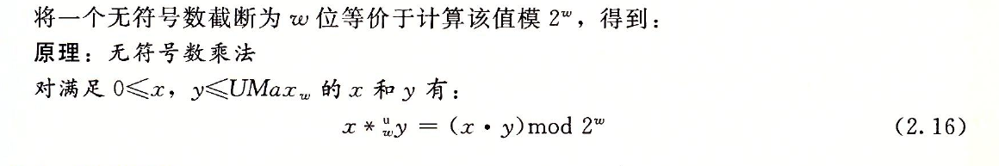

#### 补码乘法

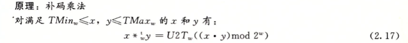


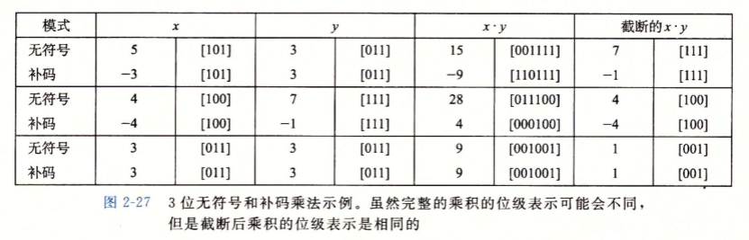

​	`(x*y)mod 2^w`求出结果截断，无符号整数按照无符号整数的规则，补码按照补码的规则求十进制。


#### 乘以常数

​	以往，大多数机器上，整数乘法指令相当慢。编译器试着用移位和加法运算的组合来代替乘以常数因子的乘法。首先，我们会考虑乘以2的幂的情况，然后再概括成乘以任意常数。

​	例如，假设一个程序包含表达式`x*14`。利用`14=2^3+2^2+2^1`，编译器会将乘法重写为`(x<<3)+(x<<2)+(x<<1)`，将一个乘法替换为三个移位和两个加法。无论x是无符号的还是补码，甚至当乘法会导致溢出时，两个计算都会得到一样的结果。更好的是，编译器还可以利用属性`14=2^4-2^1`，将乘法重写为`(x<<4)-(x<<1)`，这时只需要两个移位和一个减法。

​	

#### 除以２的幂

​	在大多数机器上，整数除法要比整数乘法更慢。除以2的幂也可以用移位运算来实现。无符号和补码数分别使用逻辑移位和算数移位来达到目的。但是，这种方法不能推广到任意常数。与乘法不同，我们不能除以2的幂的触发来表示除以任意常数K的除法。

#### 关于整数运算的最后思考


### 浮点数


## 程序的机器级表示

本章表述给予ｘ86-64。


### 历史观点

​	Intel处理器系列俗称x86。以下列举了一些Intel处理器的模型。我们用实现这些处理器所需要的晶体管数量来说明演变过程的复杂性。其中，“Ｋ”表示1000，“Ｍ”表示1000000，“G”表示1000000000。

​	8086（1978年，29K个晶体管）、80286（1982年，134K个晶体管）、i386（1985年，275K个晶体管）、	i486（1989年，1.2M个晶体管）、Pentium（1993年，3.1M个晶体管）、PentiumPro（1995年，5.5M个晶体管）、Pentium/MMX（1997年，4.5M个晶体管）、Pentium II（1997年，7M个晶体管）、Pentium III（1999年，8.2M个晶体管）、Pentium 4（2000年，42M个晶体管）、Pentium 4E（2004年，125M个晶体管）、Core 2（2006年，291M个晶体管）、Core i7（2008年，781M个晶体管）、Core i7（2011年，1.17G个晶体管）、Core i7（2013年，1.4G个晶体管）

​	每个后继处理器的设计都是后向兼容的——较早版本上编译的代码可以在较新的处理器上运行。Intel处理器系列有好几个名字，包括IA32的64位扩展，我们也成为x86-64。最常用的名字是“x86”，我们用它指代整个系列，也反映了直到i486处理器命名的习惯。


### 程序编码


#### 机器级代码

​	X86-64的既期待吗和原始的C代码差别非常大。一些通常对C语言程序员隐藏的处理器状态都是可见的：

* **程序计数器**（通常称为“PC”，在x86-64中用%rip表示）给出将要执行的下一条指令在内存中的地址。
* 整数**寄存器文件**包含16个命名的位置，分别存储64位的值。这些寄存器可以存储地址或者整数数据。有的寄存器被用来记录某些重要的程序状态，而其他的寄存器用来保存临时数据，例如过程的参数和局部变量，以及函数返回值。
* 条件码寄存器保存着最近执行的算数或逻辑指令的状态信息。它用来实现控制或数据流中的条件变化，比如说用来实现if和while语句。
* 一组向量寄存器可以存放一个或多个整数或浮点数值。


​	机器代码只是简单的将内存看成一个很大的、按字节寻址的数组。

​	程序内存包含：程序的可执行机器代码，操作系统需要的一些信息，用来管理过程调用和返回的运行时栈，以及用户分配的内存块（比如malloc）。程序内存用虚拟地址来寻址。操作系统负责管理虚拟地址空间，将虚拟地址翻译成实际处理器内存中的物理地址。


### 数据格式

​	由于是从16位体系结构扩展成32位的，Intel用术语“字”表示16位数据类型。因此，称32位数为“双字（double words）”，称64位数为“四字（quad words）”。


### 访问信息

​	一个x86-64的中央处理单元（CPU）包含一组16个64位置的**通用目的寄存器**。这些寄存器用来存储整数数据和指针。


​	他们的名字都是以`%r`开头，不过后面还跟着一些不同的命名规则的名字，这是由于指令集历史演化造成的。最初的8086中有8个16位的寄存器，即途中的`%ax`到`%bp`。每个寄存器都有特殊的用途，他们的名字反映了这些不同的用途。扩展到IA32架构时，这些寄存器扩展成32位寄存器，标号从`%eax`到`%ebp`。扩展到x86-64后，原来的8个寄存器扩展成64位，标号从`%rax`到`rbp`。除此之外，还增加了8个新的寄存器，他们的标号是按照新的命名规则制定的：从`%r8`到`%r15`。


#### 操作数指示符

​	大多数指令有一个或多个操作数，指示出执行一个操作中要使用的源数据值，以及放置结果的目的位置。源数据可以以常数形式给出，或者从寄存器或内存中读出，结果可以存放在寄存器或者内存中，因此各种不同的操作数的可能性被分为三种类型：

**立即数（immediate）**：用来表示常数值。即$后面跟一个用标准C表示法表示的整数

**寄存器（register）**：表示某个寄存器的内容，16个寄存器的低位1字节，2字节，4字节，或者8字节中的一个作为操作数分别对应于8位，16位，32位，或64位。

**内存引用**：根据计算出来的地址访问某个内存位置


​	有多种不同的**寻址方式**，允许不同形式的内存引用。

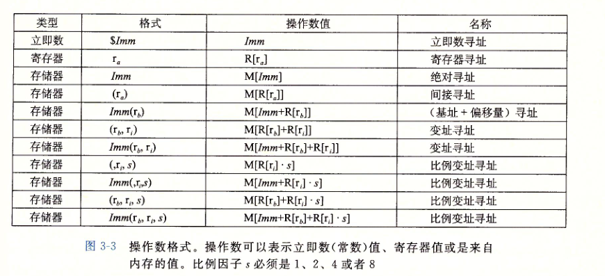


#### 数据传送指令

​	最频繁使用的指令是将数据从一个位置复制到另一个位置的指令，最简单形式的数据传送指令是MOV类，MOV类由四条指令组成：`movb`,`movw`,`movl`和`movq`。  `b`，`w`，`l`，`q`分别是1、2、4和8字节。

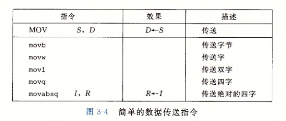

​	源操作数指定的值是一个立即数，存储在寄存器中或者内存中，目的操作数指定一个位置，要么是一个内存地址。而在x86-64中增加一个限制，传送指令的两个操作数不能都指向内存位置。将一个值从一个内存位置复制到另一个内存位置需要两条指令——第一条指令将源值加载到寄存器中，第二条将该寄存器值写入目的的位置。

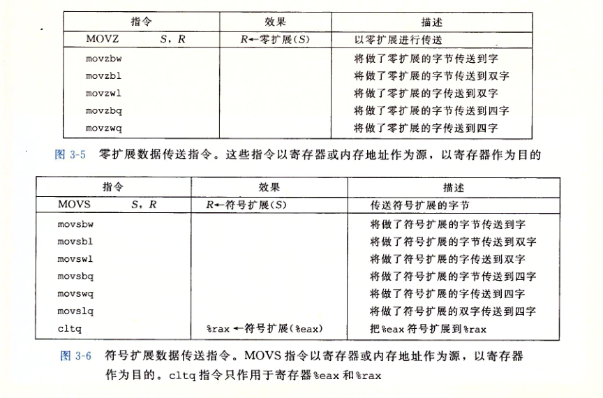

​	上图中记录的是两类数据移动指令，在将较小的源值赋值到较大的目的的时候使用，所有这些指令都把数据从源（在寄存器或内存中）复制到目的寄存器。MOVZ 类中的指令把目的中剩余的字节填充为0而MOVS类中的指令通过符号扩展来填充，把源操作的最高位进行复制。


#### 数据传送的代码示例

```c
long exchange(long *xp,long y)
{
  long x = *xp;
  *xp = y;
  return x;
}
```


```assembly
long exchange(long *xp, long y)
xp in %rdi, y in %rsi

1	exchange:
2	movq (%rdi), %rax	Get x at xp. Set as return value.
3	movq %rsi, (%rdi)	Store y at xp.
4	ret					Return

```

​	当过程开始执行时，过程参数xp和y分别存储在寄存器%rdi和%rsi中。然后，指令2从内存中读出x，把它存放到寄存器%rax中，直接实现了C程序中的操x=*xp。然后用寄存器%rax从这个函数返回一个值，因而返回值就是x。指令3将y写入到寄存器%rdi中的xp指向的内存位置，直接实现了操作 *xp=y。这个例子说明了如何用MOV指令从内存中读值到寄存器（第2行），如何从寄存器写到内存（第3行）。


#### 压入和弹出栈数据


​	最后两个数据传送操作可以将数据压入程序栈中，以及从程序栈中弹出数据。

栈是一种数据结构，可以添加和删除值，不过要遵循后进先出的原则，通过push操作将数据压入栈中，通过pop删除数据。

它具有一个属性：弹出的值永远是最近被压入而且仍然在栈中的值。

 

pushq指令的功能是把数据压入栈上，而popq是弹出数据，这些指令都只有一个操作数--压入的数据源和弹出的数据目的。

 

​	将一个四字值压入栈中，首先要将栈指针减8，然后将值写入到新的栈顶地址。

因为栈和程序代码以及其他形式的程序数据都是存放在同一个内存中，所以程序可以用标准的内存寻址方法访问栈内的任意位置。


### 算数和逻辑操作

### 控制

### 过程

### 数组和分配访问

### 异数的数据结构

### 在机器级程序中将控制与数据结构结合起来

### 浮点代码


## 处理器体系结构

本章简要介绍处理器硬件设计。


## 优化程序性能

​	本章会探讨如何使用几种不同类型的程序游湖技术，使程序运行的得更快。

​	编写高效程序需要做到以下几点：第一，我们选择一组适当的**算法和数据结构**。第二，我们必须**编写出编译器能够有效优化以转换成高效可执行代码的源代码**。对于第二点，理解优化编译器的能力和局限性是很重要的。

​	我们可以利用处理器提供的**指令级并行能力**。


## 存储器层次结构


## 链接


## 异常控制流


## 虚拟内存


## 系统级I/O


## 网络编程


## 并发编程