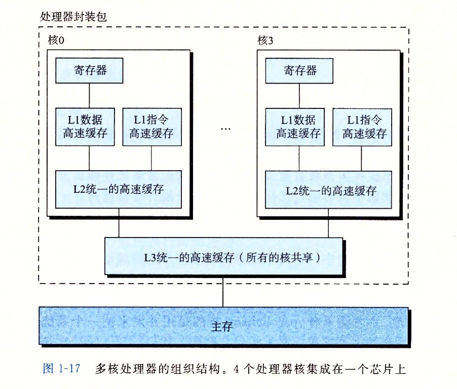

# 深入计算机系统

## 计算机系统漫游

1、像`hello.c`这样只有ASCII字符构成的文件称为`文本文件`，所有其他文件都称为`二进制文件`。

基本思想：系统中所有的信息——包括磁盘文件、内存中的程序、内存中存放的用户数据以及网络上传送的数据，都是由一串比特表示的。区分不同数据对象的唯一方法是我们读到这些数据对象时的上下文。比如，在不同的上下文中，一个同样的字节序列可能表示一个整数、浮点数、字符串或者机器指令。

2、一个switch语句是否总是比一系列的if-else语句高效得多？一个函数调用的开销有多大？while循环比for循环更有效吗？指针引用比数组索引更有效吗？为什么将循环求和的结果放到一个本地变量中，会比将其放到一个通过引用传递过来的参数中，运行起来快很多呢？为什么我们只是简单的重新排列一下算术表达式中的括号就能让函数运行的更快？

### 系统的硬件组成

#### 1、总线

​	贯穿整个系统的是一组电子管道，称作总线，他携带信息字节并负责在各个部件间传递。通常总线被设计成传送定长的字节块，也就是字（word）。字中的字节数（即字长）是一个基本的系统参数，各个系统中都不尽相同。现在的大多数机器字长要么是4个字节（32位），要么是8个字节（64位）。

#### 2、I/O设备

​	鼠标、键盘、显示器、磁盘

​	每个I/O设备都通过一个控制器或适配器与I/O总线相连。控制器和适配器的区别主要在于他们的封装方式。控制器是IO设备本身或者系统的主印制电路板（通常称作主板）上的芯片组。而适配器则是一块插在主板槽上的卡，无论如何，他们的功能都是在IO总线和IO设备之间传递信息。

#### 3、主存

​	从物理上来说，主存是一组`动态随机存取存储器（DRAM）`芯片组成的。从逻辑上来说，存储器是一个线性的字节数组，每个字节都有其唯一的地址（数组索引），这些地址是从零

#### 4、处理器

​	CPU，是解释（或执行）存储在在主存中指令的引擎。处理器的核心是一个大小为一个字的存储设备（或寄存器），称为程序计数器（PC）。在任何时刻，PC都指向主存中的某条机器语言指令（即含有该条指令的地址）。

​	处理器从程序计数器指向的内存处读取指令，解释指令中的位，执行该指令指示的简单操作，然后更新PC，使其指向下一条指令，而这条指令并不一定和在内存中刚刚执行的指令相邻。这样的简单操作并不多，他们围绕着主存、寄存器文件和算数/逻辑单元（ALU）进行。寄存器文件是一个小的存储设备，由一些单个字长的寄存器组成，每个寄存器都有唯一的名字。ALU计算新的数据和地址值。下面是一些简单操作的例子，CPU在指令的要求下可能会执行这些操作。

* 加载：从主存复制一个字节或者一个字到寄存器，以覆盖寄存器原来的内容。
* 存储：从寄存器复制一个字节或者一个字到主存的某个位置，以覆盖这个位置上原来的内容。
* 操作：把两个寄存器的内容复制到ALU，ALU对这两个字做算术运算，并将结果存放到一个寄存器中，以覆盖该寄存器中原来的内容。
* 跳转：从指令本身中抽取一个字，并将这个字复制到程序计数器（PC）中，以覆盖PC中原来的值。

### 运行hello程序

​	当执行`./hello`时，shell执行一系列指令来加载可执行的hello文件，这些指令将hello目标文件中的代码和数据从磁盘复制到主存。数据包括最终会被输出的字符串“hello world\n”。

​	利用`直接存储器存取（DMA）`技术，数据可以不通过处理器而直接从磁盘到达主存。

一旦目标文件hello中的代码和数据被加载到主存，处理器就开始执行hello程序的main程序中的机器语言指令。这些指令将“hello world\n”字符串中的字节从主存复制到寄存器文件，再从寄存器文件中复制到显示设备，最终显示在屏幕上。

### 高速缓存处理器

​	针对处理器与主存之间的速度差异，系统设计者采用更小更快的存储设备，称为高速缓存存储器（cache memory，简称为cache或高速缓存），作为暂时的集结区域，存放处理器近期可能会需要的信息。

​	位于处理器芯片上的L1告诉缓存的容量可以达到数万字节，访问速度几乎和访问寄存器堆一样快。一个容量为数十万到数百万字节的更大的L2高速缓存通过一条特殊的总线链接到处理器。进程访问L2告诉缓存的时间要比访问L1高速缓存的时间长5倍。但是这仍然比访问主存的时间快5-10倍。L1和L2高速缓存是用一种叫做`静态随机访问存储器（SRAM）`的硬件技术实现的。利用高速缓存的局部性原理，即程序具有访问局部区域里的数据和代码的趋势。通过让高速缓存里存放可能经常访问的数据，大部分的内存操作都能在快速的高速缓存中完后。

#### 存储设备形成层次结构

​	从上至下，设备的访问速度越来越慢、容量越来越大，并且每字节的造价越来越便宜。

​	存储器层次结构的主要思想是上一层的存储器作为低一层存储器的高速缓存。因此，寄存器文件就是L1的高速缓存，L1是L2的高速缓存，L2是L3的高速缓存，L3是主存的高速缓存，而主存又是磁盘的高速缓存。在某些分布式文件系统的网络系统中，本地磁盘就是存储在其他系统中磁盘上数据的高速缓存。

#### 操作系统管理硬件

​	操作系统有两个基本功能：1、防止硬件被失控的应用程序滥用；2、向应用程序提供简单一致的机制来控制复杂而又通常大不相同的低级硬件设备。操作系统通过几个基本的抽象概念（**进程、虚拟内存和文件**）来实现这两个功能。

​	文件是对IO设备的抽象表示，虚拟内存是对主存和磁盘IO设备的抽象表示，进程则是对处理器、主存和IO设备的抽象表示。

#### 进程

​	进程是操作系统对一个正在运行的程序的一种抽象。无论是单核还是多核系统，一个CPU看上去都像是在并发的执行多个进程，这是通过处理器的进程间切换来实现的。操作系统实现这种交错执行的机制称为**上下文切换**。

​	操作系统保持跟踪进程运行所需的所有状态信息。这种状态，也就是上下文，包括许多信息，比如PC和寄存器文件的当前值，以及主存的内容。在任何一个时刻，单处理器系统都只能执行一个进程代码。当操作系统决定要把控制权从当前进程转移到某个新进程时，就会进行上下文切换，即保存当前进程的上下文、恢复新进程的上下文，然后将控制权传递到新进程。新进程就会从他上次停止的地方开始。

​	比如使用shell执行hello程序，有两个进程。shell进程和hello进程。最开始，只有shell进程在运行，即等待命令行上的输入。当我们让它运行hello程序时，shell通过调用一个专门的函数，即**系统调用**，来执行我们的请求，系统调用会将控制权传递给操作系统。操作系统保存shell进程的上下文，创建一个新的hello进程及其上下文，然后将控制权交给新的hello进程。hello进程终止后，操作系统恢复shell进程的上下文，并将控制权传回给它，shell进程会继续等待下一条命令的输入。

​	从一个进程到另一个进程的转换是由操作系统内核（kernel）管理的。内核是操作系统代码常驻内存的部分。当应用程序需要操作系统的某些操作时，比如读写文件，他就执行一条特殊的系统调用（system call）指令，将控制权传递给内核。然后内核执行被请求的操作并返回应用程序。内核不是一个独立的进程。相反，他是系统管理全部进程所用代码和数据结构的集合。

#### 虚拟内存

**虚拟内存**是一个抽象的概念，他为每个进程提供了一个假象，即每个进程都在独占的使用主存。每个进程看到的内存是都是一致的，称为**虚拟地址空间**。在Linux中，地址空间最上面的区域是保留给操作系统中的代码和数据的，这对所有进程来说都是一致的。

​	每个进程看到的虚拟地址空间由大量准确定义的区构成，每个区有专门的功能。

​	我们从最低的地址开始，逐步往上介绍。

	* **程序代码和数据。**对所有进程来说，代码是从同一固定位置开始，紧接着的是和C全局变量相对应的数据位置。代码和数据区是直接按照可执行目标文件的内容初始化的。
	* **堆。**代码和数据区后紧随着的是运行时堆。代码和数据区在进程一开始运行时就被指定了大小，与此不同，当调用像malloc和free这样的C标准库函数时，堆可以在运行时动态的扩展和收缩。
	* **共享库。**大约在地址空间的中间部分是一块用来存放像C标准库和数学库这样的共享库的代码和数据的区域。
	* **栈。**位于用户虚拟地址空间顶部的是**用户栈**，编译器用它来实现函数调用。和堆一样，用户栈在程序执行期间可以动态的扩展和收缩。
	* **内核虚拟内存。**地址空间顶部的区域是为内核保留的。不允许应用程序读写这个区域的内容或者直接调用内核代码定义的函数。相反，他们必须调用内核来执行这些操作

​	虚拟内存运作的基本思想是把一个进程虚拟内存的内容存储在磁盘上，然后用主存作为磁盘的高速缓存。

#### 文件

​	文件就是字节序列。每个IO设备，包括磁盘、键盘、显示器，甚至网络都可以看成是文件。系统中的所有输入输出都是通过使用一小组称为Unix I/O的系统函数调用读写文件来实现的。

### Amdahl定律

​	主要思想：当我们对系统的某个部分加速时，其对系统整体性能的影响取决于该部分的重要性和加速程度。若系统执行某应用程序需要的时间为T(old)。假设系统某部分所需执行时间与该时间的比例为α，而该部分性能提升比例位k。即该部分初始所需时间为αT(old)，现在所需时间为（αT(old)）/k，因此，总的执行时间应为

​		T(new) = (1-α)T(old) + (αT(old))/k = T(old)[ (1-α) + α/k]

​	由此，可以计算加速比S= T(old)/T(new) 为

​	S = 1 / ((1-α) + α/k)

​	举个例子，考虑这样一种情况，系统的某个部分初始耗时比例为60%（α = 0.6）,其加速比例因子3（k=3）。则我们可以获得的加速比为1/[0.4 + 0.6/3] = 1.67倍。虽然我们对系统的一个主要部分做出了重大改进但是获得的系统加速比却明显小鱼这部分的加速比。这就是Amdahl定律的主要观点，要想显著加速整个系统，必须提升全系统中相当大的部分和速度。

- **练习题1.1**　假设你是个卡车司机，要将土豆从爱达荷州的Boise运送到明尼苏达州的Minneapolis，全程2500公里。在限速范围内，你估计平均速度为100公里/小时，整个行程需要25个小时。
  A.你听到新闻说蒙大拿州刚刚取消了限速，这使得行程中有1500公里卡车的速度可以为150公里/小时。那么这对整个行程的加速比是多少？
  B.你可以在www.fasttrucks.com网站上为自己的卡车买个新的涡轮增压器。网站现货供应各种型号，不过速度越快，价格越高。如果想要让整个行程的加速比为1.67×，那么你必须以多快的速度通过蒙大拿州？
- 答：A. 1.25倍 B. 300km/h，根据时间的比值算，约数。
- **练习题1.2**　公司的市场部向你的客户承诺，下一个版本的软件性能将改进2×。这项任务被分配给你。你已经确认只有80%的系统能够被改进，那么，这部分需要被改进多少（即k取何值）才能达到整体性能目标？
- 答：k = 2.67，利用Amdahl定律来做，2= 1 / ((1-0.8) + 0.8/k) ，k约等于2.67。

#### 并发和并行

并发是一个通用概念，指一个同时具有多个活动的系统

并行指的是用并发来使一个系统运行的更快。

​	超线程，有时称为**同时多线程（simultaneous multi-threading）**，是意向允许一个CPU执行多个控制流的技术。它涉及CPU的某些硬件有多个备份，比如程序计数器和寄存器文件；而其他的硬件部分只有一份，比如浮点算数运算的单元。常规的处理器需要大约20000个时钟周期做不同线程间的转换，而超线程的处理器可以再单个周期的基础上决定要执行哪一个线程。这使得CPU能够更好的利用它的处理器资源。例如一个线程必须等到被装载到高速缓存中，那CPU就可以继续去执行另一个线程。举例来说，Intel core i7处理器可以让一个核执行两个线程，所以一个4核的系统实际上可以并行地执行8个线程。

​	多处理器的使用可以从两方面提高系统性能。首先，他减少了在执行多个任时模拟并发的需要（不需要线程切换，本来就是两个核）。其次，他可以使应用程序运行的更快，者必须要求程序是以多线程的方式来书写的。

​	如果处理器可以达到比一个时钟周期一条指令更快的执行速率，就称为超标量（super-scalar）处理器。

#### 抽象的重要性

​	虚拟机，他提供对整个计算机的抽象，包括操作系统、处理器和程序。

## 程序的结构和执行

### 信息存储

​	大多数计算机使用**8位的块**，或者**字节（byte）**，作为最小的可寻址的内存单位，而不是访问内存中单独的位。机器级程序将内存视为一个非常大的字节数组，称为**虚拟内存（virtual memory）**。内存的每个字节都由一个唯一的数字来标识，称为他的地址（address），所有可能地址的集合就称为**虚拟地址空间（virtual address space）**。顾名思义，这个虚拟地址空间只是一个展现给机器级程序的概念性映像。实际的实现是将动态随机访问存储器（DRAM）、内存、磁盘储存器、特殊硬件和操作系统软件结合起来，为程序提供一个看上去同一的字节数组。

​	编译器和运行时系统是如何将存储器空间划分为更可管理的单元，来存放不同的程序对象（program object），即程序数据、指令和控制信息。可以用各种机制来分配和管理程序不同部分的存储。这种管理完全是在虚拟地址空间里完成的。例如，C语言中一个指针的值（无论他指向一个整数、一个结构或是某个其他程序对象）存储块的第一个字节的虚拟地址。C编译器还把每个指针和类型信息联系起来，这样就可以根据指针值的类型，生成不同的机器级代码来访问存储在指针所只想位置处的值。尽管C编译器维护者这个类型信息，但是他生成的实际机器级程序并不包含关于数据类型的信息。每个程序对象可以简单的视为一个字节块，而程序本身就是一个字节序列。

#### 十六进制表示法

​	一个字节由8位组成。

​	当值X是2的非负整数n次幂时，很容易将X写成十六进制形式，只要记住X的二进制表示就是1后面跟n个0。十六进制数字0代表4个二进制0.所以当n表示成i+4j的形式，其中0<=i<=3，我们可以把X写成开头的十六进制数字为1（i=0），2（i=1），4（i=2），8（i=3），后面跟随着j个十六进制的0。例如，X=2048=2的11次方，我们有n=11=3+4\*2,从而得到十六进制表示0x800。

#### 字数据大小

​	每台计算机都有一个字长（word size），指明指针数据的标称大小（nominal size）。因为虚拟地址是以这样的一个字来编码的，所以字长决定的最重要的系统参数就是虚拟地址空间的最大大小。也就是说，对于一个字长为w位的机器而言，虚拟地址的范围为0 ~ 2^w-1，程序最多访问2^w个字节。所以说32位的操作系统，寻址范围就是最大到2^32 = 2^10 * 2^10 * 2^10 * 4 (B)，也就是4GB。

#### 寻址和字节顺序

