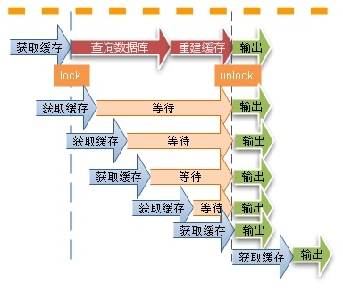
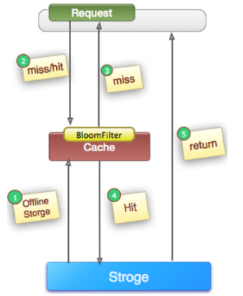
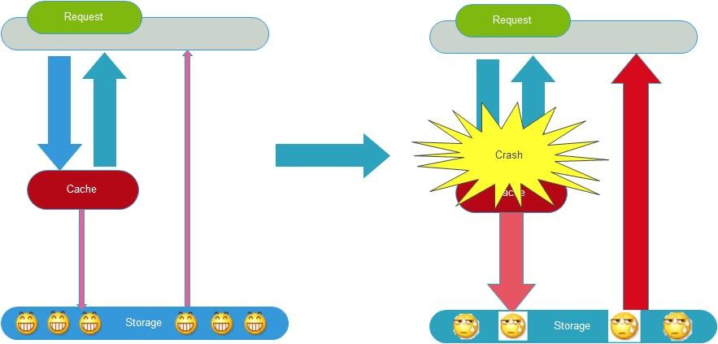
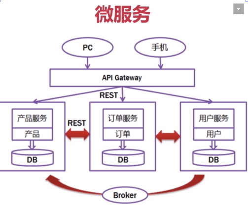
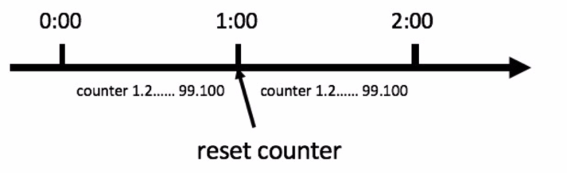
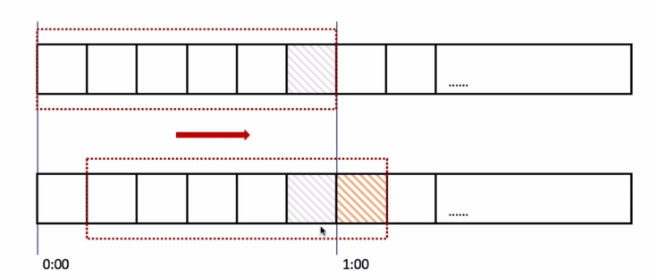
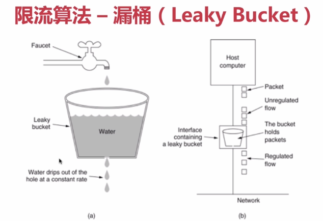
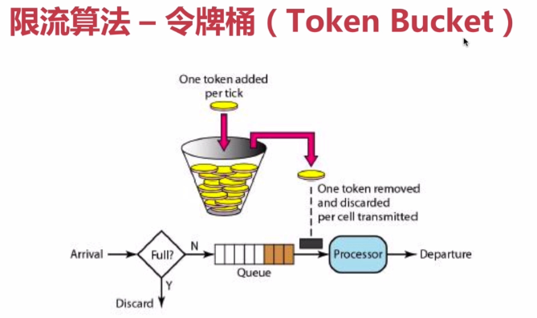

# 高并发场景解决方案

​	**高并发**（High Concurrency）是互联网分布式系统架构设计中必须考虑的因素之一，它一般是指通过设计保证系统能够同时并行处理很多请求。

​	高并发相关常用的一些指标有**响应时间（Response Time)**、**吞吐量（Throughput）**、**每秒查询率QPS（Query per Second）**、**并发用户数**等。

​	**响应时间**：系统对请求做出响应的时间。例如系统处理一个HTTP请求需要200ms，这个200ms就是系统的响应时间。

​	**吞吐量**：单位时间内处理的请求数量。

​	**QPS**：每秒响应请求数。在互联网领域，这个指标和吞吐量区分的没有那么明显。

​	**并发用户数**：同时承载正常使用系统功能的用户数量。例如一个即时通讯系统，同时在线量一定程度上代表了系统的并发用户数。

## 扩容

​	互联网分布式架构设计，提高系统并发能力的方式，方法论上主要有两种：**垂直扩展（Scale Up）**与**水平扩展（Scale Out）**。

* 垂直扩展（纵向扩展）：提升单机处理能力。垂直扩展的方式又有两种：

  > 1. 增强单机硬件性能，例如：增加CPU核数如32核，升级更好的网卡如万兆，升级更好的硬盘如SSD，扩充硬盘容量如2T，扩充系统内存如128G；
  > 2. 提升单机架构性能，例如：使用Cache来减少IO次数，使用异步来增加单服务吞吐量，使用无锁数据结构来减少响应时间。

* 水平扩展（横向扩展）：只要增加服务器数量，就能线性扩充系统性能。水平扩展对系统架构设计是有要求的，如何在架构各层进行可水平扩展的设计，以及互联网公司架构各层常见的水平扩展实践，是各个企业关注的内容。

​	简单理解：垂直扩展就是加班，水平扩展就是加人。

​	在互联网业务发展非常迅猛的早期，如果预算不是问题，强烈建议使用“增强单机硬件性能”的方式提升系统并发能力，因为这个阶段，公司的战略往往是发展业务抢时间，而“增强单机硬件性能”往往是最快的方法。

​	对于垂直扩展来说，不管是提升单机硬件性能，还是提升单机架构性能，都有一个致命的不足：单机性能总是有极限的。所以互联网分布式架构设计**高并发终极解决方案还是水平扩展**。

[参考博文链接](https://www.jianshu.com/p/be66a52d2b9b)

### 数据库

读操作扩展：memcache、redis、CDN等

写操作扩展：Cassandra、Hbase

## 缓存

### 缓存的特征

* 命中率：命中数/(命中数+未命中数)

  > 命中率越高产生的收益也就越高，性能也就越好，响应也就越短，吞吐量也就越高，抗并发的能力也就越强。

* 最大元素（空间）

  > 缓存中可以存放的最大元素的数量，当缓存的数量超过了缓存空间，则会触发缓存清空策略。

* 清空策略：FIFO，LFU，LRU，过期时间，随机等

  > FIFO：先进先出策略，先进入的优先清除
  >
  > LFU：最少使用策略，对比命中数。在一段时间内，数据被使用次数最少的，优先被淘汰。
  >
  > LRU：最近最少使用策略，判断最近被使用的时间，目前最远的数据优先被淘汰。

### 缓存的分类和应用场景

* 本地缓存：与本地程序耦合

  > Guava Cache

* 分布式缓存

  > Memceche，Redis

### 高并发场景下缓存问题

#### 缓存的一致性

* 更新数据库成功，更新缓存失败，会出现数据不一致问题
* 更新缓存成功，更新数据库失败，会出现数据不一致问题
* 更新数据库成功，淘汰缓存失败，会出现数据不一致问题
* 淘汰缓存成功，更新数据库失败，会出现查询缓存Miss问题

#### 缓存击穿

​	在高并发情况下，一个存在的key，在缓存过期的一刻，会造成大量请求访问数据库，会造成压力过大，甚至缓存雪崩问题

​	**解决方案：**

1. 设置热点数据永不过期。
2. **通过加锁的方式重建缓存。**使用双重检测锁解决。

#### 缓存穿透

​	在高并发场景下，访问一个不存在的key，缓存不起作用，出于对容错性考虑，会尝试去从后端数据库中获取，这就导致大量请求到达数据库层，造成压力过大。**主要是当key对应的数据为空或为null的情况**。

​	**解决方案：**

  1. **缓存空对象**

     对查询结果为空的对象也进行缓存，如果是集合，可以缓存一个空的集合（非null），如果是缓存单个对象，可以通过字段标识来区分。这样避免请求穿透到后端数据库，同时，也需要保证缓存的数据的时效性。这种方式实现起来成本较低，比较适合命中率不高，但可能被频繁更新的数据。

  2. **单独过滤处理**

     对所有可能对应数据为空的key进行统一存放，并在请求前做拦截，这样避免请求穿透到数据库。这种方式实现相对复杂，比较适合命中不高，但是更新不频繁的数据。

[参考文章](https://baijiahao.baidu.com/s?id=1619572269435584821&wfr=spider&for=pc)

####缓存颠簸

​	又叫”缓存抖动“，可以看作是比”雪崩“更轻微的故障，但是也会在一段时间内对系统造成冲击和性能影响。一般是由于缓存节点故障导致。业内推荐的做法是通过一致性Hash算法来解决。

#### 缓存雪崩

​	缓存雪崩就是指由于缓存的原因，导致大量请求到达后端数据库，从而导致数据库崩溃，整个系统崩溃的雪崩现象。导致问题的原因有多种，比如”缓存击穿“，”缓存穿透“，”缓存颠簸“，某个时间点内系统预加载的缓存周期性集中失效了，也可能会导致雪崩。为了避免这种周期性失效，可以通过设置不同的过期时间，来错开缓存失效时间。

​	从应用架构角度，我们可以通过限流、降级、熔断等手段来降低影响，也可以通过多级缓存来避免这种灾难。

​	此外，从整个研发体系流程的角度，应该加强压力测试，尽早模拟真实场景，尽早暴露问题从而防范。

​	

## 消息队列

### 特性

* **业务无关**：只做消息分发
* **FIFO**：先投递先到达
* **容灾**：节点的动态增删和消息的持久化
* **性能**：吞吐量提升，系统内部通信效率提高

###使用场景

* **业务解耦**

  > 异步的思想

* **最终一致性**

  > 所有跨VM的一致性问题，从技术角度讲，通用的解决方案是：
  >
  > 1. 强一致性，分布式事务，但落地太难且成本太高
  > 2. 最终一致性：主要是用”记录“和”补偿的方式“。在做所有的不确定的事情之前，先把事情记录下来，然后去做不确定的事情，结果可能是：成功、失败、不确定（超时，可以等价于失败）。成功就可以把记录的东西清理掉，对于失败和不确定，可以依靠定时任务等方式把所有失败的事情重新搞一遍，知道成功为止。

* **广播**

  > 消息队列的基本功能之一是进行广播。如果没有消息队列，每当一个新的业务方接入，我们都需要联调一次新的接口。有了消息队列，我们只需要关心消息是否送达了队列，至于谁希望订阅，是下游的事情，无疑极大的减少了开发和联调的工作量。

* **削峰与流控**

  > 对于不需要实时处理的请求来说，当并发量特别大的时候，可以现在消息队列中作缓存，然后陆续发送给对应的服务去处理。
  >
  > 上下游的处理能力是不同的，比如前端和数据库，短信系统和网关。
  >
  > 当上下游系统的处理能力存在差距的时候，利用消息队列做一个通用的”漏斗“，在下游有能力处理的时候，在进行分发。

## 应用拆分

### 原则

* 业务有限：确定业务边界
* 循序渐进：边拆分边测试
* 兼顾技术：重构、分层
* 可靠测试

###拆分的思考

1. **应用之间的通信**：RPC（dubbo等）、消息队列消息传输适用于传输数据包小但是数据量大，对实时性要求不高的场景。比如下单成功后通过短信通知用户。在实时性更高一些的场景下可选用RPC框架。

2. **应用之间的数据库设计**：每个应用都有独立的数据库

3. **避免事务操作跨应用**，分布式事务是一个非常消耗资源的问题。这样应用和应用的耦合度降低。

###拆分

**服务化——Dubbo**

**微服务——SpringCloud**

**实践微服务要解决的问题**：

1. **客户端如何访问这些服务**

   API Gateway提供统一的服务入口，对前台透明，同时可以聚合后台的服务，提供安全过滤流控等api的管理功能。

2. **服务之间是如何通信的**

   **异步**：使用消息队列，减少调用服务之间的耦合，又能成为调用之间的缓冲，确保消息积压不会冲垮被调用方。同时保证调用方的用户的体验。付出的代价是一致性的减慢，需要接受数据的最终一致性。

   **同步**：REST或者RPC，Rest可以使用springboot，RPC通常使用dubbo。Rest一般基于http实现，能够跨客户端，同时对客户端没有更多的要求。RPC的传输协议更高效，安全可控。开发效率高。同步调用一致性强。

3. **如何实现如此多的服务**

   服务发现，服务注册信息的分布式管理。

4. **服务挂了该如何解决，有什么备份方案和应急处理机制**

   重试机制、应用限流、熔断机制、负载均衡、系统降级等。

## 应用限流

### 算法

1. **计数器法**

   

2. **滑动窗口**

   

3. **漏桶算法**

   

4. **令牌桶算法**

   

## 服务降级与服务熔断

###服务降级

1. 自动降级

   超时降级、失败次数降级、故障降级、限流

2. 人工降级

### 服务熔断

### 异同

共性：目的、最终表现、

区别：

